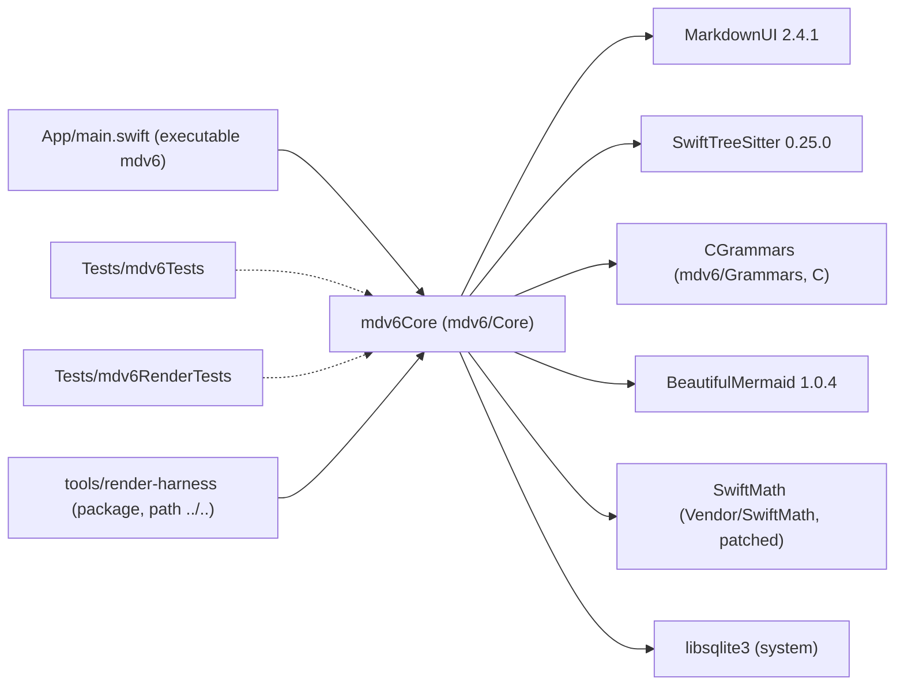

# Implementation plan — mdv6 (implementing `SPEC.md` v0.11)

> - **Target:** the `mdv6.app` macOS bundle (SwiftUI + AppKit), its `bin/mdv6` launcher, the `make` targets, the `swift test` suite and the `tools/render-harness` package, satisfying `SPEC.md` v0.11 (sha256 `eb28cfebe7456a5cfc05dca8df743dc1d2457514c68115a2b85334717437f897`) and `TYPOGRAPHY.md` (sha256 `e3a6b1a4882106f26dc9a9dfe5f34ed6a5f41e4e62a60f16edf08cd0d28e52ad`), both measured with `shasum -a 256` on 2026-09-17.
> - **Size expectation:** the spec states none. This plan budgets **7,000–9,500 production code lines** (~55 files, comments and blanks excluded, vendored code excluded) plus 3,000–4,500 test lines and 600–900 non-source lines (`build.sh`, `Makefile`, `bin/mdv6`, `Info.plist`, CI workflow, manifest, `tools/speccheck.sh`).
> - **Method:** red-green-refactor over the §9 test groups, one wave at a time; verification apparatus (metrics, harness, fixtures, reference images) before the feature it guards; `SPEC.md` never edited by a wave (a spec defect becomes an `F-nnn` in the build report).

---

## 1. Verdict

One SwiftPM package at the repository root with a library target `mdv6Core` (path `mdv6/Core`) that holds every contract, pipeline, session rule and view; a thin executable `mdv6` (`App/main.swift`); a C target `CGrammars` (`mdv6/Grammars`, eleven vendored tree-sitter grammars); a local vendored package `Vendor/SwiftMath`; two test targets (`Tests/mdv6Tests`, `Tests/mdv6RenderTests`); and a second package `tools/render-harness` that depends on the root package by path and links `mdv6Core` (R-39 "links, never copies"). The order is: a runnable ad-hoc-signed bundle first (W0), then the spec's pure contracts and its own metrics as code (W1 — C-02, C-07.1/.3, C-08, C-10, C-11, C-12, §7.1, §7.2, C-17's $q$, K-16's rhythm gap), then persistence (W2), then the trust boundary and the three renderers behind it (W3 — `ContentLimits` and `RemoteImageLoader` land in the same wave as, and are called before, every parser), then the article and the harness that renders it (W4 — the visual oracle wave), then the headless session (W5), then the window chrome (W6), then proof (W7). Three decisions carry the plan: **(a)** `DocumentSession` is a headless, testable object that owns the §3.1 state machine, find, navigation stacks and the placeholder, so every §9.4 rule has a `swift test` case before a view exists; **(b)** the harness renders through the same `ArticleBlockView` the window uses, hosted in an offscreen `NSHostingView`, so T-45/T-46 measure the product and not a copy; **(c)** chrome is one file of views (`SidebarViews.swift`) over one file of theme-independent rules and metrics (`ChromeModel.swift`), so I-015 is a property of the code's shape. The plan refuses to: copy pipeline code into the harness, treat any optional row as skippable, edit `SPEC.md`, or let the harness's own goldens certify the look. Expected landing: ~8,000 production code lines. The shortcut that fits in ~5,500 drops the C-18 chrome (headers, badges, reveal-on-click search, context menus, stripe) and the harness's `--check` metrics — the exact subsystems D-40 records as the ones prior recreations lost; they are not dropped.

## 2. What the evidence says (this is not a greenfield guess)

The starting tree holds only `SPEC.md` (920 lines), `TYPOGRAPHY.md` (215 lines) and four reference screenshots; there is no code, no `Package.swift`, no git history before this plan's first commit (`b117d9f`). No prior build of this spec is in the working directory, and by the user's instruction sibling folders are not consulted. The only measured comparables are the ones the `spec-plan` skill records for **v0.8** of this same spec (851 lines, 41 R / 17 C / 13 I / 15 K / 28 E / 43 T): a planned build at **10.0k production code lines / 46 files** with 8.3k test lines, and an unplanned, smaller complete build at **5.4k / 41 files** with 2.6k test lines — the smallest complete build, and this plan's anchor.

| Build | Prod LOC / files | Shape | What ended it |
|---|---|---|---|
| v0.8 planned build (skill record) | 10.0k / 46 | `mdv6Core` + app + harness, 11 waves | conformance report certified from self-generated goldens; shipped headings flush against paragraphs and left-aligned single-line `$$` (D-40) |
| v0.8 unplanned build (skill record) | 5.4k / 41 | same split, no plan | passed §9 of v0.8; panes structurally unlike the original (no headers, badges, active states) — the gap v0.9 made normative |
| this tree | 0 / 0 | — | — |

The systemic failure modes the evidence exposes are orthogonal, and each gets a rule in §6: **(1)** a rendered surface certified by a golden the pipeline produced about itself; **(2)** chrome built from behaviour rows only, with no structural oracle, so the panes lost the original's anatomy; **(3)** a budget treated as a target, doubling the size of a complete build with structure no row asked for.

Environment measured on 2026-09-17: Swift 6.4 (`swift-driver 1.168.6`, Xcode 27.0) on macOS 26.6.2 arm64; `swift-tools-version: 5.9` keeps the Swift 5 language mode. `speccheck 1.6.0` with the Swift adapter; Ollama present but Phase B is to run through OpenRouter (`openai/gpt-4o-mini`, per the user). GitHub reachable: MarkdownUI 2.4.1 (7,630 source lines), SwiftTreeSitter 0.25.0, beautiful-mermaid-swift 1.0.4 (public `MermaidRenderer.parse/layout/render`, `PositionedGraph`, `DiagramTheme`), SwiftMath 1.7.3 (7,411 lines; `MathImage(latex:fontSize:textColor:labelMode:)`, `MTFont.fontBundle` resolves `mathFonts.bundle` from `Bundle.module` — the patch point), and every grammar repository (tree-sitter-swift ships a `*-with-generated-files` tag). Fonts (Alegreya, Besley, OpenDyslexic; all OFL) must be fetched and vendored under `mdv6/Fonts`. No Developer ID identity, no notary profile and no `vX.Y.Z` tag exist here, so T-43 has no runnable gate (§6 names the stand-in). A window server is present (interactive user session), so the observed tests can be driven; screen-capture permission is checked before W7 starts.

## 3. Shape

*Figure 3 — target graph: the module split R-37 and R-39 require (tests `@testable import mdv6Core`; the harness links the pipeline), with the dependencies of §10.*

- **Why this split is mandated.** §9.0: "The app code is the library target `mdv6Core` with a thin executable (`App/main.swift`), so the tests `@testable import mdv6Core` and the harness links the pipeline instead of copying it; `Database(url:)` and `AppModel.bootstrap` inject the store and defaults." R-39: the harness "links the application's pipeline code rather than copying it". K-01: no Xcode project.
- **Literal filenames.** §11's "where realized" column names these files, and they are created under `mdv6/Core/` with exactly these names: `ParsedDocument.swift`, `Database.swift` (+`FTSQuery`), `Anchors.swift`, `SmartTypography.swift`, `HeadingSlug.swift` (`headingSlug`), `Sections.swift` (`sectionRange`, `stripInlineMarkdown`), `MathMarkdown.swift`, `MathSymbols.swift`, `MathImageCache.swift`, `MathSpec.swift`, `MDVMermaidPipeline.swift`, `MDVMermaidDiagramView.swift`, `MermaidCodeBlockChrome.swift`, `CodeRenderer.swift`, `CodeLanguage.swift`, `CodeBlockChrome.swift`, `ContentLimits.swift`, `ImageLoading.swift`, `ImageProviders.swift`, `ThemeManager.swift` (+`MDVTheme`), `HistoryManager.swift` (+`HistoryEntry`), `BookmarksManager.swift`, `PlaceholderStore.swift`, `HelpManager.swift`, `FileWatcher.swift`, `Diagnostics.swift`, `DocumentSession.swift`, `AppModel.swift`, `mdv6App.swift`, `DocumentRootView.swift`, `ArticleView.swift` (+`ArticleBlockView`), `SidebarViews.swift`, `ChromeModel.swift` (`ChromeMetrics`, `ChromeOpacity`), `DocumentRenderer.swift`, `RenderMetrics.swift` (`PixelCompare`, `RhythmMetric`, ink), `WindowAccessor.swift`. Grammar sources live under `mdv6/Grammars/<lang>/` with `mdv6/Grammars/README.md` pinning commits; queries under `mdv6/Queries/<lang>-highlights.scm`.
- **Headless/purity rule.** `mdv6Core` never reads `UserDefaults.standard`, `Bundle.main`, `NSScreen.main`, the clock or the home directory ambiently below the session layer: `AppModel.bootstrap(supportDir:defaultsSuite:)` injects the store URL and the defaults suite (`MDV6_SUPPORT_DIR`, `MDV6_DEFAULTS_SUITE`, §10); renderers take `width`, `scale`, `theme`, `zoom` as parameters (I-001); `Database(url:)` takes its file. The only network path is `RemoteImageLoader` (C-16).
- **Layer direction (one way, no cycles):** contracts (`ParsedDocument`, slugs, sections, anchors, typography, `MathMarkdown`, `FTSQuery`, `ContentLimits`, `MDVTheme`, metrics) → pipelines (`CodeRenderer`, `MathImageCache`, `MDVMermaidPipeline`, `ImageLoading`) → services (`Database`, `HistoryManager`, `BookmarksManager`, `PlaceholderStore`, `FileWatcher`, `HelpManager`, `Diagnostics`) → session (`DocumentSession`, `AppModel`) → views (`ArticleView`, `SidebarViews`, `DocumentRootView`, `mdv6App`) → harness (`DocumentRenderer`, `tools/render-harness`).
- **Visual oracle.** `reference/MDV-ORIGINAL-SEVILLA.png` and `reference/MDV-SCREEN.png` (structure, C-18.0), `TYPOGRAPHY.md` (values), and the measured checks the harness carries: the K-16 rhythm band $v \le g \le v + 0.6f$ with the single-`Markdown`-view rendering as the oracle (T-45), the centred display-math bounding box within 2 pt and the `.display` height (T-46), the §7.1 ink ratio (T-17), the C-17 pixel fraction $q \le 0.001$ (T-13/T-19). These land in W1 (metrics) and W4 (harness) so W6 is gated on them; the observed tests T-44/T-47/T-48 are driven on screen in W7 against the reference images, and a golden the harness writes is a regression guard only.

## 4. Order (waves; each ends at a gate, not at a file count)

1. **W0 Runnable bundle** — `Package.swift` (targets above, `linkerSettings` for sqlite3), `Vendor/SwiftMath` vendored at 1.7.3 with its four patches and `README.md` inventory (I-011), the eleven grammars vendored with `mdv6/Grammars/README.md` (K-05, R-38), fonts vendored, `mdv6/Info.plist` + `mdv6.entitlements` (C-01, K-02), `build.sh` (C-13, K-12), `Makefile` (§5.3, R-34 exact-tag gate), `bin/mdv6` (§5.2, R-33), `.github/workflows/build.yml` (R-37), `App/main.swift` with an `mdv6App` that shows one window, one stub test per §9 group, `tools/speccheck.sh`. Gate: `swift build` exit 0; `make` produces `build/mdv6.app` and `codesign --verify --deep --strict build/mdv6.app` exit 0; `bin/mdv6 --version` prints `1.0.0`; `bin/mdv6 nope.md` exit 1 with the R-33 message; `make dist` on the untagged HEAD exits non-zero before any build step; `swift test` runs. Discharges T-01, T-02, T-03 (launcher clauses), R-33, R-34, C-01, C-13, K-01, K-02, K-11 (negative), K-12, I-011 (inventory), T-34.
2. **W1 Pure contracts and the spec's metrics** — `ParsedDocument` (C-02), `headingSlug` (C-11), `sectionRange`/`stripInlineMarkdown` (C-12), `bookmarkFingerprint`/`resolveBookmarkAnchor` (C-08), `smartenMarkdown` (C-10), `FTSQuery` (C-03 construction), `MathMarkdown.rewrite`/`plainText` (C-07.1/C-07.3), `MathSymbols.preprocess` (C-07.2 rewrites), `MDVMermaidPipeline.sanitize`/`mergeStateDescriptions`/`normalizeColors` (C-06.1), `ContentLimits` (K-14, E-28 messages), `ZoomStep` (R-30 formula), `ColumnWidth` (§7.2), `RenderMetrics` (§7.1 ink, C-17 $q$, K-16 ink-row gap), `HistoryEntry` codec (C-15), `MDVTheme` + nine themes + `CodePalette` (C-09, K-10, `TYPOGRAPHY.md`), `CodeLanguage.resolve` and the prompt-aware set (C-05), `Diagnostics` (R-35). Gate: `swift test --filter mdv6Tests` exit 0 with the unit groups T-07, T-10, T-14, T-15, T-16, T-20, T-22, T-24 (query), T-26 (unit clauses), T-30 (ranges), T-39 (split) green and each formula's degenerate case asserted.
   *This wave is here because every later wave measures itself against these functions; a metric written after the feature asserts names, not behaviour.*
3. **W2 Persistence and history** — `Database` (C-03 schema + triggers, C-08 tables, `meta`/`migrate()` in one transaction, FULLMUTEX/WAL/NORMAL — I-006, I-007, E-12), `HistoryManager` (R-20, R-26, I-013, K-03, C-15), `BookmarksManager` (R-27 store, reorder, remove, five slots), scroll positions (R-06 store side, C-08 validity), `PlaceholderStore` (R-28 in-memory), `AppModel.bootstrap` with `MDV6_SUPPORT_DIR`/`MDV6_DEFAULTS_SUITE` (§10). Gate: `swift test --filter PersistenceTests` exit 0 — T-24 (index/search/tie order/E-24), T-25 (cap, eviction prune, no duplicates, decode), T-26 (store clauses), T-28 (scroll validity), T-33 (corrupt file, crash-safe rows), T-42 (C-04 fallbacks).
4. **W3 Trust boundary and renderers** — `ImageLoading` (`RemoteImageLoader` C-16, `ImageDecoding` K-14) with a local recording HTTP server test; `CodeRenderer` (C-05 highlighting, cache, plain fallback, `swift`/`sql` R-38); `MathImageCache` + symbol registration (C-07.2, E-10, I-008 bitmap bake); `MDVMermaidPipeline.prepare/rasterize/displaySize` with C-06.2 repairs, C-06.3 document theme, R-15 math nodes, E-01 ownership, E-02 fallback, K-07 caches. Every parser entry checks `ContentLimits` first (R-41, I-002). Gate: `swift test --filter mdv6RenderTests` exit 0 — T-06, T-14, T-15, T-16, T-20, T-37 (capture classes), T-41 (ceilings + HTTP server), plus the pipeline halves of T-13/T-17/T-19.
5. **W4 Article and the render harness (the visual-oracle wave)** — `ArticleView`/`ArticleBlockView` (§3.2 per-block path: math rewrite → smarten → MarkdownUI with `markdownTheme` from `MDVTheme`, image providers, `MathDisplayView`, code and Mermaid chrome, heading rules, `blockInset` = $\max(\text{bottom}_i,\text{top}_{i+1})$ — I-014/C-18.10, find tint and inline highlight rendering, hovered-block stripe, heading click/copy affordance hooks), `DocumentRenderer` (offscreen hosting at width/scale/theme, `Options.singleView`), `tools/render-harness` (C-17's three invocations, exits, JSON records), `test-docs/` corpus (`syntax.md`, `code.md`, `math.md`, `images.md`, `links.md`, `links-sibling.md`, `tables.md`, `thematic-break.md`, `mermaid/*.mmd`, `render-cases.json`, goldens). Gate: `swift run --package-path tools/render-harness render-harness --scan test-docs/mermaid --output-dir "$TMPDIR/mdv6-scan"` exit 0 with E-02 cases `fallback` and the rest `pass`; `--check test-docs/render-cases.json` exit 0 including `--case mermaid-math-ink` and `--case sequence-layout`; `swift test --filter RhythmAndDisplayMathTests` exit 0 (T-45, T-46). Discharges R-39, C-17, T-13, T-17, T-19, T-45, T-46, I-005, K-13.
6. **W5 Headless session** — `DocumentSession` (§3.1 states; R-01 adding/selecting routes; R-02 directory; R-03 drop; R-04 read/decode/split; R-05 watcher hookup with the E-21 rules; R-06 restore/persist; R-18 stacks and drop-on-removal; R-19 resolve-then-classify + fragments; R-22 `copySection`; R-24 find model with `shouldInlineHighlight`; R-27/R-28 anchor and title rules; R-40 startup; E-29 `tocSelectedBlock`), `FileWatcher` (FSEvents on the parent directory, 50 ms latency, no deferral), `HelpManager` (R-31), editor launch (R-23), `AppModel.startup/register`. Gate: `swift test --filter SessionTests` exit 0 — the headless clauses of T-04, T-22, T-23, T-25, T-27, T-28, T-29, T-39, T-40 (routing model), T-38 (help copy); every §3.1 transition has a test.
7. **W6 Window chrome** — `mdv6App` (menus and shortcuts of §5.1, key-window addressing E-26, open events, `NSWindow.isRestorable = false` E-30, CLI install alert flow, zoom HUD, `NSAlert`s of C-14), `DocumentRootView` (C-18.1 title/strip/colour scheme, C-18.2 toolbar, three panes with 8 pt handles and the collapse chevron), `SidebarViews` (C-18.3 headers, C-18.4 reveal-on-click search, C-18.5 history rows, C-18.6 hits, C-18.8 TOC rows, C-18.9 bookmark and placeholder rows with both context menus), `ChromeModel` (`ChromeMetrics`, `ChromeOpacity`, the enablement and reorder rules of T-48 as pure functions), find bar, global search UI, inspector width/bookmark height drags (K-04). Gate: `swift build` exit 0; `swift test --filter ChromeModelTests` exit 0 (T-48's menu order, enablement and reorder; C-18 metrics table; theme-independence I-015 as a rule over `MDVTheme.all`); `make` exit 0 and the app launches on `test-docs/math.md` with an isolated store.
8. **W7 Prove it** — the live pass (T-44, T-47, T-48 driven on screen against `reference/`, isolated store seeded from `test-docs/fixtures/`, screenshots under `build/observed/` opened and compared), the remaining manual §9.2/§9.4 checks (T-05, T-08, T-09, T-11, T-12, T-21, T-31, T-35, T-36, T-38), `README.md` written from the built surface, `swift test --xunit-output`, speccheck Phase A (`--judge mock --strict`) then Phase B (`--judge llm --strict` via OpenRouter `openai/gpt-4o-mini`), the §11 walk from `speccheck.json`, `SPEC_BUILD_REPORT.md` with the wave ledger and the verdict.

## 5. LOC budget (production source, excludes vendored code)

| Slice | Files | LOC |
|---|---|---|
| Package, app entry, `Info.plist`, entitlements (W0) | 4–5 | 150–250 |
| Pure contracts: split, slug, sections, anchors, typography, math rewrite/plain, FTS query, limits, zoom, column, metrics, history codec, themes, language table, diagnostics (W1) | 15–17 | 1,900–2,400 |
| Persistence: `Database`, history, bookmarks, placeholder, bootstrap (W2) | 5–6 | 700–900 |
| Renderers and trust boundary: image loading/decoding, code, math cache, Mermaid pipeline (W3) | 7–8 | 1,500–1,900 |
| Article views, `DocumentRenderer`, harness `main.swift` (W4) | 8–9 | 1,200–1,600 |
| Session: `DocumentSession`, `FileWatcher`, `HelpManager`, `AppModel` (W5) | 4–5 | 900–1,200 |
| Chrome: `mdv6App`, `DocumentRootView`, `SidebarViews`, `ChromeModel`, find bar, search, HUD (W6) | 6–7 | 1,100–1,500 |
| **Total** | **~52–57** | **7,450–9,750** (stated as 7,000–9,500 after the W4/W6 overlap is removed) |
| Tests (separate; not "the program") | 16–20 | 3,000–4,500 |
| `build.sh`, `Makefile`, `bin/mdv6`, CI, `render-cases.json`, `tools/speccheck.sh`, grammar/vendor READMEs | — | 600–900 |

Anchors: the smallest complete build of v0.8 (5.4k / 41 files, skill record) is the primary anchor; v0.11 adds the chrome section (C-18, ~1,000 lines the v0.8 builds did not have), `ContentLimits`/C-16 (~300), the C-17 `--check` metrics (~250), and Swift/SQL grammars (no Swift lines). Slices above twice their v0.8 counterpart: none by design — the contracts slice is the largest because the spec's formulas are code, and `SidebarViews` is one file by rule (I-015), not many. Two rules: if the estimate approaches the ceiling, decompose the expensive slice (split `DocumentSession` into find/navigation/lifecycle files) — never drop a subsystem to fit the number; and **the budget is an estimate, never a floor** — a build landing under it has lost nothing unless §11 says so, and code above the 5.4k anchor is named in the report as added structure.

## 6. Rules that make the observed failures impossible

| Prior failure | Structural rule |
|---|---|
| A rendered surface certified from goldens the pipeline produced (v0.8 planned build: flush headings, left-aligned `$$`) | The K-16 rhythm oracle is the single-`Markdown`-view rendering, and the T-46 oracle is a measured centre and the `.display` height — `RenderMetrics` is written in W1 with synthetic inputs, the harness in W4 compares against it, and `render-cases.json` goldens are labelled `metric: pixel` regression guards only. Checked at the W4 gate and again in W7's report, which states for every visual claim which of the three oracles (reference image, measured quantity, person) it rests on. |
| Chrome built from behaviour rows with no structural oracle (both v0.8 recreations) | `ChromeModel.swift` holds every C-18 metric, opacity, state and menu rule as data over `MDVTheme`; `SidebarViews.swift` is the only file that draws a pane and reads only `ChromeModel`; `ChromeModelTests` iterate `MDVTheme.all` (I-015). W6 cannot close without W7's on-screen comparison against `reference/MDV-ORIGINAL-SEVILLA.png`, pane by pane, recorded per T-44 clause. |
| Budget treated as a target (10.0k vs 5.4k for one spec) | §5 anchors on the smallest complete build; every wave document's budget is a ceiling; the build report names code above the anchor as added structure. No injectable configuration for spec constants — constants are `static let`s named after the spec symbol. |
| Harness copying pipeline code (R-39) | `tools/render-harness/Package.swift` depends on `mdv6Core` by path; the harness target contains only `main.swift` (argument parsing, exit codes, JSON records). `DocumentRenderer` lives in `mdv6Core`. Checked by inspection at the W4 gate: `wc -l tools/render-harness/Sources/render-harness/*.swift` is one file. |
| A parser reached before its ceiling (I-002, R-41) | `ContentLimits` is W1; W3's `prepare`, `typeset`, `decode`, `readDocument` each begin with the applicable `ContentLimits.check…` call; T-41 asserts, at the ceiling and one unit above, that the parser is not invoked (a counting hook on the pipeline entry). |
| Multi-window commands acting on every window (F-042 history) | Every menu command is a `Notification` whose `userInfo` carries the target `NSWindow` (`NSApp.keyWindow` at post time); `NotificationHandlers` in `DocumentRootView` ignore notifications not addressed to their window; `SessionTests` assert the routing model with two sessions (T-40 headless half). |
| Self-certifying wave commits ("green" over a failing test) | One agent per wave in sequence; the gate is re-run in full immediately before the wave's commit; the commit body carries the gate command and its exit code; the ledger in `SPEC_BUILD_REPORT.md` is filled from `git log`, not from memory. No scratch or probe file is written under `mdv6/`, `App/`, `Tests/` or `tools/`; probes go to the scratchpad directory. |
| Unverified digests | Every digest and count in this plan and its wave documents was computed in this session (`shasum -a 256`, `wc -l`, `cloc`-equivalent `grep -cv`); the build report recomputes them. |

**Live verification (the last wave).** T-44, T-47 and T-48 can only be verified by driving `build/mdv6.app` on screen. Commands: `make` → `MDV6_SUPPORT_DIR="$TMPDIR/mdv6-observed" MDV6_DEFAULTS_SUITE=mdv6.observed open -a build/mdv6.app test-docs/math.md` after seeding the isolated store with the T-44 fixture (four bookmarks, one placeholder, Sevilla), then `screencapture -l <windowid> build/observed/T-44-sevilla.png` (and Charcoal, Twilight), plus the T-47 title sequence and the T-48 stripe/menus, each captured and **opened by a person**. Artifacts: `build/observed/*.png`, the isolated `mdv6.db` read after quit, the `mdv6_history` value of the isolated suite.

- **Prerequisites, named now.** An unlocked interactive console (`launchctl managername` prints `Aqua`); screen-recording permission for the terminal (`screencapture -x "$TMPDIR/probe.png"` produces a non-black image); a built bundle; the isolated-store variables honoured by `AppModel.bootstrap`. Checked at the start of W7, before any screenshot is attempted.
- **A stand-in for each prerequisite.** No screen capture: hosted-window snapshots written with `NSWindow.contentView.bitmapImageRepForCachingDisplay` from a `swift test` case (`ChromeSnapshotTests`) to `build/observed/` and opened by a person — covers the static clauses of T-44 (headers, rows, badges, placeholder row, toolbar glyphs, title) but not the hover chevron, the reveal animation or the stripe's appearance/disappearance; the harness's document renders compared to `reference/MDV-SCREEN.png` for the article region; the isolated store read after a quit for the T-48 persistence clause. Locked console: the wave stops and the report says so.
- **The downgrade rule.** What the stand-ins cannot reach stays *verification pending* in `SPEC_BUILD_REPORT.md` and blocks a `PASS` verdict — the verdict is `VERIFICATION PENDING`, never `PASS`, while any observed T-nn clause is unobserved. T-43 (Developer ID signing, notarisation, a `v1.2.3` tag) has no identity, profile or tag on this host: its stand-in is T-02 (the negative gate) plus a `make -n dist` dry run showing the target chain; T-43 is recorded as *verification pending: no signing identity*. T-32 (idle CPU on an otherwise idle `macos-15` host) is measured on this host and reported with the host named; if the host is not idle the row is pending.

## 7. One fork, then action

**Fork — release provenance gates that this host cannot run (T-43, and Phase B's judge): build the full `make dist` chain and the Phase B invocation as specified, run every gate that *can* run here (T-02 negative gate, `make -n dist`, Phase A, Phase B through OpenRouter `openai/gpt-4o-mini`), and record T-43 as *verification pending: no Developer ID identity, notary profile or tag on this host* — recommended — rather than blocking the build until a signing identity and a tagged release checkout are supplied.** Rationale: T-43 proves only the signing/notarisation half of R-34/K-11; the exact-tag gate, the artefact naming and the target chain are all verifiable without credentials, and a pending row is honest where a fabricated one is not. The alternative — pausing W0 until `TEAM_ID`, `CERT_NAME` and `NOTARY_PROFILE` are supplied and a `v1.2.3` tag exists — costs the whole build's schedule for one row, and the row can be closed later by re-running `make dist` on a tagged checkout with the credentials, with no code change. In both branches the ordering, the budgets and the §6 rules are unchanged; only the T-43 row's status in the report differs.

**Next concrete action:** W0 — create `Package.swift`, vendor `Vendor/SwiftMath` (1.7.3 + patches + `README.md`), the eleven grammars, the fonts, `mdv6/Info.plist`, `mdv6/mdv6.entitlements`, `build.sh`, `Makefile`, `bin/mdv6`, `.github/workflows/build.yml`, `App/main.swift`, the stub tests; done looks like `swift build` exit 0, `make` producing `build/mdv6.app` that passes `codesign --verify --deep --strict`, `bin/mdv6 --version` printing `1.0.0`, `make dist` refusing on the untagged HEAD before any build command, and `swift test` running — then `git commit -m "feat(mdv6): W0 — runnable bundle"`.
