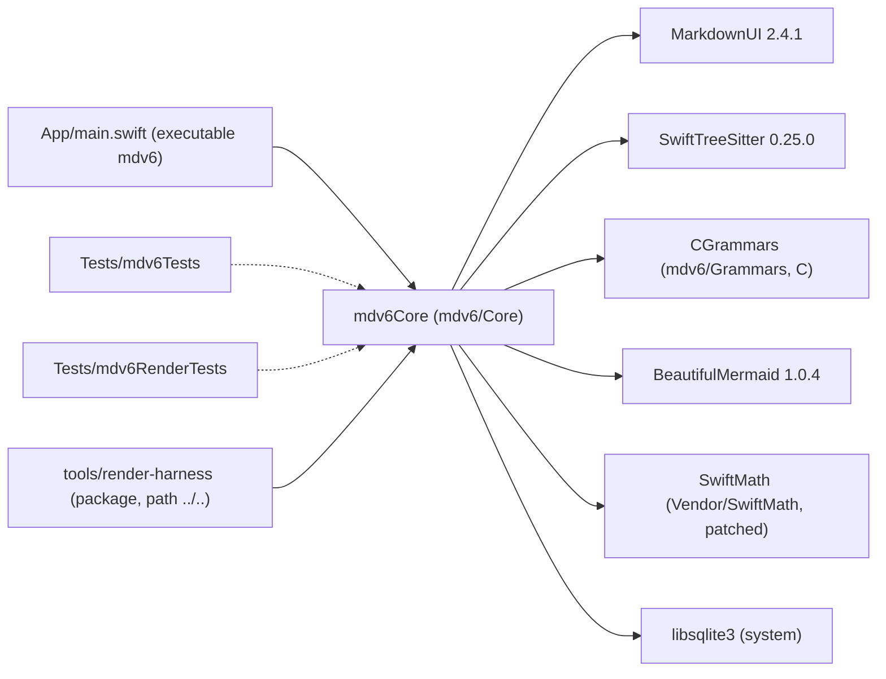
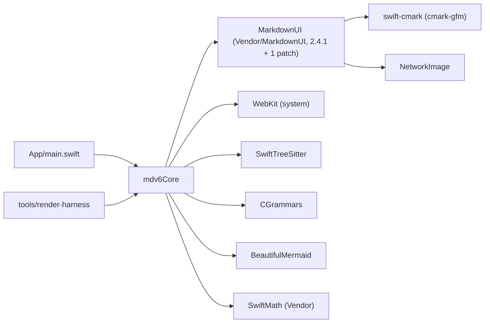

# Implementation plan — mdv6 (implementing `SPEC.md` v0.12.1; amended for v0.14.4 in Part II)

> - **Target:** the `mdv6.app` macOS bundle (SwiftUI + AppKit), its `bin/mdv6` launcher, the `make` targets, the `swift test` suite and the `tools/render-harness` package, satisfying `SPEC.md` v0.12.1 (sha256 `16c9d43727e15c959c7c8deb802160b508d6588364042b7aacf879251c61d4da`, measured with `shasum -a 256` on 2026-09-19) and `TYPOGRAPHY.md` (sha256 `e3a6b1a4882106f26dc9a9dfe5f34ed6a5f41e4e62a60f16edf08cd0d28e52ad`). W0..W7 implemented `SPEC.md` v0.11/v0.11.2; W8 covers the v0.12 addition — line citations (C-19) and the C-02 rule 8 source-line map — re-planned after `SPEC_REVIEW_REPORT.md` (F-126..F-138) was applied as v0.12.1.
> - **Size expectation:** the spec states none. This plan budgets **7,000–9,500 production code lines** (~55 files, comments and blanks excluded, vendored code excluded) plus 3,000–4,500 test lines and 600–900 non-source lines (`build.sh`, `Makefile`, `bin/mdv6`, `Info.plist`, CI workflow, manifest, `tools/speccheck.sh`).
> - **Method:** red-green-refactor over the §9 test groups, one wave at a time; verification apparatus (metrics, harness, fixtures, reference images) before the feature it guards; `SPEC.md` never edited by a wave (a spec defect becomes an `F-nnn` in the build report).

---

## 1. Verdict

One SwiftPM package at the repository root with a library target `mdv6Core` (path `mdv6/Core`) that holds every contract, pipeline, session rule and view; a thin executable `mdv6` (`App/main.swift`); a C target `CGrammars` (`mdv6/Grammars`, eleven vendored tree-sitter grammars); a local vendored package `Vendor/SwiftMath`; two test targets (`Tests/mdv6Tests`, `Tests/mdv6RenderTests`); and a second package `tools/render-harness` that depends on the root package by path and links `mdv6Core` (R-39 "links, never copies"). The order is: a runnable ad-hoc-signed bundle first (W0), then the spec's pure contracts and its own metrics as code (W1 — C-02, C-07.1/.3, C-08, C-10, C-11, C-12, §7.1, §7.2, C-17's $q$, K-16's rhythm gap), then persistence (W2), then the trust boundary and the three renderers behind it (W3 — `ContentLimits` and `RemoteImageLoader` land in the same wave as, and are called before, every parser), then the article and the harness that renders it (W4 — the visual oracle wave), then the headless session (W5), then the window chrome (W6), then proof (W7). Three decisions carry the plan: **(a)** `DocumentSession` is a headless, testable object that owns the §3.1 state machine, find, navigation stacks and the placeholder, so every §9.4 rule has a `swift test` case before a view exists; **(b)** the harness renders through the same `ArticleBlockView` the window uses, hosted in an offscreen `NSHostingView`, so T-45/T-46 measure the product and not a copy; **(c)** chrome is one file of views (`SidebarViews.swift`) over one file of theme-independent rules and metrics (`ChromeModel.swift`), so I-015 is a property of the code's shape. The plan refuses to: copy pipeline code into the harness, treat any optional row as skippable, edit `SPEC.md`, or let the harness's own goldens certify the look. Expected landing: ~8,000 production code lines. The shortcut that fits in ~5,500 drops the C-18 chrome (headers, badges, reveal-on-click search, context menus, stripe) and the harness's `--check` metrics — the exact subsystems D-40 records as the ones prior recreations lost; they are not dropped.

## 2. What the evidence says (this is not a greenfield guess)

The starting tree holds only `SPEC.md` (920 lines), `TYPOGRAPHY.md` (215 lines) and four reference screenshots; there is no code, no `Package.swift`, no git history before this plan's first commit (`b117d9f`). No prior build of this spec is in the working directory, and by the user's instruction sibling folders are not consulted. The only measured comparables are the ones the `spec-plan` skill records for **v0.8** of this same spec (851 lines, 41 R / 17 C / 13 I / 15 K / 28 E / 43 T): a planned build at **10.0k production code lines / 46 files** with 8.3k test lines, and an unplanned, smaller complete build at **5.4k / 41 files** with 2.6k test lines — the smallest complete build, and this plan's anchor.

| Build | Prod LOC / files | Shape | What ended it |
|---|---|---|---|
| v0.8 planned build (skill record) | 10.0k / 46 | `mdv6Core` + app + harness, 11 waves | conformance report certified from self-generated goldens; shipped headings flush against paragraphs and left-aligned single-line `$$` (D-40) |
| v0.8 unplanned build (skill record) | 5.4k / 41 | same split, no plan | passed §9 of v0.8; panes structurally unlike the original (no headers, badges, active states) — the gap v0.9 made normative |
| this tree | 0 / 0 | — | — |

The systemic failure modes the evidence exposes are orthogonal, and each gets a rule in §6: **(1)** a rendered surface certified by a golden the pipeline produced about itself; **(2)** chrome built from behaviour rows only, with no structural oracle, so the panes lost the original's anatomy; **(3)** a budget treated as a target, doubling the size of a complete build with structure no row asked for.

Environment measured on 2026-09-17: Swift 6.4 (`swift-driver 1.168.6`, Xcode 27.0) on macOS 26.6.2 arm64; `swift-tools-version: 5.9` keeps the Swift 5 language mode. `speccheck 1.6.0` with the Swift adapter; Ollama present but Phase B is to run through OpenRouter (`openai/gpt-4o-mini`, per the user). GitHub reachable: MarkdownUI 2.4.1 (7,630 source lines), SwiftTreeSitter 0.25.0, beautiful-mermaid-swift 1.0.4 (public `MermaidRenderer.parse/layout/render`, `PositionedGraph`, `DiagramTheme`), SwiftMath 1.7.3 (7,411 lines; `MathImage(latex:fontSize:textColor:labelMode:)`, `MTFont.fontBundle` resolves `mathFonts.bundle` from `Bundle.module` — the patch point), and every grammar repository (tree-sitter-swift ships a `*-with-generated-files` tag). Fonts (Alegreya, Besley, OpenDyslexic; all OFL) must be fetched and vendored under `mdv6/Fonts`. No Developer ID identity, no notary profile and no `vX.Y.Z` tag exist here, so T-43 has no runnable gate (§6 names the stand-in). A window server is present (interactive user session), so the observed tests can be driven; screen-capture permission is checked before W7 starts.

## 3. Shape

```mermaid
flowchart LR
  App["App/main.swift (executable mdv6)"] --> Core["mdv6Core (mdv6/Core)"]
  Core --> MUI["MarkdownUI 2.4.1"]
  Core --> STS["SwiftTreeSitter 0.25.0"]
  Core --> CG["CGrammars (mdv6/Grammars, C)"]
  Core --> BM["BeautifulMermaid 1.0.4"]
  Core --> SM["SwiftMath (Vendor/SwiftMath, patched)"]
  Core --> SQL["libsqlite3 (system)"]
  UT["Tests/mdv6Tests"] -.-> Core
  RT["Tests/mdv6RenderTests"] -.-> Core
  RH["tools/render-harness (package, path ../..)"] --> Core
```

*Figure 3 — target graph: the module split R-37 and R-39 require (tests `@testable import mdv6Core`; the harness links the pipeline), with the dependencies of §10.*

- **Why this split is mandated.** §9.0: "The app code is the library target `mdv6Core` with a thin executable (`App/main.swift`), so the tests `@testable import mdv6Core` and the harness links the pipeline instead of copying it; `Database(url:)` and `AppModel.bootstrap` inject the store and defaults." R-39: the harness "links the application's pipeline code rather than copying it". K-01: no Xcode project.
- **Literal filenames.** §11's "where realized" column names these files, and they are created under `mdv6/Core/` with exactly these names: `ParsedDocument.swift`, `Database.swift` (+`FTSQuery`), `Anchors.swift`, `SmartTypography.swift`, `HeadingSlug.swift` (`headingSlug`), `Sections.swift` (`sectionRange`, `stripInlineMarkdown`), `MathMarkdown.swift`, `MathSymbols.swift`, `MathImageCache.swift`, `MathSpec.swift`, `MDVMermaidPipeline.swift`, `MDVMermaidDiagramView.swift`, `MermaidCodeBlockChrome.swift`, `CodeRenderer.swift`, `CodeLanguage.swift`, `CodeBlockChrome.swift`, `ContentLimits.swift`, `ImageLoading.swift`, `ImageProviders.swift`, `ThemeManager.swift` (+`MDVTheme`), `HistoryManager.swift` (+`HistoryEntry`), `BookmarksManager.swift`, `PlaceholderStore.swift`, `HelpManager.swift`, `FileWatcher.swift`, `Diagnostics.swift`, `DocumentSession.swift`, `AppModel.swift`, `mdv6App.swift`, `DocumentRootView.swift`, `ArticleView.swift` (+`ArticleBlockView`), `SidebarViews.swift`, `ChromeModel.swift` (`ChromeMetrics`, `ChromeOpacity`), `DocumentRenderer.swift`, `RenderMetrics.swift` (`PixelCompare`, `RhythmMetric`, ink), `WindowAccessor.swift`. Grammar sources live under `mdv6/Grammars/<lang>/` with `mdv6/Grammars/README.md` pinning commits; queries under `mdv6/Queries/<lang>-highlights.scm`.
- **Headless/purity rule.** `mdv6Core` never reads `UserDefaults.standard`, `Bundle.main`, `NSScreen.main`, the clock or the home directory ambiently below the session layer: `AppModel.bootstrap(supportDir:defaultsSuite:)` injects the store URL and the defaults suite (`MDV6_SUPPORT_DIR`, `MDV6_DEFAULTS_SUITE`, §10); renderers take `width`, `scale`, `theme`, `zoom` as parameters (I-001); `Database(url:)` takes its file. The only network path is `RemoteImageLoader` (C-16).
- **Layer direction (one way, no cycles):** contracts (`ParsedDocument`, slugs, sections, anchors, typography, `MathMarkdown`, `FTSQuery`, `ContentLimits`, `MDVTheme`, metrics) → pipelines (`CodeRenderer`, `MathImageCache`, `MDVMermaidPipeline`, `ImageLoading`) → services (`Database`, `HistoryManager`, `BookmarksManager`, `PlaceholderStore`, `FileWatcher`, `HelpManager`, `Diagnostics`) → session (`DocumentSession`, `AppModel`) → views (`ArticleView`, `SidebarViews`, `DocumentRootView`, `mdv6App`) → harness (`DocumentRenderer`, `tools/render-harness`).
- **Visual oracle.** `reference/MDV-ORIGINAL-SEVILLA.png` and `reference/MDV-SCREEN.png` (structure, C-18.0), `TYPOGRAPHY.md` (values), and the measured checks the harness carries: the K-16 rhythm band $v \le g \le v + 0.6f$ with the single-`Markdown`-view rendering as the oracle (T-45), the centred display-math bounding box within 2 pt and the `.display` height (T-46), the §7.1 ink ratio (T-17), the C-17 pixel fraction $q \le 0.001$ (T-13/T-19). These land in W1 (metrics) and W4 (harness) so W6 is gated on them; the observed tests T-44/T-47/T-48 are driven on screen in W7 against the reference images, and a golden the harness writes is a regression guard only.

## 4. Order (waves; each ends at a gate, not at a file count)

1. **W0 Runnable bundle** — `Package.swift` (targets above, `linkerSettings` for sqlite3), `Vendor/SwiftMath` vendored at 1.7.3 with its four patches and `README.md` inventory (I-011), the eleven grammars vendored with `mdv6/Grammars/README.md` (K-05, R-38), fonts vendored, `mdv6/Info.plist` + `mdv6.entitlements` (C-01, K-02), `build.sh` (C-13, K-12), `Makefile` (§5.3, R-34 exact-tag gate), `bin/mdv6` (§5.2, R-33), `.github/workflows/build.yml` (R-37), `App/main.swift` with an `mdv6App` that shows one window, one stub test per §9 group, `tools/speccheck.sh`. Gate: `swift build` exit 0; `make` produces `build/mdv6.app` and `codesign --verify --deep --strict build/mdv6.app` exit 0; `bin/mdv6 --version` prints `1.0.0`; `bin/mdv6 nope.md` exit 1 with the R-33 message; `make dist` on the untagged HEAD exits non-zero before any build step; `swift test` runs. Discharges T-01, T-02, T-03 (launcher clauses), R-33, R-34, C-01, C-13, K-01, K-02, K-11 (negative), K-12, I-011 (inventory), T-34.
2. **W1 Pure contracts and the spec's metrics** — `ParsedDocument` (C-02), `headingSlug` (C-11), `sectionRange`/`stripInlineMarkdown` (C-12), `bookmarkFingerprint`/`resolveBookmarkAnchor` (C-08), `smartenMarkdown` (C-10), `FTSQuery` (C-03 construction), `MathMarkdown.rewrite`/`plainText` (C-07.1/C-07.3), `MathSymbols.preprocess` (C-07.2 rewrites), `MDVMermaidPipeline.sanitize`/`mergeStateDescriptions`/`normalizeColors` (C-06.1), `ContentLimits` (K-14, E-28 messages), `ZoomStep` (R-30 formula), `ColumnWidth` (§7.2), `RenderMetrics` (§7.1 ink, C-17 $q$, K-16 ink-row gap), `HistoryEntry` codec (C-15), `MDVTheme` + nine themes + `CodePalette` (C-09, K-10, `TYPOGRAPHY.md`), `CodeLanguage.resolve` and the prompt-aware set (C-05), `Diagnostics` (R-35). Gate: `swift test --filter mdv6Tests` exit 0 with the unit groups T-07, T-10, T-14, T-15, T-16, T-20, T-22, T-24 (query), T-26 (unit clauses), T-30 (ranges), T-39 (split) green and each formula's degenerate case asserted.
   *This wave is here because every later wave measures itself against these functions; a metric written after the feature asserts names, not behaviour.*
3. **W2 Persistence and history** — `Database` (C-03 schema + triggers, C-08 tables, `meta`/`migrate()` in one transaction, FULLMUTEX/WAL/NORMAL — I-006, I-007, E-12), `HistoryManager` (R-20, R-26, I-013, K-03, C-15), `BookmarksManager` (R-27 store, reorder, remove, five slots), scroll positions (R-06 store side, C-08 validity), `PlaceholderStore` (R-28 in-memory), `AppModel.bootstrap` with `MDV6_SUPPORT_DIR`/`MDV6_DEFAULTS_SUITE` (§10). Gate: `swift test --filter PersistenceTests` exit 0 — T-24 (index/search/tie order/E-24), T-25 (cap, eviction prune, no duplicates, decode), T-26 (store clauses), T-28 (scroll validity), T-33 (corrupt file, crash-safe rows), T-42 (C-04 fallbacks).
4. **W3 Trust boundary and renderers** — `ImageLoading` (`RemoteImageLoader` C-16, `ImageDecoding` K-14) with a local recording HTTP server test; `CodeRenderer` (C-05 highlighting, cache, plain fallback, `swift`/`sql` R-38); `MathImageCache` + symbol registration (C-07.2, E-10, I-008 bitmap bake); `MDVMermaidPipeline.prepare/rasterize/displaySize` with C-06.2 repairs, C-06.3 document theme, R-15 math nodes, E-01 ownership, E-02 fallback, K-07 caches. Every parser entry checks `ContentLimits` first (R-41, I-002). Gate: `swift test --filter mdv6RenderTests` exit 0 — T-06, T-14, T-15, T-16, T-20, T-37 (capture classes), T-41 (ceilings + HTTP server), plus the pipeline halves of T-13/T-17/T-19.
5. **W4 Article and the render harness (the visual-oracle wave)** — `ArticleView`/`ArticleBlockView` (§3.2 per-block path: math rewrite → smarten → MarkdownUI with `markdownTheme` from `MDVTheme`, image providers, `MathDisplayView`, code and Mermaid chrome, heading rules, `blockInset` = $\max(\text{bottom}_i,\text{top}_{i+1})$ — I-014/C-18.10, find tint and inline highlight rendering, hovered-block stripe, heading click/copy affordance hooks), `DocumentRenderer` (offscreen hosting at width/scale/theme, `Options.singleView`), `tools/render-harness` (C-17's three invocations, exits, JSON records), `test-docs/` corpus (`syntax.md`, `code.md`, `math.md`, `images.md`, `links.md`, `links-sibling.md`, `tables.md`, `thematic-break.md`, `mermaid/*.mmd`, `render-cases.json`, goldens). Gate: `swift run --package-path tools/render-harness render-harness --scan test-docs/mermaid --output-dir "$TMPDIR/mdv6-scan"` exit 0 with E-02 cases `fallback` and the rest `pass`; `--check test-docs/render-cases.json` exit 0 including `--case mermaid-math-ink` and `--case sequence-layout`; `swift test --filter RhythmAndDisplayMathTests` exit 0 (T-45, T-46). Discharges R-39, C-17, T-13, T-17, T-19, T-45, T-46, I-005, K-13.
6. **W5 Headless session** — `DocumentSession` (§3.1 states; R-01 adding/selecting routes; R-02 directory; R-03 drop; R-04 read/decode/split; R-05 watcher hookup with the E-21 rules; R-06 restore/persist; R-18 stacks and drop-on-removal; R-19 resolve-then-classify + fragments; R-22 `copySection`; R-24 find model with `shouldInlineHighlight`; R-27/R-28 anchor and title rules; R-40 startup; E-29 `tocSelectedBlock`), `FileWatcher` (FSEvents on the parent directory, 50 ms latency, no deferral), `HelpManager` (R-31), editor launch (R-23), `AppModel.startup/register`. Gate: `swift test --filter SessionTests` exit 0 — the headless clauses of T-04, T-22, T-23, T-25, T-27, T-28, T-29, T-39, T-40 (routing model), T-38 (help copy); every §3.1 transition has a test.
7. **W6 Window chrome** — `mdv6App` (menus and shortcuts of §5.1, key-window addressing E-26, open events, `NSWindow.isRestorable = false` E-30, CLI install alert flow, zoom HUD, `NSAlert`s of C-14), `DocumentRootView` (C-18.1 title/strip/colour scheme, C-18.2 toolbar, three panes with 8 pt handles and the collapse chevron), `SidebarViews` (C-18.3 headers, C-18.4 reveal-on-click search, C-18.5 history rows, C-18.6 hits, C-18.8 TOC rows, C-18.9 bookmark and placeholder rows with both context menus), `ChromeModel` (`ChromeMetrics`, `ChromeOpacity`, the enablement and reorder rules of T-48 as pure functions), find bar, global search UI, inspector width/bookmark height drags (K-04). Gate: `swift build` exit 0; `swift test --filter ChromeModelTests` exit 0 (T-48's menu order, enablement and reorder; C-18 metrics table; theme-independence I-015 as a rule over `MDVTheme.all`); `make` exit 0 and the app launches on `test-docs/math.md` with an isolated store.
8. **W7 Prove it** — the live pass (T-44, T-47, T-48 driven on screen against `reference/`, isolated store seeded from `test-docs/fixtures/`, screenshots under `build/observed/` opened and compared), the remaining manual §9.2/§9.4 checks (T-05, T-08, T-09, T-11, T-12, T-21, T-31, T-35, T-36, T-38), `README.md` written from the built surface, `swift test --xunit-output`, speccheck Phase A (`--judge mock --strict`) then Phase B (`--judge llm --strict` via OpenRouter `openai/gpt-4o-mini`), the §11 walk from `speccheck.json`, `SPEC_BUILD_REPORT.md` with the wave ledger and the verdict.
9. **W8 Line citations** — `ParsedDocument.split` + `blockLines`/`lineCount` (C-02 rule 8, I-004), `LineCitation` (C-19.1 grammar, C-19.2 normalisation, C-19.3/E-31 resolution), `DocumentSession.handleLink`'s citation dispatch (R-19 precedence over slug matching, R-18 no same-document snapshot, C-19.4 no TOC selection, C-19.5 scope limit), the `copySection`/citation shared `flashBlocks` (K-06). Gate: `swift build` exit 0; `swift test` exit 0; `speccheck check … --judge mock --strict` with C-19, E-31, T-49 and T-50 no longer `UNCITED`, 0 dangling, 0 stale; T-49's scroll-and-flash half observed on screen on `test-docs/links-sibling.md`. Discharges C-02 rule 8, C-19, R-18, R-19, E-31, E-06 (the no-op path), E-29, C-18.8, I-004, D-44, T-49, T-50. Brief: `DETAILED_IMPLEMENTATION_PLAN_W8.md`.

## 5. LOC budget (production source, excludes vendored code)

| Slice | Files | LOC |
|---|---|---|
| Package, app entry, `Info.plist`, entitlements (W0) | 4–5 | 150–250 |
| Pure contracts: split, slug, sections, anchors, typography, math rewrite/plain, FTS query, limits, zoom, column, metrics, history codec, themes, language table, diagnostics (W1) | 15–17 | 1,900–2,400 |
| Persistence: `Database`, history, bookmarks, placeholder, bootstrap (W2) | 5–6 | 700–900 |
| Renderers and trust boundary: image loading/decoding, code, math cache, Mermaid pipeline (W3) | 7–8 | 1,500–1,900 |
| Article views, `DocumentRenderer`, harness `main.swift` (W4) | 8–9 | 1,200–1,600 |
| Session: `DocumentSession`, `FileWatcher`, `HelpManager`, `AppModel` (W5) | 4–5 | 900–1,200 |
| Chrome: `mdv6App`, `DocumentRootView`, `SidebarViews`, `ChromeModel`, find bar, search, HUD (W6) | 6–7 | 1,100–1,500 |
| Line citations: `LineCitation`, the C-02 rule 8 map, `handleLink` dispatch (W8) | 2 | 120–200 |
| **Total** | **~52–57** | **7,450–9,750** (stated as 7,000–9,500 after the W4/W6 overlap is removed) |
| Tests (separate; not "the program") | 16–20 | 3,000–4,500 |
| `build.sh`, `Makefile`, `bin/mdv6`, CI, `render-cases.json`, `tools/speccheck.sh`, grammar/vendor READMEs | — | 600–900 |

Anchors: the smallest complete build of v0.8 (5.4k / 41 files, skill record) is the primary anchor; v0.11 adds the chrome section (C-18, ~1,000 lines the v0.8 builds did not have), `ContentLimits`/C-16 (~300), the C-17 `--check` metrics (~250), and Swift/SQL grammars (no Swift lines). Slices above twice their v0.8 counterpart: none by design — the contracts slice is the largest because the spec's formulas are code, and `SidebarViews` is one file by rule (I-015), not many. Two rules: if the estimate approaches the ceiling, decompose the expensive slice (split `DocumentSession` into find/navigation/lifecycle files) — never drop a subsystem to fit the number; and **the budget is an estimate, never a floor** — a build landing under it has lost nothing unless §11 says so, and code above the 5.4k anchor is named in the report as added structure.

## 6. Rules that make the observed failures impossible

| Prior failure | Structural rule |
|---|---|
| A rendered surface certified from goldens the pipeline produced (v0.8 planned build: flush headings, left-aligned `$$`) | The K-16 rhythm oracle is the single-`Markdown`-view rendering, and the T-46 oracle is a measured centre and the `.display` height — `RenderMetrics` is written in W1 with synthetic inputs, the harness in W4 compares against it, and `render-cases.json` goldens are labelled `metric: pixel` regression guards only. Checked at the W4 gate and again in W7's report, which states for every visual claim which of the three oracles (reference image, measured quantity, person) it rests on. |
| Chrome built from behaviour rows with no structural oracle (both v0.8 recreations) | `ChromeModel.swift` holds every C-18 metric, opacity, state and menu rule as data over `MDVTheme`; `SidebarViews.swift` is the only file that draws a pane and reads only `ChromeModel`; `ChromeModelTests` iterate `MDVTheme.all` (I-015). W6 cannot close without W7's on-screen comparison against `reference/MDV-ORIGINAL-SEVILLA.png`, pane by pane, recorded per T-44 clause. |
| Budget treated as a target (10.0k vs 5.4k for one spec) | §5 anchors on the smallest complete build; every wave document's budget is a ceiling; the build report names code above the anchor as added structure. No injectable configuration for spec constants — constants are `static let`s named after the spec symbol. |
| Harness copying pipeline code (R-39) | `tools/render-harness/Package.swift` depends on `mdv6Core` by path; the harness target contains only `main.swift` (argument parsing, exit codes, JSON records). `DocumentRenderer` lives in `mdv6Core`. Checked by inspection at the W4 gate: `wc -l tools/render-harness/Sources/render-harness/*.swift` is one file. |
| A parser reached before its ceiling (I-002, R-41) | `ContentLimits` is W1; W3's `prepare`, `typeset`, `decode`, `readDocument` each begin with the applicable `ContentLimits.check…` call; T-41 asserts, at the ceiling and one unit above, that the parser is not invoked (a counting hook on the pipeline entry). |
| Multi-window commands acting on every window (F-042 history) | Every menu command is a `Notification` whose `userInfo` carries the target `NSWindow` (`NSApp.keyWindow` at post time); `NotificationHandlers` in `DocumentRootView` ignore notifications not addressed to their window; `SessionTests` assert the routing model with two sessions (T-40 headless half). |
| Self-certifying wave commits ("green" over a failing test) | One agent per wave in sequence; the gate is re-run in full immediately before the wave's commit; the commit body carries the gate command and its exit code; the ledger in `SPEC_BUILD_REPORT.md` is filled from `git log`, not from memory. No scratch or probe file is written under `mdv6/`, `App/`, `Tests/` or `tools/`; probes go to the scratchpad directory. |
| Unverified digests | Every digest and count in this plan and its wave documents was computed in this session (`shasum -a 256`, `wc -l`, `cloc`-equivalent `grep -cv`); the build report recomputes them. |

**Live verification (the last wave).** T-44, T-47 and T-48 can only be verified by driving `build/mdv6.app` on screen. Commands: `make` → `MDV6_SUPPORT_DIR="$TMPDIR/mdv6-observed" MDV6_DEFAULTS_SUITE=mdv6.observed open -a build/mdv6.app test-docs/math.md` after seeding the isolated store with the T-44 fixture (four bookmarks, one placeholder, Sevilla), then `screencapture -l <windowid> build/observed/T-44-sevilla.png` (and Charcoal, Twilight), plus the T-47 title sequence and the T-48 stripe/menus, each captured and **opened by a person**. Artifacts: `build/observed/*.png`, the isolated `mdv6.db` read after quit, the `mdv6_history` value of the isolated suite.

- **Prerequisites, named now.** An unlocked interactive console (`launchctl managername` prints `Aqua`); screen-recording permission for the terminal (`screencapture -x "$TMPDIR/probe.png"` produces a non-black image); a built bundle; the isolated-store variables honoured by `AppModel.bootstrap`. Checked at the start of W7, before any screenshot is attempted.
- **A stand-in for each prerequisite.** No screen capture: hosted-window snapshots written with `NSWindow.contentView.bitmapImageRepForCachingDisplay` from a `swift test` case (`ChromeSnapshotTests`) to `build/observed/` and opened by a person — covers the static clauses of T-44 (headers, rows, badges, placeholder row, toolbar glyphs, title) but not the hover chevron, the reveal animation or the stripe's appearance/disappearance; the harness's document renders compared to `reference/MDV-SCREEN.png` for the article region; the isolated store read after a quit for the T-48 persistence clause. Locked console: the wave stops and the report says so.
- **The downgrade rule.** What the stand-ins cannot reach stays *verification pending* in `SPEC_BUILD_REPORT.md` and blocks a `PASS` verdict — the verdict is `VERIFICATION PENDING`, never `PASS`, while any observed T-nn clause is unobserved. T-43 (Developer ID signing, notarisation, a `v1.2.3` tag) has no identity, profile or tag on this host: its stand-in is T-02 (the negative gate) plus a `make -n dist` dry run showing the target chain; T-43 is recorded as *verification pending: no signing identity*. T-32 (idle CPU on an otherwise idle `macos-15` host) is measured on this host and reported with the host named; if the host is not idle the row is pending.

## 7. One fork, then action

**Fork — release provenance gates that this host cannot run (T-43, and Phase B's judge): build the full `make dist` chain and the Phase B invocation as specified, run every gate that *can* run here (T-02 negative gate, `make -n dist`, Phase A, Phase B through OpenRouter `openai/gpt-4o-mini`), and record T-43 as *verification pending: no Developer ID identity, notary profile or tag on this host* — recommended — rather than blocking the build until a signing identity and a tagged release checkout are supplied.** Rationale: T-43 proves only the signing/notarisation half of R-34/K-11; the exact-tag gate, the artefact naming and the target chain are all verifiable without credentials, and a pending row is honest where a fabricated one is not. The alternative — pausing W0 until `TEAM_ID`, `CERT_NAME` and `NOTARY_PROFILE` are supplied and a `v1.2.3` tag exists — costs the whole build's schedule for one row, and the row can be closed later by re-running `make dist` on a tagged checkout with the credentials, with no code change. In both branches the ordering, the budgets and the §6 rules are unchanged; only the T-43 row's status in the report differs.

**Next concrete action:** W8 — add `ParsedDocument.split`/`blockLines`/`lineCount`, `LineCitation`, and the citation dispatch in `DocumentSession.handleLink` test-first per `DETAILED_IMPLEMENTATION_PLAN_W8.md`; done looks like `swift test` green, `speccheck … --judge mock --strict` with 0 uncited among C-19/E-31/T-49/T-50 and 0 dangling/stale, the `test-docs/links-sibling.md` flash seen on screen — then `git commit -m "feat(mdv6): W8 — line citations"`.

---

# Part II — the v0.14 delta (W10–W15), planned against `SPEC.md` v0.14.4

> - **Target:** the rows `SPEC.md` v0.14.4 §11 marks *not yet realised* for this tree — R-44…R-51, C-20…C-22 (with the sub-contracts C-05.1, C-06.4, C-06.5, C-09.1), I-016…I-018, K-17…K-19, E-32…E-38, T-52…T-62 — and the v0.14.x amendments to already-realised rows (R-01, R-04, R-06, R-08, R-09, R-10, R-11, R-16, R-24, R-26, R-27, R-28, R-34, R-35, C-01, C-02 rule 9, C-04, C-06.1 rule 0, C-12 step 0, C-13, C-17, I-001, I-003, E-02, E-26, K-07, §3.1, §5.1). `SPEC.md` sha256 `2c193583d1f807d7e73310263e67deed22eb7f8808b49102f11e2b727ad59fdc`, `TYPOGRAPHY.md` sha256 `e3a6b1a4882106f26dc9a9dfe5f34ed6a5f41e4e62a60f16edf08cd0d28e52ad` (both `shasum -a 256`, 2026-09-27); `reference/ORIGINAL-{FRONTMATTER,GANTT,DIFF,RAW-HTML-IMAGES,PRINT-MATH}.png` as the spec ships them.
> - **Size expectation:** the spec states none. This part budgets **1,900–2,900 production code lines** (~12 new files, ~14 edited; vendored MarkdownUI excluded) plus 1,000–1,600 test lines and 60–120 non-source lines (`build.sh`, `Package.swift`, `.gitignore`, `render-cases.json`).
> - **Method:** unchanged from Part I — red-green-refactor over the §9 groups, one wave at a time, apparatus before the feature it guards, `SPEC.md` never edited by a wave (a spec defect found while building becomes an `F-nnn` in `SPEC_BUILD_REPORT.md` and a separate `fix(spec):` commit).

## II.1 Verdict

The delta lands as six waves on the existing `mdv6Core` shape, with no new target except the vendored `MarkdownUI` (I-016 requires it; D-49). The order is:

- **W10:** pure contracts first — the frontmatter span and rows, C-02 rule 9 and the BOM strip, the C-05.1 diff classifier, the C-06.4 dispatch and C-06.1 rule 0, the C-22.1 rewrite and C-22.2 size function, C-12 step 0, the C-09.1 style table, and the K-18, R-48 and C-21.1 formulas as functions. Every later wave is measured against these.
- **W11:** the vendored MarkdownUI with its one patch, then the renderers that need no session — diff tint, `mdv6-img` block and inline providers, the properties table, find typography.
- **W12:** the session and window commands — R-44's block-0 rules, Close File / Window / All, Next / Previous File, keyboard scrolling, frontmost-window routing, the zero-window state.
- **W13:** the Mermaid web path behind its trust boundary.
- **W14:** printing, with its harness oracle landing first inside the wave.
- **W15:** the observed pass against the five `ORIGINAL-*` references, the README and Help rewrite, the §11 walk and the report.

Three decisions carry the plan:

- **(a)** Every parser-shaped rule is a pure function with a unit test before any view calls it, so T-52/T-54/T-58/T-59/T-60's unit halves gate W10 and the views in W11–W14 only compose them.
- **(b)** The web renderer's trust boundary — load refusal, `securityLevel: 'strict'`, `logLevel: 'fatal'`, the SHA-pinned script — lands in the same wave as, and before, the view that loads the page (I-001, I-003).
- **(c)** Print is verified through the harness (`--print-pdf` with per-block JSON) and not through the print panel, so T-53's eight scripted assertions are the oracle and the panel is the observed half.

The plan refuses to:

- copy the original's source (the spec's *Sources* line: "none of the original's source is used");
- treat the manual halves of T-52…T-61 as done without the W15 look;
- change C-18.7's no-stripe-on-fences rule (D-54 is unconfirmed).

Expected landing: ~2,300 production code lines. The shortcut that fits in ~1,400 drops the print pipeline's inline-formula overlay (C-21.4) and the web view's host integration (C-06.5) — exactly the two clauses the eighth and ninth reviews had to add; they are not dropped.

## II.2 What the evidence says

| Build | Prod code lines / files (this delta's features only) | Shape | What ended it |
|---|---|---|---|
| the original at `68aa008` (`tqbf/mdv`) | 1,735 in 7 new files (`grep -cv '^\s*$\|^\s*//'`: `PrintController` 741, `MermaidWebRenderer` 346, `Frontmatter` 223, `RawHTMLImages` 162, `FrontmatterView` 90, `DiffHighlighter` 89, `ScrollKeyMonitor` 84) + ~520 in edits (`git diff --numstat c1577a6..68aa008`: 872 lines added to `ContentView`, `mdvApp`, `ThemeManager`, `MathRenderer`, `MermaidRenderer`, `CodeRenderer`, roughly 60 % code) ≈ **2,250**; vendored MarkdownUI 7,756 raw lines | features grafted onto one 3,600-line `ContentView` | shipped; the spec reviews found a privacy hole (inline remote `` fetched outside the gate, D-51), an unaddressed Close All (D-50), flat print rhythm (F-160), and a TEMP self-test hook left in the product |
| this tree at `655f86e` | 5,949 in 53 files under `mdv6/Core` + `App`; 3,160 test lines; 173 tests | `mdv6Core` library, thin app, harness package | green: `swift test` 173/0; speccheck Phase A `175/210`, the 35 uncited ids exactly the v0.14 set |

**Measured starting state.** `swift build` 10.6 s and `swift test --parallel` 41.8 s on this host. `speccheck 1.20.0`. No `Vendor/MarkdownUI`, and `mdv6/mermaid.min.js` absent. `mdv6/mermaid.LICENSE.txt` is present (v0.14.2). `mdv6AppDelegate.applicationShouldTerminateAfterLastWindowClosed` returns `true`, which R-47 and E-38 contradict.

**A stale spec row.** §11, and the new *Status* line, still mark C-19/E-31/T-49/T-50 *not yet realised*, but W8 (`e61c60f`) built them and speccheck reports them `PASSING`. This is a spec defect for W15's `fix(spec):` commit, not work.

The systemic failure modes are the Part I set, plus two the reviews of this very delta exposed:

- **(4)** A rule added in one place whose reach nobody checked. F-153, F-173 and F-174 were all "a new clause overrides a row that does not know". A wave that edits a function must grep for every row citing it.
- **(5)** A test oracle written without running it on its fixture: F-175 and F-176.

## II.3 Shape

```mermaid
flowchart LR
  App["App/main.swift"] --> Core["mdv6Core"]
  Core --> MUI["MarkdownUI (Vendor/MarkdownUI, 2.4.1 + 1 patch)"]
  MUI --> CM["swift-cmark (cmark-gfm)"]
  MUI --> NI["NetworkImage"]
  Core --> WK["WebKit (system)"]
  Core --> STS["SwiftTreeSitter"]
  Core --> CG["CGrammars"]
  Core --> BM["BeautifulMermaid"]
  Core --> SM["SwiftMath (Vendor)"]
  RH["tools/render-harness"] --> Core
```

*Figure II.3 — the target graph after W11: `MarkdownUI` moves from a package product to a vendored target (I-016, D-49), and WebKit joins for R-46.*

**New files** (named as §11's v0.14 rows name them):

| File | Contents | Wave |
|---|---|---|
| `mdv6/Core/Frontmatter.swift` | `frontmatterSpan`, `frontmatterRows`, `FrontmatterRow` (C-20.1/.2) | W10 |
| `mdv6/Core/FrontmatterTableView.swift` | C-20.3 | W11 |
| `mdv6/Core/DiffHighlighter.swift` | C-05.1 classify + render | W10 classify, W11 render |
| `mdv6/Core/MermaidDispatch.swift` | C-06.4 | W10 |
| `mdv6/Core/RawHTMLImages.swift` | C-22.1, `HTMLImageSpec`, C-22.2 size | W10 |
| `mdv6/Core/FindBlockStyle.swift` | C-09.1 | W10 |
| `mdv6/Core/ScrollKeys.swift` | K-18 step math W10, `ScrollKeyMonitor` W12 | W10, W12 |
| `mdv6/Core/MermaidWebView.swift` | C-06.5 on screen, `MermaidWebRenderer` for print | W13 |
| `mdv6/Core/PrintController.swift` | C-21 | W14 |
| `Vendor/MarkdownUI/**` | upstream `Sources/MarkdownUI` + patch + `README.md` | W11 |

The **layer direction** is unchanged. The new contracts sit in the contract layer. `MermaidWebView` and `FrontmatterTableView` are views. `PrintController` sits beside `DocumentRenderer` in the harness layer, because the harness calls it and the app calls it the same way (R-39 "links, never copies").

**Headless rule** (Part I, unchanged):

- The print type scale, diagram widths and densities are `static let`s named after the spec symbols ($s_p$, $w_d$, $w_\ell$).
- `PrintController` takes the paper size, theme and preferences as parameters, never reading the screen (I-017).
- The web renderer takes the theme and source only.

**Visual oracle.**

- The five `reference/ORIGINAL-*.png` images, as structure (§9.7).
- The measured checks: C-22.2 sizes in points from the harness render of `raw-html-images.md`; C-05.1 colours sampled from the render of `diff.md` against the hex table; T-53's per-block JSON (vector text on `rhythm.md`, no image in an accepted formula's rect, one page per short block, the rhythm gap $s_p \cdot v$ within 1 pt).
- The person's look in W15.

## II.4 Order

**W10 — v0.14 pure contracts.**

*Contents:*
- `Frontmatter.swift` (C-20.1 recognition with the zero-row rule, C-20.2 rows);
- `ParsedDocument` rule 9 (block 0, `blockLines` in whole-document lines, `frontmatter` field);
- R-04's leading-U+FEFF strip in `DocumentSession.readDocument`'s decode helper;
- `DiffHighlighter.classify` (C-05.1);
- `MermaidDispatch` (C-06.4) and C-06.1 rule 0 in `MDVMermaidPipeline.sanitize`;
- `RawHTMLImages.rewrite` / `HTMLImageSpec` / `displaySize` (C-22.1/.2);
- `stripInlineMarkdown` step (0) (C-12);
- `FindBlockStyle` (C-09.1);
- `ScrollKeys.target` (K-18);
- `HistoryStep.target` (R-48, clamp, no wrap);
- `PrintScale` ($s_p$, $w_d$, $w_\ell$ — C-21.1/C-21.3).

*Gate:* `swift test --filter "FrontmatterTests|DiffClassifyTests|MermaidDispatchTests|RawHTMLImagesTests|FindStyleTests|V014FormulaTests|SplitTests|TypographyTests|MermaidSanitizeTests"` exits 0, with every existing test still green.

*Discharges (unit halves):* T-52, T-54, T-56, T-57, T-58, T-59, T-60. *Fully:* C-02 rule 9, C-12 step (0), E-32, E-35 (rewrite clauses), I-018 (split half).

*This wave is here because four reviews found that the v0.14 rules interact. Only pure functions with tests let the later waves compose them without re-deriving the interactions.*

**W11 — vendored MarkdownUI and the block renderers.**

*Contents:*
- **`Vendor/MarkdownUI`:** upstream `Sources/MarkdownUI` from the resolved 2.4.1 checkout (verify revision `5f613358…`). Add the `markdownResolvedInlineImages(_:)` environment hook and a `README.md` patch inventory, both written from the spec's description (I-016, D-49). Declare the target in the root `Package.swift` with swift-cmark and NetworkImage as package dependencies.
- **`CodePalette`:** gains `diffAdd`, `diffAddBg`, `diffRemove`, `diffRemoveBg`, with the C-05.1 table per theme.
- **`CodeRenderer`:** the diff route, a diff flag in the cache key, and the R-08 exception (R-50).
- **`ImageProviders`:**
  - the `mdv6-img` scheme on the block path (C-22.2 caps, `alt`, missing-file text);
  - an inline image provider that loads local and `data:` images against the document directory;
  - C-16 for inline remote images;
  - the inline *Remote image blocked* / *Image failed to load* text images (R-16, C-22.2);
  - baseline placement for non-math inline images.
- **`FrontmatterTableView`:** C-20.3.
- **`ArticleBlockView`:**
  - block 0 renders the table or nothing (R-44 view half), taking no height, padding or spacing when hidden;
  - the §3.2 order `` → math → smart typography;
  - C-09.1 find typography;
  - R-24's verbatim header path.

*Gate:*
1. `swift test --filter "CodeRendererTests|ImageLoadingTests|ArticleTests|VendorMarkdownUITests"` exits 0.
2. `swift run --package-path tools/render-harness render-harness test-docs/raw-html-images.md --output "$TMPDIR/raw.png"` exits 0, and the C-22.2 sizes are measured in `ArticleTests`.
3. `diff -r` against the pristine checkout shows only the inventoried files (T-62).

*Discharges:* R-50, R-51 (render), R-16 amendment, R-08 amendment, C-05.1 render, C-09.1, C-20.3, C-22.2, I-016, T-62. *Halves of:* T-52, T-58, T-59, T-60.

**W12 — session and window commands.**

*Contents:* all in `DocumentSession`, `AppModel`, `mdv6App`, `DocumentRootView`, `WindowAccessor` and `Preferences`.

- **Preferences (C-04):** `mdv6_show_frontmatter`, with the View · *Show Frontmatter* toggle.
- **R-44 session rules:** the hidden header is not an anchor; a block-0 bookmark or placeholder is titled `Frontmatter`; a header-only document beeps on ⌘D and ⌘⇧0. Carried into `BookmarkTitle` and the R-27/R-28 anchor selection.
- **R-47:**
  - `closeFile` goes through the delete path without persisting a scroll position (R-06 exception) and without pushing a snapshot;
  - *Close Window* replaces the system Close;
  - *Close All* shows its confirmation dialog, cancels in-flight loads, and puts every session into `EMPTY` (E-36, E-26 exception).
- **R-48:** *Next File* / *Previous File*, their enablement, and ⌃⇥ / ⌃⇧⇥ through a local key monitor that consumes only Control-Tab.
- **R-49:** `ScrollKeyMonitor` over the article's enclosing `NSScrollView`, with focus ownership per E-37.
- **R-01:** the frontmost-document-window target, and background opens (`NSApp.isActive` guard).
- **R-01 / E-38, the zero-window state:**
  - `applicationShouldTerminateAfterLastWindowClosed` returns `false`;
  - a window is created on demand only when the action has a file;
  - a Dock reopen follows R-40.
- **§5.1 menu rows**, with their enablement.

*Gate:*
1. `swift test --filter "SessionTests|ChromeModelTests|PersistenceTests"` exits 0, with a test for each new §3.1 transition and the two-session *Close All* case.
2. `make` exits 0.
3. The app is launched on an isolated store, and ⌘W / ⇧⌘W / ⌥⌘W / ⇧⌘] / ↓ / End are driven through `tools/observe.sh`'s drive hook, with snapshots written.

*Discharges:* R-47, R-48, R-49, R-01 / R-06 / R-26 / R-27 / R-28 amendments, C-04, E-26, E-36, E-37, E-38, K-18. *Headless halves of:* T-55, T-56, T-57, T-61, T-52.

**W13 — the Mermaid web path.**

*Contents:*

- **`build.sh`:** fetch `mermaid.min.js` 11.4.1 when absent, verify SHA-256 `a43bc1af…` with a hard fail that names both digests, and copy it and `mermaid.LICENSE.txt` into `Resources/` (C-13, C-01, K-19).
- **`Package.swift`:** declares `mermaid.min.js` as a resource.
- **`.gitignore`:** lists `mdv6/mermaid.min.js`.
- **`MermaidWebView`:** the C-06.5 page — escaping, the background as CSS, `strict`, `logLevel: 'fatal'`, the height report after two animation frames plus `ResizeObserver`, the 0.5 pt filter, the 60 pt spinner. It carries the trust boundary first:
  - a `WKContentRuleList` that blocks every URL;
  - a navigation delegate that refuses every navigation except the initial `about:blank` load;
  - no inspectability.

  Host integration:
  - the block menu instead of WebKit's;
  - wheel events forwarded;
  - no first responder;
  - no text selection.

  The message handler is removed when the view is dismantled.
- **The dispatch:**
  - `MermaidCodeBlockChrome` hides the style menu and export on the web path (R-09);
  - `MDVMermaidDiagramView` routes by `MermaidDispatch`;
  - a native failure is not retried on the web (E-02).
- **The harness:** `--scan` reports `web` (C-17), and `render-cases.json`'s `expect` values are updated.

*Gate:*
1. `swift test --filter "MermaidTests|MermaidWebTests|HarnessTests"` exits 0. `MermaidWebTests` loads `gantt.md`'s source in an offscreen `WKWebView` and asserts a positive height, and asserts that a page containing an `` reaches a recording server zero times.
2. `swift run --package-path tools/render-harness render-harness --scan test-docs/mermaid --output-dir "$TMPDIR/scan"` exits 0, with web cases reported `web`.
3. `rm mdv6/mermaid.min.js && ./build.sh debug` exits 0, and a corrupted copy exits 1 with both digests printed.

*Discharges:* R-46, C-06.5, K-19, E-34, the R-09/R-10/R-34/R-35/C-01/C-13/C-17/I-001/I-003/E-02/K-07 amendments. *Unit half of:* T-54.

**W14 — printing.**

*Contents:* `PrintController`, built in this order:

1. **The apparatus first:** `PrintController.renderPDF(document:options:)`, returning the paginated PDF data plus per-block records (`index`, `kind`, `page`, `rect`, `images`, `formulas`), and the harness's `--print-pdf` invocation over it (C-17).
2. **The C-21.1 page:** 54 pt margins, the header and footer on, $s_p$, the fixed print theme, smart typography from the print theme.
3. **C-21.2:** one `ImageRenderer` vector PDF per block; the gap is $s_p$ times the print theme's screen gap (`ArticleBlockView.blockInset`); code soft-wrapped; no remote fetch.
4. **C-21.3:** Mermaid through a native PDF, or the web PDF from an offscreen window never ordered front, with the raster fallbacks and the `text` retag.
5. **C-21.4:**
   - a standalone `$$` block drawn from SwiftMath's vector image;
   - an inline formula or picture drawn into a placeholder slot found by the pixel signature;
   - a rejected span printing its E-10 fallback.
6. **C-21.5:** `adjustPageHeightNew` with `heightAdjustLimit` 0.9.
7. **C-21.6:** the frontmatter table or nothing; a sheet on the target window; presentation from a main-queue callout; a second ⌘P beeps.
8. **The menu:** File · *Print…* ⌘P.

*Gate:*
1. `swift test --filter PrintTests` exits 0: T-53 (1)–(8) over `rhythm.md`, `math.md`, `syntax.md`, the native `test-docs/mermaid/*.mmd` and `frontmatter.md`.
2. `swift run --package-path tools/render-harness render-harness test-docs/math.md --print-pdf "$TMPDIR/m.pdf"` exits 0, with one JSON object per block.

*Discharges:* R-45, C-21, I-017, K-17, E-33, and the scripted half of T-53.

**W15 — Prove it.** The live pass (§II.6) comes first, then:

- `README.md` and `mdv6/Help.md` rewritten from the built surface;
- a `fix(spec):` commit that updates §11 and *Status* for the realised rows, including the stale C-19 marker;
- the §11 walk from `speccheck.json`;
- speccheck Phase A and Phase B;
- `SPEC_BUILD_REPORT.md` with the W10–W15 ledger.

*Gate:* `bash tools/speccheck.sh` exits 0, Phase A at `210/210`, and Phase B is recorded.

## II.5 LOC budget (production code lines; vendored MarkdownUI excluded)

| Slice | Files | LOC |
|---|---|---|
| W10 pure contracts (`Frontmatter`, `DiffHighlighter` classify, `MermaidDispatch`, `RawHTMLImages`, `FindBlockStyle`, `ScrollKeys` math, `ParsedDocument`/`Sections`/sanitize edits) | 6 new, 3 edited | 400–550 |
| W11 renderers (`FrontmatterTableView`, diff render, palettes, image providers, article edits, MarkdownUI patch ≈40) | 1 new, 5 edited | 400–600 |
| W12 session and commands (`DocumentSession`, `AppModel`, `mdv6App`, `DocumentRootView`, `ScrollKeyMonitor`, `Preferences`, `BookmarkTitle`) | 0–1 new, 7 edited | 350–550 |
| W13 web path (`MermaidWebView`, dispatch in chrome/diagram view, harness status) | 1 new, 3 edited | 300–450 |
| W14 print (`PrintController`, harness `--print-pdf`) | 1 new, 2 edited | 450–700 |
| W15 docs and fixes | — | 0–50 |
| **Total** | **~10 new, ~14 edited** | **1,900–2,900** |
| Tests | 7–9 files | 1,000–1,600 |
| `build.sh`, `Package.swift`, `.gitignore`, `render-cases.json` | — | 60–120 |

**Anchor:** the original's same features at ≈2,250 code lines (§II.2). Its `PrintController` alone is 741 code lines, including a TEMP self-test and a content-stream scanner, so W14's 450–700 assumes the scanner (~90 lines) is kept and the self-test is not. `MermaidWebRenderer` at 346 includes a print path, which W14 owns here. No slice exceeds twice its counterpart there.

The two rules of Part I apply unchanged:
- **Decompose, don't drop:** if the estimate approaches the ceiling, decompose `PrintController` into page, overlay and container files — never drop a subsystem.
- **An estimate, not a floor:** landing under the budget loses nothing unless §11 says so.

## II.6 Rules that make the observed failures impossible

| Failure | Structural rule |
|---|---|
| (4) A new clause overrides a row that does not know (F-153, F-173, F-174) | Every wave document's §8 lists the rows that cite each function it edits (from `grep -n` over `SPEC.md`), and each wave's tests include one case per such row. `stripInlineMarkdown` step (0) gets a `BookmarkTitle` and TOC case; `ArticleBlockView`'s inline placement gets an inline-math case asserting math keeps R-12's placement. |
| (5) An oracle written without running it on its fixture (F-175, F-176) | Every scripted assertion is run against its named fixture on the unmodified tree **before** the feature exists, and must fail for the stated reason (red), not because the fixture contradicts the oracle. T-53 (1) uses `rhythm.md`; (2) exempts rejected spans and has (2b). |
| The original's inline remote `` fetched outside C-16 (D-51) | Every image load goes through `DocumentImageView` / the inline provider, and both call `RemoteImageLoader` for `http(s)`. `ImageLoadingTests` asserts, with the recording server, zero requests for the block and inline `` with the preference off. |
| A web view that loads more than its page (I-001, I-003, D-46) | The content rule list and navigation delegate are created in `MermaidWebView.makeNSView` before `loadHTMLString`, and `MermaidWebTests` asserts zero requests to a recording server from a diagram with an `` label and a `click` directive. |
| A TEMP self-test hook left in the product (the original's `MDV_PRINT_TEST`) | Print is exercised only through `PrintController.renderPDF` from the harness and `PrintTests`. No environment-variable hook is added to the app. `grep -rn MDV_PRINT_TEST mdv6` is empty at the W14 gate. |
| The app quits when its last window closes, contradicting R-47 / E-38 | The W12 gate includes a `SessionTests` case over `mdv6AppDelegate.applicationShouldTerminateAfterLastWindowClosed == false`, plus the zero-window drive in W15. |
| A reference image the build did not produce is the only visual oracle for the v0.14 surfaces | W15 compares the running product against `reference/ORIGINAL-*.png` pane by pane, and records each comparison. Harness renders written during W11–W14 are regression guards only. |

**Live verification (W15).** These observed clauses need the running product:

- T-52: table, hide and show, find in a hidden header.
- T-53 (manual half): panel, preview, Save as PDF.
- T-54: web diagrams on screen, right-click menu, wheel, focus, VoiceOver label.
- T-55: the Close dialog, two windows.
- T-56: ⌃⇥.
- T-57: keyboard scrolling to the true top and bottom.
- T-58: colours.
- T-59: sizes and baseline.
- T-60: find typography.
- T-61: `open -g`, zero-window reopen.

Commands:
1. `make`.
2. `tools/observe.sh <name> <file> [--theme ID]` on an isolated store, with the drive hook for keystrokes.
3. `screencapture -l` into `build/observed/`, opened by a person.
4. For T-53, `open` the saved PDF.

- **Prerequisites.** An unlocked Aqua console (`launchctl managername` prints `Aqua`); screen-recording permission (the v0.14.2 references were captured on this host with `screencapture -l`, so it is present); Accessibility is **absent** (AppleScript window resize was refused on 2026-09-27), so key events are driven through the app's existing `WindowAccessor` drive hook, not through System Events. The print panel needs a person, or the drive hook's `runModal` bypass.
- **Stand-ins.** The print panel falls back to `PrintController.renderPDF` output opened by a person (covers the preview and type-scale clauses, not the panel's paper menu). `open -g` activation is covered by `NSApp.isActive` logged by the drive hook. VoiceOver is covered by the accessibility element dump (`NSAccessibility` attributes of the web block).
- **The downgrade rule.** Any observed clause not reached stays *verification pending* and the verdict is `VERIFICATION PENDING`, never `PASS`.

## II.7 One fork, then action

**Fork — may W13 and W14 read the original's implementation (`../mdv` at `68aa008`) while building, or only the spec and the original as a black box? Recommended: spec and black box only** — the spec's *Sources* line states that "this repository is a from-scratch rebuild against this specification; none of the original's source is used", every behaviour W13/W14 need is pinned in C-06.5 and C-21 (written from that source and reviewed twice), and the original is still available to *run* for comparison, as the v0.14.2 references were. The alternative, reading the source, would likely shorten W13–W14 (the hard parts — the height handshake, the content-stream scanner, the offscreen-window rules — are solved there), but it would falsify the *Sources* line, and a reviewer could no longer tell whether a behaviour came from the spec or from copied code. In both branches the order, the budgets and the §II.6 rules are unchanged. If you choose the alternative, W15's `fix(spec):` must reword the *Sources* line.

**Next concrete action:** W10 — per `DETAILED_IMPLEMENTATION_PLAN_W10.md`, write `Tests/mdv6Tests/FrontmatterTests.swift` first, with the C-20.1 accept and reject cases (including E-32's zero-row `---`/`# Title`/`---`), and watch it fail to compile for the missing `frontmatterSpan`. Done looks like the W10 gate command exiting 0 and `git commit -m "feat(mdv6): W10 — v0.14 pure contracts"`.
