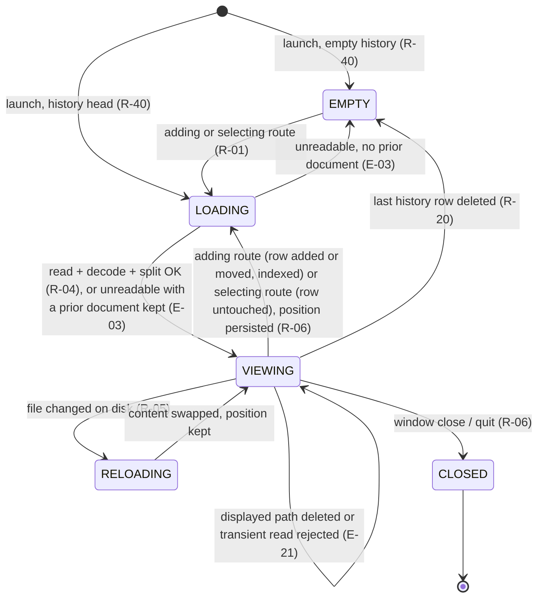
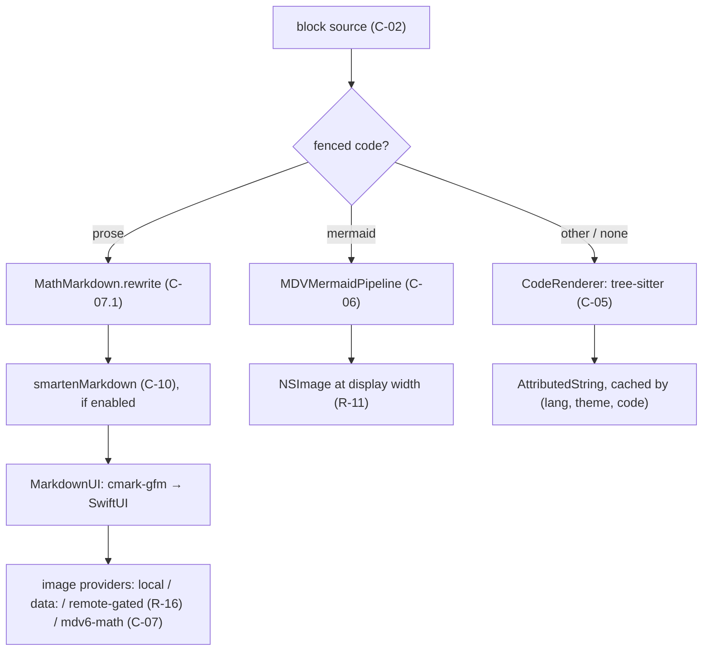

# SPECIFICATION — mdv6 (Markdown viewer, native macOS GUI + CLI launcher, Swift/SwiftUI)

> - **Status:** v0.13 — seven more fence words highlight (R-43, D-45): `cpp` (with `c++`, `cc`, `metal`), `json`, `lua`, `opencl`, `perl` and `markdown` (with `md`, `gfm`), from six more grammars vendored under `mdv6/Grammars/` and pinned in its README; C++ also backs a `metal` fence, because Metal Shading Language is C++14-based and no Metal grammar in the wild ships a licence file, and markdown is the one language run as two grammars (the block grammar plus `tree-sitter-markdown-inline` over each inline span). K-05, C-05, §10 and §11 carry the additions, T-51 proves them, and `mdv6/Grammars/README.md` names the files that are derived rather than verbatim. v0.12.1 — seventh review applied (`SPEC_REVIEW_REPORT.md`, F-126..F-138): the R-18/C-19.4 back-snapshot contradiction is resolved; the C-19.1 grammar rejects `#L0`; T-49's fixture is re-derived from `nl -ba test-docs/links-sibling.md`; "slug fragment" and "line citation" are named once (R-18, R-19, C-18.8, E-22, E-29); C-02 rule 8 is total and half-open; C-19.5 pins the in-app scope; the four new ids are marked *not yet realised*; T-49's map half is now the scripted T-50. v0.12 — GitHub-style line citations specified (C-19, D-44): a `#L14-L22` fragment opens the target, scrolls the block containing line 14 to the top, and flashes that block; C-02 rule 8 adds the source-line map the resolution needs. v0.11.2 — F-002 (build): the §5.5 heading now declares `C-18` in the same form as the other contracts (`### C-18 …`), so a checker sees the id that R-42, I-015 and §11 cite; no row changed. v0.11.1 — F-001 (build): the §5.4 cross-reference row for R-35 is no longer a second bold declaration (speccheck rejected the duplicate); no row changed. v0.11 — sixth review applied (`SPEC_REVIEW_REPORT.md`, F-114..F-125): window restoration disabled (E-30), status markers and §11 refreshed to the built tree, the *View · Show/Hide Inspector* row, R-19 as resolve-then-classify, the store-isolation variables and `--theme`, *sidebar focus* defined, the title-bar colour-scheme rule, the collapse chevron, overlay precedence and the isolated-store rule for observed tests. v0.10.1 was editorial (sources cite the original's repository); v0.10 added three chrome affordances of the original, taken from its screenshots (C-18.7 hovered-block stripe, C-18.9 placeholder and bookmark context menus; K-16, T-48, D-43). v0.9.2 — F-107 and F-109 applied (F-109: C-18.6/C-18.9 accent-fill text is the page background colour, not literal white) (I-014/K-16/T-45: the rhythm oracle is the single-`Markdown`-view rendering; the ink gap is bounded by the theme margin plus the fonts' leading, because an ink row never coincides with a line box). v0.9 was the chrome-parity uplift of v0.8 after the first two spec-driven recreations (see D-40): window chrome, sidebar and inspector anatomy, per-block vertical rhythm and single-line display math are now normative (R-42, C-18, I-014, I-015, K-16, E-29, T-44..T-47) with reference screenshots under `reference/`. v0.8 was an implementation-grade uplift of the v0.7 as-built specification after the fifth review (`SPEC_REVIEW_REPORT.md`; F-001..F-093 applied). A plain §11 row is realised and verified; *not yet realised* marks specified work with no implementation; **open defect** marks known implemented behaviour that violates the normative row; *verification pending* marks a revised implemented path whose conformance has not yet been observed. Rows are never weakened to hide a defect.
> - **Language / stack:** Swift 5.9 (SwiftPM, no Xcode project) | SwiftUI + AppKit | MarkdownUI 2.4.1 (cmark-gfm) · SwiftTreeSitter 0.25.0 (manifest floor 0.8.0) + eighteen vendored tree-sitter grammars · beautiful-mermaid-swift 1.0.4 (ELK layout) · SwiftMath 1.7.3 (vendored, patched) · SQLite (FTS5) | surfaces: macOS app bundle, `bin/mdv6` shell launcher, `make` targets
> - **Sources:** the original application, [tqbf/mdv](https://github.com/tqbf/mdv) — its README and Help (user-facing behaviour), its NOTES (library gaps and their work-arounds), `TYPOGRAPHY.md` (theme conventions, carried into this repository), its code-block design notes, its vendored-SwiftMath README, its implementation, launcher, build script, Makefile, package manifest and CI workflow, and its git history through the v0.7 commit; `SPEC_REVIEW_REPORT.md` (the sixth review, F-114..F-125; the five earlier reviews, F-001..F-093, were applied through v0.8 and are not carried); `reference/MDV-SCREEN.png` and `reference/MDV-ORIGINAL-SEVILLA.png` (the original application, normative for chrome structure — C-18); `reference/RECREATION-MDV6-SEVILLA.png` and `reference/RECREATION-MDV7-SEVILLA.png` (the two v0.8 recreations, shown as the gaps T-44..T-47 close). This repository is a from-scratch rebuild against this specification; none of the original's source is used.
> - **Scope of this document:** the observable behaviour of the mdv6 application and its launcher — file opening, rendering (Markdown, code, Mermaid, LaTeX), navigation, find and search, history, bookmarks, persistence, theming, packaging and release. It does **not** specify the internals of the third-party renderers beyond the contracts mdv6 relies on, nor the colour and type values of individual themes (those live in `TYPOGRAPHY.md`). Since v0.9 it **does** specify the structure of the window chrome — title, toolbar, sidebar rows, inspector rows, badges and active states — because the v0.8 recreations showed that behaviour-only rows reproduce the function of the original and none of its look (§5.5, D-40).
> - **Normative language:** MUST/MUST NOT/SHALL/SHALL NOT = normative; SHOULD = strong recommendation; MAY = optional.
> - **Principle:** *Native and honest.* Every pixel is drawn by AppKit/SwiftUI/CoreText — no WebView, no JavaScript bridge — and when a renderer cannot handle an input, the user sees the source, never a blank.

---

## 0. Intent and purpose

mdv6 is a macOS application for *reading* Markdown. It renders a `.md` file the way a good document viewer renders a PDF: typographically deliberate, fast to open, with the navigation aids a long technical document needs (table of contents, in-document find, cross-file full-text search, bookmarks, back/forward history) and without any editing surface. It is meant to be the default handler for `.md` files on a developer's Mac, reachable from Finder, from the terminal (`mdv6 FILE`), and from other Markdown files via links.

The renderer is a pipeline of native components: cmark-gfm (via MarkdownUI) for Markdown, tree-sitter for code syntax highlighting, an ELK-based layout library for Mermaid diagrams, and a CoreText math typesetter for LaTeX. Each of those libraries has gaps relative to what real documents contain (Mermaid.js syntax, amssymb, `<br/>` in labels, …); mdv6 owns a **sanitising and repair layer** in front of each one so that documents written for GitHub or Mermaid.js render faithfully, and a **fallback rule** so that anything the layer cannot repair is shown as its source text with an explanation rather than dropped.

**Non-goals.** mdv6 does not edit Markdown (it hands off to an external editor); it does not render HTML blocks beyond what cmark-gfm passes through as text; it does not fetch remote images unless the user opts in; it does not sync anything off the machine; it is not sandboxed for the App Store (it reads arbitrary user files and installs a CLI symlink).

**Trust boundary.** Everything the application processes — file contents, link targets, image URLs, Mermaid and LaTeX source — is untrusted document content. The only runtime network activity is the user-enabled remote-image fetch governed by R-16 and C-16; the release pipeline (§10) is separate. The application never executes document content.

## 1. Actors and goals

| Actor | Goals |
| ----- | ----- |
| **Reader** (human, GUI) | Open Markdown files by any route, read them with good typography, move around them quickly, find text within and across files, keep places, and get back to files read before. |
| **Terminal user** (human, `bin/mdv6`) | Open one or more files, a directory, or stdin from a shell in the running application; query the version; install the launcher once. |
| **Finder / LaunchServices** (`com.mdv6.app` document-type registration) | Route double-clicks, drag-onto-icon, and `open -a` of `.md`/`.markdown`/`.mdown`/`net.daringfireball.markdown`/`public.plain-text` items into the application (C-01). |
| **External editor** (any macOS app the reader chooses) | Receive the current file on ⌘E; its saves are picked up by the live-reload watcher. |
| **Document author** (indirect) | Their GitHub-flavoured Markdown, Mermaid.js diagrams, and LaTeX math render as they would on GitHub / mermaid.live, or degrade visibly. |
| **Release engineer** (human, `make dist`, CI) | Produce a signed, notarised, stapled `.zip` from an exact `vX.Y.Z` tag; CI builds every push to `main` and publishes a rolling `latest` prerelease. |
| **Persistence store** (SQLite at `~/Library/Application Support/mdv6/mdv6.db`, `UserDefaults`) | Durably hold history, the full-text index, bookmarks, per-file scroll positions, and preferences across launches. |

## 2. Requirements (intent, high level)

Sources are cited as `[Help §…]`, `[README]`, `[NOTES]`, or a file or symbol in the original's tree ([tqbf/mdv](https://github.com/tqbf/mdv)) — where the behaviour was read from, not where it is realised here (§11 names this tree's files).

### 2.1 Opening and loading

| ID | Statement |
| -- | --------- |
| **R-01** | The application MUST open a Markdown file from every one of: File → Open… (⌘O), Open in New Window… (⌘⇧O), a LaunchServices open event (Finder double-click, drag onto the icon, `open -a`), a file dropped onto the window, a Markdown link clicked inside a document (any local path, per R-19), a history-sidebar row, a search hit, a bookmark, the placeholder (R-28), and ⌘←/⌘→ (R-18). Routes are of two kinds: **adding routes** — ⌘O, ⌘⇧O, LaunchServices, drop, link, bookmark, placeholder, and the directory scan (R-02) — add the file's history row or move an existing one to the top (R-20) and index it (R-26); **selecting routes** — a history-sidebar row, a search hit whose file is already in history, ⌘←/⌘→, and the delete-current-row transition (§3.1) — display an entry the list already holds and MUST NOT reorder history or re-index. All routes MUST load the file into the **key window's** content view only; a second window (only ⌘⇧O creates one) MUST NOT react to a menu command or an open event addressed to another window (E-26). When one open event carries several URLs (`mdv6 A.md B.md`, a multi-file `open -a`), each MUST be added to history in the order received and the **last** MUST be displayed. `[Help §Opening files; mdv6/mdv6App.swift application(_:open:); ContentView.loadFile (adding), List(selection:) / openHit / applySnapshot (selecting)]` |
| **R-02** | When the opened path is a **directory**, the application MUST consider the directory's non-hidden, readable files whose extension (case-insensitive) is `md`, `markdown`, or `mdown`, ordered by case-insensitive localized comparison of the filename; it MUST load `README.md` (case-insensitive match on the stem) if present, else the first file in that order, and MUST add every other such file to history as rows (not displayed, but indexed per R-26; primary first, the rest in that order) (R-20). `[Help §Opening files; ContentView.loadDirectory]` |
| **R-03** | Only the **first** item of a drop is considered (further items are ignored without error); it MUST be accepted only when its extension (case-insensitive) is one of `md`, `markdown`, `txt`, `mdown`, `mkd`; other drops MUST be ignored without error. `[ContentView.handleDrop]` |
| **R-04** | The file MUST be read and decoded as UTF-8 **before** any history change; a file that is not valid UTF-8, or that vanishes between the existence check and the read, is unreadable and the load MUST abort per E-03 — no history row, no selection change, no watcher re-arm. A file that decodes to zero bytes or only whitespace is readable: it MUST display an empty article with the file selected and watched, never the `EMPTY` panel (§3.1). The document MUST be split into **blocks** once per load (C-02) and every per-frame consumer (rendering, find, TOC, bookmarks) MUST read the cached split, never re-parse. `[ParsedDocument; commit 38df878; ContentView.loadFile/loadCurrentEntry]` |
| **R-05** | While a file is displayed, the application MUST watch it **by path** (not by open file descriptor or inode) and reload its content when the file changes on disk — a plain write, an atomic save that renames a temporary file over it, or a delete-and-recreate MUST all trigger a reload of the new content. Change events are delivered with a 50 ms latency and no deferral: the first event of a burst is delivered at once and later events within 50 ms are batched into at most one further delivery, so a burst yields at most **two** reloads and the content read last is the content displayed (K-06). A reload MUST keep the reader's scroll position (clamped to the new block count); any text selection is not preserved. A read that fails (file deleted, moved away, or not valid UTF-8 — a half-written save) MUST be ignored: the window keeps its content, shows no error, and keeps the watch armed for the path until a later event yields a readable file. A read that returns **zero bytes** while content is displayed MUST be treated as a truncate-then-write in progress: the page is kept and the file is re-read after 500 ms, and whatever that second read yields (including empty) is shown (E-21, D-18). `[FileWatcher (FSEvents on the parent directory); Help §Editor integration]` |
| **R-06** | On load, the application MUST restore the reader's last scroll position for that path (C-08) when the stored anchor still resolves (E-08); otherwise it MUST start at the top. It MUST persist the current position on window close, on quit, and before loading a different file into the window. `[ContentView.persistScrollPosition]` |

### 2.2 Rendering

| ID | Statement |
| -- | --------- |
| **R-07** | Markdown MUST be rendered as GitHub-flavoured Markdown (cmark-gfm: tables, task lists, strikethrough, autolinks, footnotes) using the active theme's typography (R-29). `[README; ThemeManager.markdownTheme]` |
| **R-08** | Fenced code blocks MUST be syntax-highlighted with tree-sitter for the languages in K-05 (with the alias map in C-05), and MUST render as plain monospaced text — never an error — for any other or missing language hint. The block MUST show a language label, a hover-revealed toolbar (wrap toggle, copy), and a context menu; blocks whose fence word is in the prompt-aware set of C-05 and whose non-empty lines are at least half `$ `/`# `-prompted MUST additionally offer *Copy Without Prompts*, whose output is the block with the leading `$ ` or `# ` removed from each prompted line and **every other line copied unchanged** (output lines are kept; line count is preserved). `[CodeRenderer; CodeBlockChrome.copyWithoutPrompts]` |
| **R-09** | A ` ```mermaid ` fence MUST render as a diagram image drawn natively (C-06). The block MUST offer: a style menu (Document, Light, Dark, Tokyo Night, Catppuccin — the choice persisted document-wide in `mdv6.mermaid.style`), *Show Mermaid source* (toggles to a monospaced source view — no Mermaid grammar exists, so it is not syntax-coloured), *Export diagram as PNG*, copy source, and pinch-to-zoom between $0.5\times$ and $4\times$. `[Help §Diagrams and math; MermaidCodeBlockChrome]` |
| **R-10** | Before parsing, Mermaid source MUST be sanitised per C-06.1 so that the Mermaid.js constructs listed there render; after layout, the corrections in C-06.2 MUST be applied. A diagram whose source the library cannot parse (e.g. `timeline`, `gantt`, `pie`, `mindmap`) MUST render the fallback: the text "Mermaid diagram could not be rendered" and the source in monospace. `[NOTES §Mermaid]` |
| **R-11** | A diagram MUST be rasterised at the exact width from the §7.2 formula — its natural width or the available column width minus 36 pt, floored to whole points and bounded below by 1 pt — at the backing scale of the screen the window is on (as built: `NSScreen.main`, the screen of the key window). It MUST be re-rasterised when that width, committed zoom, or backing scale changes; the raster cache key includes all three. It MUST NOT be drawn wider than its natural width. `[NOTES §Resolution; MDVMermaidDiagramView]` |
| **R-12** | LaTeX math delimited by `$…$` (inline) and `$$…$$` (display) MUST be typeset natively with SwiftMath in every block type — paragraphs, headings, list items, blockquotes, table cells — following the delimiter rules in C-07. Display math on its own paragraph MUST be centred and MUST offer *Copy LaTeX* in its context menu. `[Help §Diagrams and math; MathRenderer]` |
| **R-13** | Math inside an ATX heading MUST be sized by that heading's em factor (C-09); elsewhere by the body size times the zoom factor (R-30). Math colour MUST be the theme's text colour. `[MathMarkdown.rewrite]` |
| **R-14** | LaTeX that SwiftMath rejects MUST render as its source (`$…$` delimiters included) in monospace; a display block MUST additionally show the parser's message. Before typesetting, the command rewrites and symbol registrations of C-07.2 MUST be applied. `[MathImageCache.typeset; MathSymbols]` |
| **R-15** | A node label in a Mermaid flowchart or state diagram that is exactly one `$$…$$` span MUST be typeset with SwiftMath and composited centred in the node at the same pixel weight as document math (I-009). Math mixed with text, and math in edge labels, MUST be rendered as the Unicode approximation of C-07.3. `[NOTES §LaTeX in labels]` |
| **R-16** | Images MUST resolve `data:` URIs inline and relative paths against the document's directory. `http(s)` images MUST NOT be fetched unless View → *Load Remote Images* is on; when on, the fetch MUST obey C-16, and turning the preference off MUST cancel in-flight remote-image requests. When off, a clickable "Remote image blocked" placeholder MUST be shown instead. A missing local image MUST show an "image not found" placeholder naming the file. Every local, data-URI, and remote image MUST obey K-14 and MUST NOT be scaled above its intrinsic size. `[LocalImageProvider; mdv6App View menu]` |
| **R-17** | When View → *Smart Typography* is on **and** the active theme allows it, prose blocks MUST be rendered with curly quotes, en/em dashes, and ellipses per C-10; fenced/inline code, GFM table blocks, thematic-break lines, link URLs, and `<…>` spans MUST be left verbatim. Math spans MUST be rewritten to image references *before* smartening so LaTeX is never altered. `[SmartTypography.swift; ContentView.blockView]` |

### 2.3 Navigation and copying

| ID | Statement |
| -- | --------- |
| **R-18** | The application MUST maintain per-window back/forward stacks whose entries are `(history entry, top block index)`. Loading a different file pushes the outgoing document's entry and clears the forward stack **except** when the load is initiated by a bookmark (R-27), the placeholder (R-28), or a cold-start file argument (R-40); those three routes MUST NOT push, whether their target is in the current file or another file. ⌘← pops a live snapshot, pushes the current view onto the forward stack, loads the file as a **selecting route** (R-01: history order and index untouched), and scrolls to the saved block; ⌘→ is the mirror. When a history row is removed (swipe-delete, cap eviction), every snapshot holding that entry MUST be dropped from both stacks or skipped when popped, so ⌘← never displays a document that has no history row. A same-document jump from a **slug** `#fragment` link (R-19) or a TOC row (R-21) MUST push a snapshot and clear the forward stack; a **line citation** (R-19, C-19) is a position move and MUST NOT push or clear either stack (C-19.4); find stepping (R-24) MUST NOT push. Re-opening the current path pushes nothing. `[Help §Moving around; NavSnapshot, pushSameDocSnapshot]` |
| **R-19** | A clicked link is handled in two steps. **Resolution:** a destination with no scheme is resolved by path arithmetic against the current document's directory; a `file:` URL's path is used as it is (the Markdown renderer resolves relative destinations against the document's base URL before the click reaches the application, so a relative link normally arrives already in this form — F-117); any other scheme is not a path. **Classification:** the application MUST navigate in-app when the resolved path is an existing local file whose extension is, case-insensitively, `md`, `markdown`, or `mdown`; every other destination — a missing file, another extension, a `file:` URL to a non-Markdown file, a custom scheme — MUST be handed to the system opener, because a click is an explicit user action. A fragment MUST be percent-decoded exactly once as UTF-8 before comparison; invalid percent encoding has no matching slug. **Fragment kinds.** A fragment is one of two kinds, tested in this order: a **line citation** — the C-19.1 grammar — which selects a *line range*; otherwise a **slug fragment**, compared per C-11. A fragment that is neither (empty, or an unmatched slug) behaves as before. The line form wins when it parses, so a heading slug that happens to look like `l10` is unreachable by fragment — an accepted consequence, since GitHub emits the same form and resolves it the same way. A line citation MUST scroll to the block resolved by C-19 and flash it (C-19.3); a same-document line citation MUST NOT push a snapshot or select a TOC row (it is not a heading choice, unlike D-41's rule for slug fragments), while a cross-file line citation loads the target as an adding route and suppresses R-06 restoration exactly as a slug fragment does. A same-document slug fragment MUST scroll to the first matching C-11 slug or do nothing when none matches (E-06). A local path plus slug fragment MUST load the target as an adding route, suppress R-06 scroll restoration, then scroll to its first matching slug; if no slug matches, the loaded file MUST remain at the top. Only C-02 single-line ATX `#`–`###` headings are slug targets (E-22, D-17). `[ContentView.handleLinkClick]` |
| **R-20** | The history sidebar MUST list every file opened by an adding route (R-01), most recently **added** first — a selecting route leaves the order unchanged — capped at 100 entries (the oldest is evicted), persisted across launches; a row MUST support swipe-to-delete. The sidebar MUST be collapsible (⌃⌘S, View menu, hover chevron) with the collapsed state persisted, and resizable by dragging its divider between 180 and 400 pt. `[HistoryManager; Help §Sidebars]` |
| **R-21** | The inspector MUST show a table of contents of the document's single-line ATX `#`, `##`, `###` headings (C-02), each row jumping to its block, with a search field that filters rows; and a collapsible bookmarks pane with a draggable height. The inspector is shown and hidden by View · Show/Hide Inspector (⌥⌘0) and the toolbar's `sidebar.right` button (§5.1); its visibility and width (180–520 pt, dragged at its left edge) MUST persist. Heading text in the TOC MUST show math as Unicode (C-07.3), not as LaTeX source. `[Help §Sidebars; commit bcd2150]` |
| **R-22** | Prose blocks MUST support standard macOS text selection (drag to select; ⌘C copies the rendered text through the system pasteboard). A **TOC heading block** — a block listed in `tocHeadings` (C-02 rule 7: single-line ATX `#`–`###`); an h4–h6 or setext heading is prose for every rule in this row (E-22) — MUST NOT be text-selectable; the pointer over one MUST be the pointing hand; a click on one (a tap without drag — modifier keys are not distinguished) MUST copy that heading's section (C-12) as Markdown source to the pasteboard and flash the section for 0.6 s; a repeated click copies again and restarts the flash. There is no block-level selection model (it was removed in commit `c50817a`). `[commit c50817a; ContentView.copySection, BlockTextSelection]` |
| **R-23** | ⌘E MUST open the current file in the chosen external editor; File → Edit → *Choose Editor…* picks one and *Forget Editor* clears it; with no editor set, ⌘E MUST prompt to choose. `[Help §Editor integration]` |

### 2.4 Find, search, bookmarks

| ID | Statement |
| -- | --------- |
| **R-24** | ⌘F MUST open an in-document find bar. An empty query MUST produce no matches, show "No matches", and disable stepping; a non-empty query, including whitespace-only input, MUST be matched verbatim as a case-insensitive substring over each block's source (no trimming, no diacritic folding — unlike C-03). A reload (R-05) while the bar is open MUST recompute $m$ and return to the first occurrence. $m$ counts **occurrences** in document order, and the bar MUST show "$n$ of $m$" or "No matches". ⌘G / ⇧⌘G MUST step per occurrence, wrap at the ends, and scroll the occurrence's block into view; Esc MUST close. A matching block MUST be tinted as a whole when it is a code fence (` ``` `/`~~~`), a `$$` math fence (C-02 rule 3), a GFM table (first line contains `|`, second line consists only of `-`, `:`, `|`, space), or contains `![` anywhere. Every other matching block MUST be inline-highlighted: the block is re-rendered as inline text (leading `#`, `>`, and ordered-list markers stripped, `-`/`*`/`+` bullets shown as `•`, inline Markdown interpreted, math shown as `$…$` source) and every occurrence of the query in that text is marked, so an occurrence inside markup can be counted but unmarked, and vice versa (E-17). All occurrences in the current match's block share the stronger tint; the current occurrence is not otherwise distinguished from siblings in that block (D-21). When the sidebar has focus, ⌘F MUST route to global search (E-18). *The sidebar has focus* when the window's first responder is a view inside the history sidebar — the history list, its revealed search field, or a search-hit row; a freshly opened window has no first responder, so its first ⌘F opens the find bar. `[Help §Find; ContentView find, shouldInlineHighlight, highlightedAttributedString]` |
| **R-25** | ⌘⇧F MUST focus a search field that queries the full-text index of every file in history (C-03): tokens are prefix-matched and ANDed; results (at most 80) MUST show the filename and a snippet with matched terms highlighted; choosing a result MUST open the file. `[Help §Find; Database.search]` |
| **R-26** | The application MUST index a file's content into the full-text index when it is added to history by an adding route (R-01: opened, or seeded as a directory sibling by R-02 — a selecting route does not re-index) and re-index history on launch, skipping any file whose modification time (whole seconds, K-06) is unchanged since its last indexing. Removing a file from history — swipe-delete **or eviction by the 100-entry cap** — MUST remove its row from the index (and its C-08 scroll position; bookmarks are kept), and launch MUST drop any index row whose path is not in history, so the search population is exactly the current history. (There is no *clear history* command; `HistoryManager.clear()` exists but is unreachable from the UI.)  `[Database.indexFile/removeFile; HistoryManager.add/remove]` |
| **R-27** | ⌘D MUST add a bookmark at the block under the pointer if one is hovered, else at the topmost block whose frame intersects the viewport; titled by the nearest TOC heading (C-02 rule 7) at or within the previous 40 blocks, using its display text (inline Markdown stripped per C-12, math per C-07.3); else the block's **first line** with inline Markdown stripped, truncated to 60 extended grapheme clusters (K-06); else `(line n)` with $n$ the 1-based block index when the stripped line is empty; `(empty)` only when the document has no blocks. The anchor is block index and fingerprint (C-08). Bookmarking the same block twice creates two rows. Bookmarks MUST persist in order; the first five MUST be bound to ⌘1…⌘5; rows MUST be reorderable by drag and removable. Opening a bookmark MUST load its file if needed and scroll to the resolved anchor without pushing a back-snapshot (R-18). `[Help §Bookmarks; BookmarksManager]` |
| **R-28** | ⌘⇧0 MUST set a transient in-memory placeholder — anchored by the R-27 rule (hovered block, else topmost visible block; index and fingerprint) and recording the file path — and ⌘0 MUST return to it, loading that file first (adding route, R-01) if another is displayed; ⌘0 with no placeholder, or whose file no longer exists (E-27), MUST beep (§5.1); the placeholder MUST NOT survive relaunch and does not push a back-snapshot (R-18); *Clear Placeholder* in the row's context menu (C-18.9) MUST remove it, after which ⌘0 beeps. While set, the placeholder MUST be visible as the **first row of the bookmarks pane** (R-21), above a divider, titled by the R-27 title rule for its block and carrying the `⌘0` badge; clicking the row is ⌘0; setting it MUST expand a collapsed bookmarks pane and mark the row *current* (C-18.9). `[Help §Bookmarks; setPlaceholder, jumpToPlaceholder, placeholderRow]` |

### 2.5 Appearance and preferences

| ID | Statement |
| -- | --------- |
| **R-29** | The reader MUST be able to choose one of the nine named themes or *System* from the toolbar; *System* MUST resolve to `high-contrast` in Light appearance and `twilight` in Dark and MUST switch live when macOS appearance changes. Each theme MUST restyle the article pane, code palette, and the diagram *Document* style; the choice MUST persist (`mdv6_theme_id`). `[ThemeManager; TYPOGRAPHY.md]` |
| **R-30** | Let $s$ be the stored zoom factor and $d$ be $+0.10$ for ⌘= or $-0.10$ for ⌘-. Each step MUST set $s' = \operatorname{clamp}(\operatorname{roundHalfAway}(10s)/10 + d, 0.60, 2.50)$; `roundHalfAway` rounds a half-integer away from zero. View → Actual Size MUST set $s'=1.0$. The factor MUST persist (`mdv6_font_scale`) and MUST scale body text, document math (R-13), inline code, and fenced code blocks (C-05: fence text at $0.85 \times$ base $\times s'$). The zoom HUD MUST appear after the change for 0.9 s and show $\lfloor 100s' + 0.5 \rfloor$ %. `[ThemeManager fontScale; CodeRenderer.render]` |
| **R-31** | ⌘? (Help → mdv6 Help) MUST open the bundled `Help.md`, copied (overwritten) to `~/Library/Application Support/mdv6/Help.md` on **every** ⌘? so the copy matches the running build and has a stable path for history and bookmarks. Because each copy changes the file's mtime, the C-08 scroll position for Help is never restored across ⌘? invocations, and a ⌘? while Help is displayed triggers a reload (R-05). `[HelpManager]` |
| **R-32** | Every preference in C-04 MUST persist via `UserDefaults` under the listed key and MUST be honoured on the next launch. |
| **R-42** | The window chrome MUST follow C-18: the window title is the displayed file's name; the toolbar is the five icon buttons of §5.1; the history sidebar and the inspector carry the section headers, row anatomy, hover/selection states, hotkey badges and reveal-on-click search fields of §5.5; a document rendered block-by-block keeps the vertical rhythm of `TYPOGRAPHY.md` at every block boundary (I-014); a single-line own-paragraph `$$…$$` is centred like a multi-line one (C-07.1). Colours and type come from the active theme (C-09, `TYPOGRAPHY.md`); the structure does not vary by theme. `[reference/*.png; ContentView.sidebar/tocPane/bookmarksHeader/bookmarkRow/toolbarContent in the original]` |

### 2.6 Launcher, packaging, diagnostics

| ID | Statement |
| -- | --------- |
| **R-33** | `bin/mdv6` MUST implement the surface in §5.2: locate the app bundle per the documented search order, open files/directories by absolute path, read stdin into a temporary `.md` for `-`, print the bundle version for `--version`, and exit `1` with `mdv6: no such file: <path>` on stderr for a missing argument. `[bin/mdv6]` |
| **R-34** | `make` (default) MUST build a runnable `build/mdv6.app` from a clean checkout with only the Swift toolchain, copying every resource the app needs (C-13); `make install` MUST place it in `/Applications`, register it with LaunchServices, and symlink the CLI. Every `make dist` invocation MUST refuse before building unless `HEAD` carries an exact `vX.Y.Z` tag; a command-line `VERSION` value MUST NOT bypass or replace that tag. `[Makefile; build.sh]` |
| **R-35** | The application MUST NOT print document content, file contents, or query strings to any log at any verbosity. The only diagnostics it emits are `NSLog` lines prefixed `[mdv6]` — persistence-store failures (E-12, may name the file path), bundled-font registration failures, and an external-editor launch failure (R-23, whose error text may include the file path) — and the font-registration lines SwiftMath prints once per font on first use. |
| **R-36** | For every input admitted by K-14, the application MUST NOT terminate because of document content. A repair-layer or third-party parse/layout failure MUST degrade to the fallback of R-10/R-14/C-14, and every path that reaches a third-party parser MUST be preceded by the applicable validation and sanitisation. Inputs rejected by K-14 MUST follow E-28 without entering a third-party parser. `[NOTES §Mermaid: ELK layout asserts]` |
| **R-37** | The repository MUST carry an automated test suite runnable with `swift test` from a clean checkout, covering at least the pure contracts (C-02 block split, C-03 query construction, C-07.1 delimiters and C-07.3 plain text, C-08 fingerprint/resolve, C-10 smart typography, C-11 slugs, C-12 sections) and the Mermaid/LaTeX sanitisers (C-06.1, C-07.2), and CI MUST run it on every push to `main` and on every pull request. `[Tests/mdv6Tests, Tests/mdv6RenderTests; .github/workflows/build.yml; D-01, §9.0]` |
| **R-38** | Fenced code blocks tagged `swift` and `sql` MUST be syntax-highlighted with tree-sitter like the languages of K-05: the `tree-sitter-swift` and `tree-sitter-sql` grammars (parser, scanner, and a `highlights.scm`) vendored under `mdv6/Grammars/`, pinned in its README, compiled into `CGrammars`, and resolved from the fence hints in C-05 (`swift`; `sql`, `sqlite`, `postgresql`/`postgres`, `mysql`, `plsql`, `tsql`). Highlighting quality MUST match the existing languages: keywords, strings, comments, numbers, types, and function names each map to a palette capture. `[mdv6/Grammars/swift, mdv6/Grammars/sql; D-15]` |
| **R-43** | Fenced code blocks tagged `cpp` (or `c++`, `cplusplus`, `cc`, `cxx`, `cp`, `hpp`, `hxx`, `hh`, `metal`, `msl`), `json`, `lua`, `opencl` (or `cl`, `opencl-c`), `perl` (or `pl`, `perl5`) and `markdown` (or `md`, `gfm`) MUST be syntax-highlighted with tree-sitter like the languages of K-05: the `tree-sitter-cpp`, `tree-sitter-json`, `tree-sitter-lua`, `tree-sitter-opencl`, `tree-sitter-perl` and `tree-sitter-markdown` grammars (parser, scanner where the grammar has one, and a `highlights.scm`) vendored under `mdv6/Grammars/`, pinned in its README, compiled into `CGrammars`, and resolved from the fence hints in C-05. Highlighting quality MUST match R-38 — keywords, strings, comments, numbers, types and function names each map to a palette capture — with the C-05 caveat that a capture name no `CodePalette` entry covers renders in the plain colour; the vendored queries are upstream's except where `mdv6/Grammars/README.md` lists a derivation. `[mdv6/Grammars/{cpp,json,lua,opencl,perl,markdown}; D-45]` |
| **R-39** | The repository MUST contain the render harness and corpus specified by C-17: `tools/render-harness/` MUST be a SwiftPM executable that links the application's pipeline code rather than copying it; `test-docs/mermaid/*.mmd` MUST contain one licence-cleared raw Mermaid diagram per file; and `test-docs/render-cases.json` MUST enumerate the deterministic render checks. The C-17 commands MUST make T-13, T-17, and T-19 reproducible from a clean checkout. `[tools/render-harness; test-docs/mermaid, test-docs/render-cases.json; D-01]` |
| **R-40** | On launch with no file argument, the main window MUST attempt exactly the first history entry (the most recently added path, R-20) and restore its scroll position (R-06). If that entry is unreadable, it MUST remain in history and the window MUST enter `EMPTY`; later rows MUST NOT be tried automatically. A cold-start file argument (LaunchServices, `bin/mdv6 FILE`) MUST pre-empt automatic history restoration, display that file, and MUST NOT create a back-stack snapshot for the unseen history head (R-18). The window MUST otherwise enter `EMPTY` only when history is empty. Automatic window-state restoration MUST be disabled (E-30): a launch creates exactly one window regardless of how many were open at the previous quit. `[ContentView onAppear; application(_:open:)]` |
| **R-41** | Before reading, parsing, laying out, downloading, or decoding untrusted document content, the application MUST enforce the applicable K-14 ceiling. Content over a ceiling MUST follow E-28; admitted content MUST remain subject to R-36. Remote fetches MUST additionally obey C-16. `[ContentLimits; ImageLoading]` |

## 3. Behavior and state model

### 3.1 Document lifecycle

A window holds at most one **current document**. Its states and transitions:

| State | Meaning | Enters via | Leaves via |
| ----- | ------- | ---------- | ---------- |
| `EMPTY` | No file loaded; the drop target / Open… prompt is shown. History MAY be empty or may retain an unreadable initial head (R-40). A launch creates exactly one window (E-30). | launch with empty history; failed load of the initial history head with no prior document (R-40, E-03); swipe-delete of the last history row while it is displayed (R-20) | any open route (R-01) → `LOADING` |
| `LOADING` | Outgoing document's scroll position persisted when one exists (R-06); file read and decoded (R-04), split into blocks (C-02); **adding route only**: history row added or moved to the top (R-20) and file indexed (R-26); **selecting route**: history and index untouched; scroll anchor looked up unless R-19 suppresses it. | adding or selecting route (R-01); launch with non-empty history (R-40, selecting); swipe-delete of the displayed row with other rows remaining (R-20, selecting) | success → `VIEWING` (an empty file is a success, R-04); unreadable file → the previous state (`VIEWING` of the prior document, or `EMPTY` if there was none), with no history or selection change (E-03). An unreadable initial history head therefore leaves the row in history and enters `EMPTY` (R-40). |
| `VIEWING` | Blocks rendered lazily; watcher armed on the path (R-05); find/TOC/bookmarks operate on the cached split. In-flight renders (diagram layout, math) are cancelled when the document changes. | `LOADING` | open of another file → `LOADING`; file changed on disk → `RELOADING`; file deleted → stays `VIEWING` (E-21); swipe-delete of the displayed history row → `LOADING` of the new first history entry (selecting route; position persisted; the deleted entry's snapshots dropped, R-18), or `EMPTY` when no rows remain (R-20); window close → `CLOSED` |
| `RELOADING` | New content replaces `rawMarkdown` in place; scroll position kept; text selection not preserved. Transient empty/undecodable reads are ignored (R-05, E-21). | watcher event, coalesced 50 ms | → `VIEWING` |
| `CLOSED` | Scroll position persisted (R-06); watcher cancelled. | window close, quit | terminal |



*Figure 3.1 — document lifecycle per R-01, R-04..R-06, R-20, R-40, E-03, E-21. The table is normative; the diagram is illustrative.*

### 3.2 Render pipeline for one block

Every visible block goes through the same path on each render (the split itself happens once per load, R-04):



*Figure 3.2 — per-block render path per R-07..R-17. Each edge corresponds to a §4 contract; the diagram is illustrative.*

Order matters in one place and is normative: **math rewriting precedes smart typography** (R-17), so that `--`, `...`, and quotes inside `$…$` are never curled or dashed.

### 3.3 Durable artifacts

| Artifact | Location | Written when | Read when |
| -------- | -------- | ------------ | --------- |
| History list | `UserDefaults["mdv6_history"]` (JSON per C-15, $\leq 100$ entries) | every adding-route open (R-01), swipe-delete, cap eviction | launch |
| Full-text index | `mdv6.db` tables `articles`, `articles_fts` (C-03) | every adding-route open (mtime-gated), launch re-index; rows removed on swipe-delete and eviction (R-26) | ⌘⇧F search |
| Bookmarks | `mdv6.db` table `bookmarks` (C-08) | ⌘D, reorder, remove | launch, Bookmarks menu, inspector |
| Scroll positions | `mdv6.db` table `scroll_positions` (C-08) | window close / quit / file switch (R-06); row removed with the history row (R-26) | file load |
| Preferences | `UserDefaults` keys in C-04 | on change | launch |
| Help file | `~/Library/Application Support/mdv6/Help.md` | every ⌘? (overwritten from the bundle, R-31) | ⌘? |
| Render caches | in-memory only: code `AttributedString` (256 entries), math images (2048), Mermaid layouts (96) and rasters (192, $\leq 192$ MB) | render | render |

`mdv6.db` MUST be opened with `SQLITE_OPEN_FULLMUTEX`, `journal_mode = WAL`, `synchronous = NORMAL` (I-006). Its `meta` table holds `schema_version` (currently `4`); `migrate()` MUST apply forward migrations by comparing it, each migration's statements and the version bump inside **one** transaction (`BEGIN IMMEDIATE … COMMIT`), so a crash mid-migration leaves the previous schema and version intact. A migration whose statement fails is rolled back and logged (E-12); the next launch retries it.

## 4. Interfaces / contracts

### C-01 Application bundle and document types

```
mdv6.app/
  Contents/Info.plist        CFBundleIdentifier com.mdv6.app, LSMinimumSystemVersion 13.0,
                             CFBundleShortVersionString 1.0.0
                             CFBundleDocumentTypes: extensions [md, markdown, mdown];
                             LSItemContentTypes [net.daringfireball.markdown, public.plain-text]
  Contents/MacOS/mdv6         SwiftPM executable
  Contents/Resources/        AppIcon.icns · *.otf (Alegreya, Besley, OpenDyslexic) ·
                             *-highlights.scm (9) · mathFonts.bundle/ (Latin Modern Math + plist)
                             · mdv6 (CLI script, for "Install Command Line Tool…") · Help.md
Entitlements: app-sandbox = false; files.user-selected.read-only = true
```

### C-02 Document split: `ParsedDocument`

```swift
struct ParsedDocument {            // computed once per load (R-04); equality on `raw`
    let raw: String
    let blocks: [String]           // see rules
    let blockLines: [Range<Int>]   // half-open 1-based source lines per block; definition: rule 8
    let lineCount: Int             // lines in `raw` after normalization (C-02 rule 6)
    let tocHeadings: [TOCHeading]  // level 1…3, single-line ATX only
}
struct TOCHeading { level: Int; text: String /*display*/; slugText: String /*for #fragment*/; blockIndex: Int }
```

Split rules (normative):

1. Input is split on `\n`. A **blank line** (only whitespace) ends the current block.
2. A line whose first non-space characters are ` ``` ` or `~~~` opens a **fence**; blank lines inside a fence do not split; the fence closes at the next line starting (after spaces) with the same three-character marker — *as built, the closing run is not required to be at least as long as the opener* (a deviation from CommonMark; see E-23). An unclosed fence runs to the end of the input.
3. A line whose first non-space characters are `$$`, with no second `$$` on the same line, opens a **math fence**; it closes at the next line *containing* `$$`, or at the end of the input.
4. Indented code blocks (four spaces) are **not** recognised by the splitter: a blank line inside one splits it into two blocks (E-23).
5. Leading/trailing newlines of a block are trimmed; empty blocks are dropped.
6. Line endings are normalised before splitting: `\r\n` and lone `\r` MUST be treated as `\n`, so a CRLF document yields the same blocks and TOC as its LF equivalent.
7. `tocHeadings` contains each block whose trimmed text starts with `# `, `## `, or `### ` and is not a fence, using its first line only. `text` is the line with inline Markdown stripped (C-12 rules) and math converted per C-07.3; `slugText` is the same without the math conversion.
8. `blockLines[i]` is **half-open**: $\text{lowerBound}$ is block `i`'s first source line (1-based) and $\text{upperBound}$ is one past its last, so a block on lines 5–7 is $5\,..<\,8$ and line $n$ lies in block `i` exactly when $\text{blockLines}[i].\text{lowerBound} \le n < \text{blockLines}[i].\text{upperBound}$. `lineCount` is the number of lines the normalized input splits into (rule 6; a trailing `\n` does not create a final empty line). The map derives from the same split as `blocks`, so `blocks[i]` is `raw`'s lines $\text{blockLines}[i]$ with rule 5's trimming applied. Both are computed once per load and stored on the document, so a line→block lookup (C-19) is $O(\log |\mathrm{blocks}|)$ and answers at most once per distinct `raw` (I-004). Resolution is **total**: a line no block contains — one past `lineCount`, inside the run of blank lines a rule-5 drop or a C-07.1 insertion removed, or before the first block — resolves to the **last** block whose $\text{lowerBound} \le n$, or to the **first** block when no block satisfies that (the line precedes every block); a document with no blocks resolves to nothing.

### C-03 Full-text index

```sql
CREATE TABLE articles (id INTEGER PRIMARY KEY, path TEXT NOT NULL UNIQUE, filename TEXT NOT NULL,
    content TEXT NOT NULL DEFAULT '', indexed_at INTEGER NOT NULL,
    file_mtime INTEGER NOT NULL DEFAULT 0, file_size INTEGER NOT NULL DEFAULT 0);
CREATE VIRTUAL TABLE articles_fts USING fts5(filename, content, path UNINDEXED,
    content='articles', content_rowid='id', tokenize='unicode61 remove_diacritics 2');
-- triggers keep articles_fts in step with INSERT/UPDATE/DELETE on articles
```

Query construction: split the input on whitespace; drop the characters `" ( ) : * ^` from each token; discard tokens that become empty; wrap every survivor as `"token"*`; join with spaces (FTS5 implicit AND). A query with no surviving tokens performs no search and yields no results. Results MUST use `ORDER BY rank ASC, path COLLATE NOCASE ASC, path ASC LIMIT 80`, with `snippet(articles_fts, 1, char(2), char(3), '…', 14)` — U+0002/U+0003 bracket matched terms and the UI renders them highlighted. The two path keys make equal-rank ordering deterministic, including the 80-row boundary.

### C-04 Preferences (`UserDefaults`)

| Key | Type | Default | Meaning |
| --- | ---- | ------- | ------- |
| `mdv6_theme_id` | String | `high-contrast` | Theme id or `system` (R-29) |
| `mdv6_font_scale` | Double | `1.0` | Zoom factor (R-30), clamped on read |
| `mdv6_smart_typography` | Bool | `true` | View → Smart Typography (R-17) |
| `mdv6_load_remote_images` | Bool | `false` | View → Load Remote Images (R-16) |
| `mdv6_sidebar_collapsed` | Bool | `false` | History sidebar hidden (R-20) |
| `mdv6_inspector_visible` | Bool | `false` | TOC/bookmarks inspector shown (R-21) |
| `mdv6_inspector_width` | Double | `240` | Inspector width, clamped to $[180, 520]$ |
| `mdv6_bookmarks_expanded` | Bool | `false` | Bookmarks pane open |
| `mdv6_bookmarks_height` | Double | `240` | Bookmarks pane height, clamped at use (K-04) |
| `mdv6_editor_app_path` | String | `""` | External editor bundle path (R-23) |
| `mdv6_history` | Data (JSON) | `[]` | History entries (R-20, C-15) |
| `mdv6.mermaid.style` | String | `document` | Diagram style (R-09) |

A stored value of the wrong type, outside its range, or not in its enumeration falls back to the default at use: an unknown `mdv6_theme_id` resolves to `high-contrast` (the picker shows no selection until the reader picks one); `mdv6_font_scale` is clamped on read and each step applies the R-30 round-half-away formula; widths and height are clamped per K-04; an unknown `mdv6.mermaid.style` reads as `document`.

### C-05 Code highlighting: `CodeRenderer`

```swift
func render(code: String, languageHint: String?, theme: MDVTheme) -> AttributedString   // synchronous, never throws
```

- Language resolution: lower-case the info string, keep its first word; direct names `c go rust bash javascript yaml toml python ruby` (+ `swift sql` per R-38) and `cpp json lua opencl perl markdown` (R-43); aliases `js jsx javascriptreact node → javascript`, `sh zsh shell → bash`, `py python3 → python`, `rb → ruby`, `yml → yaml`, `rs → rust`, `golang → go`, `h objective-c objc → c`, `sqlite postgresql postgres mysql plsql tsql → sql` (R-38), `c++ cplusplus cc cxx cp hpp hxx hh metal msl → cpp` (a `metal` fence is the C++ grammar — D-45), `cl opencl-c → opencl`, `pl perl5 → perl`, `md gfm → markdown`; anything else → plain.
- Prompt-aware fence words (R-08 *Copy Without Prompts*): the **raw** first word of the info string, lower-cased, is one of `bash sh zsh fish shell console` — a separate test from language resolution (`fish` and `console` highlight as plain yet are prompt-aware; `shell-session` is not).
- Highlighting: parse with a fresh `Parser` per call, run the grammar's `highlights.scm`, colour each capture from the theme's `CodePalette` by capture-name components; `comment` captures are italic. If the query fails to compile, that language falls back to plain for the rest of the session. Fence text is set in the system monospace face at $0.85 \times$ `baseFontSize` $\times$ the zoom factor (R-30).
- Markdown is the one language highlighted by two grammars (R-43): the block grammar's captures are applied first, then every `(inline)` span it leaves whole is re-parsed with `tree-sitter-markdown-inline` and its captures are applied on top, so an inline capture wins on its own range. The embedded query failing to compile leaves the block captures standing — it is not a `plainForSession` case.
- Result cache: key `(language, theme id, zoom factor, hash(code))`, at most 256 entries (flushed whole when full).

### C-06 Mermaid pipeline: `MDVMermaidPipeline`

```swift
static func prepare(source: String, theme: DiagramTheme) throws -> MDVMermaidPrepared  // parse → repair → layout (ELK)
static func rasterize(_ p: MDVMermaidPrepared, width: CGFloat, scale: CGFloat) -> NSImage?  // CoreText at final size, upright
static func displaySize(for p: MDVMermaidPrepared, width: CGFloat) -> CGSize  // whole points; shared by view and raster
```

**C-06.1 Source sanitisation (before parsing), in this order:**

| # | Rule | Reason |
| - | ---- | ------ |
| 1 | Drop a leading YAML front-matter block (`---` … `---`). | parser rejects it (`invalidHeader`) |
| 2 | xychart: `line "name" [...]`/`bar "name" [...]` → `line [...]`/`bar [...]`. | parser knows only the unnamed form |
| 3 | On `style`/`classDef`/`linkStyle` lines: expand `#rgb`/`#rgba` to 6/8 digits; map these CSS colour names (case-insensitive, only where they follow `fill:`, `stroke:` or `color:`) to hex: `white black red green blue yellow orange purple gray grey lightgray lightgrey darkgray silver pink lightblue lightgreen lightyellow gold teal navy maroon olive cyan magenta brown beige ivory lavender coral salmon tomato crimson indigo violet khaki tan wheat mintcream honeydew aliceblue whitesmoke gainsboro snow`, plus `transparent` and `none` → `#00000000`. Any other name is passed through (and renders black). | 3-digit hex and names render **black** |
| 4 | stateDiagram: fold every `ID: text` description line for an ID into one `state "a<br/>b" as ID` alias inserted after the header. | parser keeps only the first registration |
| 5 | `id[/text/]` and `id[\text\]` (parallelograms) → `id[text]`. | not in the parser's shape table |
| 6 | Strip inline formatting tags `<b> <i> <u> <s> <strong> <em> <small> <sup> <sub> <span> <code> <tt> <font> <mark>` (open and close), keeping their content; leave `<br/>`. | rendered literally |

**C-06.2 Post-parse and post-layout repairs:**

| Diagram | Repair |
| ------- | ------ |
| flowchart, stateDiagram | Subgraph ownership: a node listed in several subgraphs belongs to the **last** one (Mermaid.js semantics); it is removed from the others. (Prevents the ELK `assert`, E-01.) |
| stateDiagram | `classDef`, `class A,B name`, and `style` lines read from the source are applied to the model (`classDefs`, `classAssignments`, `nodeStyles`). |
| flowchart, stateDiagram | Whole-label `$$…$$` nodes: label replaced by a blank placeholder measured to the math image's size; image composited after rasterising, centred, at a pixel-snapped origin (R-15, I-009). |
| sequenceDiagram | `<br>` → newline in notes; → space in actor labels; message labels with `<br>` are blanked and drawn by mdv6, lines stacked upward from the arrow (13 pt pitch, 11 pt font, muted colour). |
| sequenceDiagram | Actor gaps widened until every message label fits between its endpoints (+ 24 pt; self-messages + 36 pt); all x coordinates remapped piecewise-linearly through old→new actor centres. |
| sequenceDiagram | Multi-line message rows: the message and everything below shifted down $(n-1) \times 13 + 4$ pt; spanning blocks, lifelines, and the diagram height grow. |
| sequenceDiagram | A block whose last item is a note is extended to enclose it (+ 8 pt). `autonumber` draws a filled disc ($r = 8$ pt) with the 1-based index at each arrow's tail. |

**C-06.3 Document theme.** The *Document* style derives a `DiagramTheme` from the active `MDVTheme`: background = code-block background, foreground = text colour, node surface = page colour mixed 25 % toward the code background on light themes (lifted 16 % toward foreground on dark), lines/borders/muted = fixed mixes of background and foreground.

### C-07 LaTeX math

**C-07.1 Rewriting.** `MathMarkdown.rewrite(block, fontSize, headingSizeEms, color)` replaces each math span in a prose block with an image reference

```
>?s=<size pt, 1 decimal>&c=<RRGGBBAA>)     // $…$ only
>?s=…&c=…)                                // every $$…$$, own line or mid-line
```

The host selects the typesetting mode (K-08: `inline` → `.text`, `display` → `.display`) and is decided by the delimiter alone. Placement is a separate rule: a `$$…$$` whose opening is at line start and closing at line end — **whether the span occupies one source line (`$$x$$`) or several (a C-02 rule 3 fence)** — is emitted as its **own paragraph** (blank lines inserted, indentation preserved) so MarkdownUI's block-image path renders it centred via `MathDisplayView`; every other span — `$…$`, and a `$$…$$` mid-line — is an inline image via `MathInlineImageProvider`, so a mid-line `$$\sum_{i=1}^n$$` shows display-style limits inside the sentence. `base64url` is RFC 4648 §5 without `=` padding; decoders MUST re-pad to a multiple of four. Delimiter rules (Pandoc `tex_math_dollars`): an opening `$` is followed by non-whitespace; a closing `$` is preceded by non-whitespace and not followed by a digit; a span contains no bare `$` and never crosses a backtick; `\$` is literal; fenced blocks and inline code are never rewritten; an empty `$$` pair is literal.

**C-07.2 Typesetting.** `MathImageCache.rendered(for: MathSpec)` typesets with `MathImage(latex, fontSize, textColor, labelMode: display ? .display : .text)` after (a) registering the extra symbols and (b) applying the rewrites below, and bakes the result to a bitmap at the screen scale (I-008). Cache: 2048 entries keyed by the URL.

| (a) Registered symbols (Latin Modern Math has the glyphs) | (b) Command rewrites (regex, in order) |
| --- | --- |
| relations: `gtrsim lesssim gtrapprox lessapprox leqslant geqslant lll ggg nless ngtr nleq ngeq doteq triangleq therefore because implies impliedby models vDash Vdash nparallel nmid subsetneq supsetneq nsubseteq nsupseteq sqsubseteq sqsupseteq precsim succsim`; arrows: `hookrightarrow hookleftarrow rightharpoonup leftharpoonup rightleftharpoons leftrightharpoons nearrow searrow swarrow nwarrow longmapsto twoheadrightarrow rightsquigarrow leadsto rightrightarrows leftleftarrows`; ordinary: `dots dotsc dotsb varnothing hslash mho Box square blacksquare bigstar checkmark ddagger S P pounds copyright degree beth gimel wp nexists complement # _`; big operators: `iint iiint oiint bigsqcup bigodot bigotimes biguplus`; binary: `intercal leftthreetimes rightthreetimes divideontimes` | `\operatorname{X}` / `\operatorname*{X}` → `\mathrm{X}`; `\dfrac`/`\tfrac` → `\frac`; `\boldsymbol` → `\bm`; `\bmod` → `\;\mathrm{mod}\;`; `\pmod{n}` → `\;(\mathrm{mod}\;n)`; `\not=` → `\neq`; `\big \Big \bigg \Bigg` (with optional `l r m`) before a delimiter → removed; `\coloneqq` → `:=`; `align*`/`equation*`/`gather*`/`multline*` → unstarred; `align` → `aligned`; `multline` → `gather`; `\begin{equation}`/`\end{equation}` → removed |

`\boxed{…}` is implemented in the vendored SwiftMath (`MTBoxed` atom, `MTBoxDisplay`: frame of fraction-rule thickness with $0.35\,\mathrm{em}$ padding). Unsupported and shown as source: `\underbrace`, `\overbrace`, `\stackrel`, `\substack`, `\&`.

**C-07.3 Plain-text form** (`MathMarkdown.plainText`), used by the TOC, bookmark titles, and mixed Mermaid labels: same delimiter rules; `\frac{a}{b}` → `a/b`, `\sqrt{x}` → `√x`, wrappers (`\text \mathrm \mathbf \mathit \mathcal \mathbb \operatorname \boldsymbol \bm \hat \vec \bar \tilde`) → their content; `^`/`_` followed by a character or `{…}` → Unicode super/subscript when every character has one (digits, `+ - n i` / `+ - i j n k x`), else kept verbatim; Greek letters, common relations/operators/arrows/sets → Unicode; unknown commands → their name; braces removed; whitespace collapsed.

### C-08 Anchors: bookmarks and scroll positions

```sql
CREATE TABLE bookmarks (id INTEGER PRIMARY KEY, path TEXT NOT NULL, title TEXT NOT NULL,
    sort_order INTEGER NOT NULL, created_at INTEGER NOT NULL,
    block_index INTEGER NOT NULL DEFAULT 0, block_fingerprint TEXT NOT NULL DEFAULT '');
CREATE TABLE scroll_positions (path TEXT PRIMARY KEY, block_index INTEGER NOT NULL,
    block_fingerprint TEXT NOT NULL, updated_at INTEGER NOT NULL, file_mtime INTEGER NOT NULL DEFAULT 0);
```

`fingerprint(block)` MUST split `block` at every Unicode whitespace scalar, discard empty pieces, join the pieces with U+0020 SPACE, apply locale-independent Unicode lowercase without compatibility or canonical normalization, and retain the first 80 extended grapheme clusters. `resolve(blocks, storedIndex, fingerprint)` = the first block whose fingerprint equals the stored one; else `storedIndex` clamped to $[0, |\mathrm{blocks}|-1]$; else 0 for an empty document. A scroll position is restored only when the stored anchor resolves **and** the file's modification time is within 1 s of the stored `file_mtime` **and** the index is in bounds (E-08).

### C-09 Theme contract (`MDVTheme`), the fields behaviour depends on

```swift
struct MDVTheme {
    let id: String; let isDark: Bool
    let text, secondaryText, tertiaryText, heading, strong, link, accent, background, secondaryBackground, border, divider, blockquoteBar: Color
    var bodyFontFamily: FontFamily; var baseFontSize: CGFloat            // default 16
    var h1SizeEm = 1.75, h2SizeEm = 1.4, h3SizeEm = 1.15; h4SizeEm 1.0, h5SizeEm 0.875, h6SizeEm 0.85 (fixed)
    var headingSizeEms: [CGFloat]     // [h1…h6], used by markdownTheme and by math in headings (R-13)
    var articleMaxWidth: CGFloat?; var articleHorizontalPadding: CGFloat
    var smartTypographyAllowed: Bool  // false for phosphor, standard-erin-light, standard-erin-dark
    var codePalette: CodePalette?     // default: oneDark (dark) / githubLight (light)
}
static let all = [highContrast, sevilla, charcoal, solariumDaylight, solariumMoonlight, phosphor, twilight, standardErinLight, standardErinDark]
```

Code blocks always use the system monospace face regardless of `bodyFontFamily` (`TYPOGRAPHY.md`).

### C-10 Smart typography (`smartenMarkdown`)

Applied to one block; the block is returned unchanged if it is a fence, looks like a GFM table (a `|---|` separator row), or is a thematic-break line. Otherwise, outside inline code spans (a run of $n$ backticks closes only on a run of exactly $n$), link/image URL parts (`](` … matching `)`), and `<…>` spans: `"` and `'` → directional quotes chosen from the preceding character; `---` → `—`; `--` between letters/digits → `–`; ` -- ` → ` — `; other `--` runs unchanged (CLI flags survive); `...` → `…`.

### C-11 Heading slug

`slug(s)` = lower-case `s`; keep letters and digits; keep `-` and `_` when something precedes them; drop every other non-whitespace character; **every** run of whitespace becomes one `-` when something precedes it — including a run that follows a `-` or a dropped character, so that `a - b` → `a---b` and `C++ & Rust` → `c--rust` as on GitHub; strip trailing `-`/`_`. Applied to both the link fragment and `TOCHeading.slugText`; equality selects the target, and when several headings share a slug the **first in document order** wins. GitHub's numeric disambiguation suffixes (`-1`, `-2`) are not generated (D-17).

### C-12 Section and inline-stripped text

`section(headingAt i)` = blocks $[i, j)$ where $j$ is the index of the next **TOC heading** (C-02 rule 7 — an h4–h6 or setext heading never ends a section) with level $\leq$ the level of $i$, or the block count. Copy output = those blocks joined with `\n\n`. `stripInlineMarkdown` removes trailing `#`s, `**`, `__`, backticks, unescaped `*`, **both** underscores of an `_…_` emphasis pair whose opening `_` is not preceded by a letter or digit (word-internal underscores such as `snake_case` are kept), and reduces `[text](url)` to `text`.

### C-13 Build outputs (`build.sh`)

```
swift build -c {debug|release}
build/mdv6.app/Contents/{MacOS/mdv6, Info.plist, Resources/{AppIcon.icns, *.otf, *-highlights.scm,
                        mathFonts.bundle/, mdv6, Help.md}}
codesign --force --sign - --entitlements mdv6/mdv6.entitlements build/mdv6.app     # ad hoc
```

The vendored SwiftMath resolves `mathFonts.bundle` from `Bundle.main` first and from `Vendor/SwiftMath/mathFonts.bundle` (by `#filePath`) when running unbundled (`swift run`).

### C-15 History persistence (`mdv6_history`)

```json
[ { "id": "<UUID>", "path": "/abs/path/to/file.md", "addedAt": <seconds since 2001-01-01 as Double> }, … ]
```

Swift `Codable` encoding of `[HistoryEntry]` (`id: UUID`, `path: String`, `addedAt: Date`, keys as shown, default `JSONEncoder` date strategy). Order is most recent first. `filename` is derived (last path component), not stored. A value that fails to decode MUST yield an empty history, never a crash; unknown keys MUST be ignored.

### C-16 Remote-image network contract

When `mdv6_load_remote_images` is true, a remote image MUST be fetched with an ephemeral `URLSession` that has no persistent cache, cookie storage, credential storage, or shared authentication state. The request MUST be an unauthenticated `GET` to the document-provided `http` or `https` URL; it MUST send no `Cookie`, `Authorization`, or `Referer` header. The only document-derived request data MAY be the original URL and the sequence of redirect URLs. Redirects MUST be followed at most five times and only while every target remains `http` or `https`; any other redirect MUST fail. Connection timeout is 15 s and total resource timeout is 30 s. The body MUST be streamed and cancelled as soon as it exceeds 32 MiB. A successful response MUST have a 2xx status, an `image/*` media type, and decode through ImageIO within K-14. Any violation MUST produce the E-11 failure placeholder. No response body or decoded remote image may be written to disk.

### C-17 Render harness and corpus

The executable name is `render-harness`; every invocation runs as `swift run --package-path tools/render-harness render-harness …` from the repository root. The harness links the application's pipeline code (R-39) and renders through the same block views the window uses.

| Invocation | Behaviour | Exit |
| ---------- | --------- | ---- |
| `render-harness INPUT --output FILE [--width PT] [--scale S] [--theme ID]` | Render one `.md` document or one raw `.mmd` diagram to PNG. Defaults: width 860 pt, scale 2, theme `high-contrast`; `--theme` takes a C-09 theme id (T-45). The parent directory of `FILE` MUST exist; the command MUST NOT create it. | 0 success; 1 render/fallback failure; 2 usage, unreadable input, unknown theme id, or unwritable output |
| `render-harness --scan ROOT --output-dir DIR` | Recursively discover non-hidden `.mmd` files and Mermaid fences in `.md` files, ordered by the UTF-8 bytes of relative path and then fence index. Render each case to a collision-free relative PNG path under `DIR`; raw `.mmd` is one case. Unsupported diagram types declared by E-02 count as expected fallbacks; every other fallback is a failure. | 0 when every case has its expected result; 1 when any case fails; 2 for usage or I/O failure |
| `render-harness --check MANIFEST [--case ID]` | Execute every manifest case, or exactly `ID`, compare dimensions and pixels with its golden when present, and evaluate its named metric. Cases MUST run in manifest order. | 0 when all selected cases pass; 1 for any mismatch or render failure; 2 for invalid manifest, unknown `ID`, usage, or I/O failure |

`test-docs/render-cases.json` MUST be UTF-8 JSON with this shape; paths are repository-relative, ids are unique, and unknown keys are ignored:

```json
{
  "version": 1,
  "cases": [
    {
      "id": "unique-string",
      "input": "test-docs/example.md",
      "kind": "markdown-or-mermaid",
      "width": 860,
      "scale": 2,
      "expect": "render-or-fallback",
      "golden": "test-docs/goldens/example.png",
      "metric": "pixel-or-ink-or-sequence-layout"
    }
  ]
}
```

For a pixel comparison, let $N$ be the number of pixels in either equal-sized image and let $D$ be the pixels for which at least one 8-bit RGBA channel differs by more than 8. The mismatch fraction is

$$
q = \frac{|D|}{N}.
$$

The comparison MUST pass when $q \leq 0.001$; $N=0$, unequal dimensions, a missing golden, or a missing output is a failure. `ink` uses §7.1. `sequence-layout` checks the geometric assertions in T-19. Each case MUST emit one JSON object on stdout with `id`, `status` (`pass`, `fail`, or `fallback`), and `output`; human-readable diagnostics go to stderr. Case output MUST be byte-for-byte stable for identical inputs, dependencies, width, scale, and backing environment.

### C-19 Line citations (`#L…` fragments)

**C-19.1 Grammar.** A **line citation** is the fragment of a link destination, after the single UTF-8 percent-decode of R-19, matching

```
^L([1-9][0-9]*)(?:-(?:L)?([1-9][0-9]*))?$      case-insensitive, anchored
```

so `#L10`, `#L10-L12`, `#l10-l12`, and `#L10-12` all parse. Line numbers are **1-based** and refer to the target document's source lines after C-02 rule 6 normalisation — the same coordinate space as `blockLines`/`lineCount`. The leading digit excludes `0`, so `#L0` and `#L00` do not match; a fragment that does not match this pattern in full (including `#L`, `#L0`, `#L10C5`, `#Ll0`, and any fragment with a trailing or interior token) is **not** a line citation and falls through to C-11 **slug** matching (R-19).

**C-19.2 Range normalisation.** Let the parse yield the start $a$ and, when the fragment names two numbers, the second number $b$ (absent otherwise). The **resolved start line** is

$$
a' = \begin{cases} \min(a, b) & b \text{ present} \\ a & b \text{ absent} \end{cases}
$$

so a reversed range (`#L12-L10`) is read as the range it names rather than as an error. The range is resolved by its start line only; the end is informational and is not used for scrolling or for the flash extent (C-19.3).

**C-19.3 Resolution and effect.** The target block is the last index $i$ with $\text{blockLines}[i].\text{lowerBound} \le a'$ — the block that **contains** line $a'$ — falling back to the first block when no index satisfies the predicate; C-02 rule 8 owns the total resolution. On a successful resolution the application MUST (a) set the top visible block to the target and scroll it to the top of the viewport — the same scroll a TOC row performs (R-21), without the snapshot or the row selection (C-19.4) — and (b) **flash** that single block for the R-22 duration ($0.6\,$s) using the existing section-flash treatment — `theme.accent` at $0.18$ opacity over the block, restarting on a repeat click. Because a C-02 block is the smallest addressable render unit (§3.2 renders one `Markdown` view per block), the flash covers the **whole block**, not the line run; the citation therefore highlights the *paragraph* containing the cited line. Line-accurate highlighting inside a block is explicitly **not** specified: the render path rewrites block text before layout (C-07.1 inserts blank lines around own-paragraph `$$…$$` spans) and cmark-gfm normalises the paragraph flow, so no line identity survives to the view tree. A resolution that finds no block (an empty document) scrolls to the top and flashes nothing.

**C-19.4 Interaction with the rest.** A line-citation jump is a *position* move, not a *choice*: it MUST NOT set the TOC selected row (E-29, D-41), MUST NOT push a back snapshot on a same-document jump (R-18), and MUST NOT be recorded as a bookmark anchor. It MUST cancel an in-progress flash and take it over (one flash at a time). It works in every document state that has blocks; in `EMPTY` there is no fragment to resolve against, so a link click cannot arise.

**C-19.5 Scope.** A line citation applies only where R-19's classification admits the destination in-app: local files whose extension is `md`, `markdown`, or `mdown`. A citation to any other extension — the `Foo.swift#L412-L418` form GitHub emits for source files — takes R-19's system-opener branch (E-05) and never reaches this contract; rendering a cited code file is out of scope and is not implied by these rows.

## 5. Interface specification

### 5.1 GUI: menus and shortcuts

| Menu · item | Shortcut | Effect | Errors / disabled |
| ----------- | -------- | ------ | ----------------- |
| mdv6 · Install Command Line Tool… | — | Symlink `/usr/local/bin/mdv6` → `Contents/Resources/mdv6`: unprivileged attempt first, then an AppleScript *with administrator privileges* auth dialog | every outcome is an `NSAlert` (C-14): *CLI helper missing*, *Already installed*, *Install failed* (with the error message), *Command line tool installed*; cancelling the auth dialog leaves the symlink untouched with no alert |
| File · Open… | ⌘O | Open panel; loads into this window (R-01) | cancel: no-op |
| File · Open in New Window… | ⌘⇧O | Open panel; new window | — |
| File · Edit · Edit Current File | ⌘E | Open current file in the chosen editor (R-23) | no editor: prompts to choose; launch failure: `NSAlert` "Couldn't open in external editor" with *Choose Different Editor…* / *Cancel* (C-14) |
| File · Edit · Choose Editor… / Forget Editor | — | Set / clear `mdv6_editor_app_path` | — |
| Edit · Find… | ⌘F | Find bar, or global search when the sidebar was last focused (R-24) | — |
| Edit · Search History… | ⌘⇧F | Focus global search (R-25) | — |
| Edit · Copy / Select All | ⌘C / ⌘A | System pasteboard group: act on the focused view's text selection (R-22) | — |
| Navigate · Back / Forward | ⌘← / ⌘→ | History stacks (R-18) | always enabled; no-op when the stack is empty |
| View · Show/Hide Sidebar | ⌃⌘S | Toggle history sidebar (R-20) | — |
| View · Show/Hide Inspector | ⌥⌘0 | Toggle the inspector (R-21); the same command as the toolbar's `sidebar.right` button | — |
| View · Zoom In / Zoom Out / Actual Size | ⌘= / ⌘- / — | R-30 | Zoom In / Out disabled at the clamps; Actual Size disabled at 1.0 |
| View · Smart Typography | — | Toggle R-17; label reads "(off for this theme)" and is disabled when the theme opts out | — |
| View · Load Remote Images | — | Toggle R-16 | — |
| Bookmarks · Bookmark Current Spot | ⌘D | R-27 | — |
| Bookmarks · Set Placeholder / Jump to Placeholder | ⌘⇧0 / ⌘0 | R-28 | Jump always enabled; beeps when no placeholder |
| Bookmarks · slot 1…5 | ⌘1…⌘5 | Open numbered bookmark (R-27) | disabled when the slot is empty; beeps when the bookmark's file is missing (E-09) |
| Help · mdv6 Help | ⌘? | R-31 | — |
| Find bar | ⌘G / ⇧⌘G / Esc | next / previous / close (R-24) | stepping disabled with no matches |
| Toolbar | — | Five **icon-only** buttons, trailing (`primaryAction`), in this order: `plus` (Open…, ⌘O) · `pencil` (Edit in external editor, ⌘E) · `paintpalette` pop-up menu (nine themes + System, checkmark on the active one — R-29) · `bookmark` / `bookmark.fill` (Bookmark Current Spot, ⌘D; filled and accent-tinted when the displayed file has a bookmark) · `sidebar.right` (Toggle Inspector, ⌥⌘0; accent-tinted while the inspector is shown). No text labels, no visible picker control. See C-18.2 | bookmark button disabled with no document |

In-block controls: code blocks — hover toolbar (wrap, copy), context menu (Copy Code, Wrap Long Lines, Copy Without Prompts when applicable); Mermaid blocks — hover capsule (style menu, show source, export PNG, copy) and context menu (Copy Code, Show Mermaid Source / Show Diagram, Diagram Style, Export Diagram as PNG); display math — context menu (Copy LaTeX). PNG export writes the diagram at natural size, $2\times$ pixel density, to a user-chosen path; failure beeps.

### 5.2 CLI: `bin/mdv6`

| Invocation | Behaviour | Exit |
| ---------- | --------- | ---- |
| `mdv6` | `open <app>` | 0 |
| `mdv6 FILE…` / `mdv6 DIR` | Each argument resolved to an absolute path; `open -a <app> <paths…>` (the app receives them via LaunchServices, R-01/R-02) | 0; `1` + `mdv6: no such file: <arg>` on stderr for the **first** argument that does not exist (later arguments are not checked; nothing opened) |
| `mdv6 -` | Only as the sole argument: stdin copied to `$(mktemp -t mdv6-stdin).md`, then opened. `mdv6 - FILE` treats `-` as a filename (`no such file: -`, exit 1) | 0 |
| `mdv6 -h` / `--help` | Usage text (lines 2–9 of the script) to stdout | 0 |
| `mdv6 --version` | `CFBundleShortVersionString` from the located bundle's `Info.plist` | 0 |
| any (including `--help`/`--version`), bundle not found | `mdv6: mdv6.app not found (set MDV6_APP or install to /Applications)` on stderr — the bundle is located before the arguments are read | 1 |

Bundle search order: `$MDV6_APP` (if a directory) → `/Applications/mdv6.app` → `~/Applications/mdv6.app` → `../build/mdv6.app` and `../mdv6.app` relative to the script → `mdfind "kMDItemCFBundleIdentifier == 'com.mdv6.app'"` (first hit).

### 5.3 Build and release: `make`

| Target | Effect |
| ------ | ------ |
| `make` / `build` | `deps` check (Swift $\geq$ 5.9, macOS $\geq$ 13, `build.sh` executable) then `./build.sh debug` → `build/mdv6.app` (C-13) |
| `release` | `./build.sh release` |
| `run` | build + launch |
| `install` | copy to `/Applications/mdv6.app`, `lsregister -f`, then `install-cli` (sudo symlink `/usr/local/bin/mdv6` → `bin/mdv6`) |
| `uninstall` | remove the symlink and `/Applications/mdv6.app` |
| `register` | `lsregister -f build/mdv6.app` |
| `clean` | remove `build/`, `.build/`, and `build_icon/` |
| `dist` | `check-version` MUST require an exact `vX.Y.Z` tag on `HEAD` and MUST reject an absent, malformed, or command-line-overridden version before `clean` or any build step (R-34) → `clean` → `release` → `sign` (Developer ID, hardened runtime, timestamp; `codesign --verify --deep --strict`) → `zip-notary` → `notarize` (keychain profile) → `staple` → `zip-release` → `checksum` (`.sha256`) → `verify-release` (`spctl`) |
| `github-release` | upload the zip and checksum to the GitHub release for the tag |
| `icon` | regenerate `mdv6/AppIcon.icns` from `MDV6.png` |

Release inputs (Makefile variables, overridable on the command line): `TEAM_ID` and `CERT_NAME` (Developer ID identity; `sign` exits 1 when empty — the checked-in defaults name the repository owner's identity and MUST be overridden by any other release engineer), `NOTARY_PROFILE` (default `mdv6-notary`; `notarize` exits 1 when empty), and `NOTES_FILE` (optional release notes for `github-release`). `VERSION` is derived only from the exact tag and is not an overridable release input.

CI (`.github/workflows/build.yml`): on every push to `main`, every pull request, and manual dispatch, build `debug` and `release` on `macos-15`, verify the bundle layout, and upload `mdv6-release.tar.gz`; on a push to `main` only, publish it as the rolling `latest` prerelease.

### 5.4 Cross-cutting: diagnostics and failure reporting

| ID | Contract |
| -- | -------- |
| R-35 (above) | Nothing document-derived is logged. |
| **C-14** | Failures arising from **document content** are reported in place, never modally: unrenderable diagram / math → fallback text in the block (R-10, R-14); missing or blocked image → placeholder in the block (R-16); unreadable file → the window stays on its previous content (E-03); missing bookmark file → row marked as missing in the inspector, and opening it beeps (E-09). Failures of a user-initiated system action are reported by a beep (PNG export, R-09) or an `NSAlert` (CLI install outcomes; external-editor launch failure, R-23) — the only two modal dialogs the application shows besides open/save panels and the editor chooser (§5.1). |

### C-18 Window chrome (§5.5, normative structure)

**C-18.0 Reference images.** `reference/MDV-SCREEN.png` (Sevilla theme, a long technical document; from the original's README) and `reference/MDV-ORIGINAL-SEVILLA.png` (Sevilla, `05-fixed-mortgages.md`, with a placeholder and four bookmarks set) show the original application and are **normative for structure**: which elements exist, where they sit, what a row contains, what is highlighted when. They are **not** normative for pixel values — colours, faces and sizes come from `TYPOGRAPHY.md` and C-09. `reference/RECREATION-MDV6-SEVILLA.png` and `reference/RECREATION-MDV7-SEVILLA.png` are the two v0.8 recreations of this specification rendering the same document; every difference between them and `MDV-ORIGINAL-SEVILLA.png` is a gap this section closes, and an implementer SHOULD look at all three before writing any pane. The images show the product name `mdv`; the rename to mdv6 changes no structure.


**C-18.1 Window.** The window title is the displayed file's last path component (`navigationTitle`), or the product name when the window is `EMPTY` (§3.1). The title-bar/toolbar strip is painted with the theme's page background so title bar, article and both side panes read as one surface (see both reference images; the original does this in `ContentView` via `.toolbarBackground`). The window — title bar included — takes the theme's colour scheme (light or dark per C-09 `isDark`), so the title is drawn in the system's title colour for that scheme and stays legible on the strip; the application-wide appearance is not changed (the System theme keeps following macOS, R-29). The three panes are: history sidebar (left, R-20), article (centre), inspector (right, R-21); sidebar and inspector are separated from the article by a 1 pt divider in the theme's border colour, each inside an 8 pt drag handle (§7.2). **Collapse chevron (R-20):** a `chevron.left` glyph (11 pt, tertiary colour) sits at the vertical middle of the sidebar's handle and is visible only while the pointer is over the handle; clicking it collapses the sidebar. While the sidebar is collapsed, a `chevron.right` button of the same size sits at the left edge of the article at the same height and is always visible (there is no handle to hover); the inspector's handle has no chevron (⌥⌘0 and the toolbar toggle it).

**C-18.2 Toolbar.** Exactly the five icon buttons of §5.1, trailing, in that order, with `.help` tooltips naming the shortcut. There is no labelled theme picker control: the theme is a pop-up under the `paintpalette` glyph. Nothing else sits in the toolbar.

**C-18.3 Section headers.** Each pane section has a header row: a label set in 11 pt semibold, **uppercase**, 0.6 pt tracking, in the theme's tertiary text colour — `HISTORY` (sidebar), `ON THIS PAGE` (inspector, TOC), `BOOKMARKS` (inspector, bookmarks pane). Horizontal padding 14 pt; top 14 pt / bottom 6 pt for `HISTORY` and `ON THIS PAGE`; the `BOOKMARKS` header is a 32 pt tall row that is itself the collapse toggle (chevron `chevron.down`/`chevron.right`, 9 pt semibold, 10 pt wide, leading the label; R-21) and, when at least one bookmark exists, ends with a count capsule (10 pt medium, monospaced digits, tertiary text on `text.opacity(0.06)`, 5 pt/1 pt padding).

**C-18.4 Reveal-on-click search.** The `HISTORY` and `ON THIS PAGE` headers end with a `magnifyingglass` button (11 pt semibold, tertiary colour, 18 × 18 pt hit area, tooltip *Search history* / *Filter headings*). Clicking it replaces the button with the search field beneath the header (0.20 s ease-out) and focuses the field after 0.05 s; the field is not shown until then. Esc, or clearing and blurring the field, hides it again and restores the button. ⌘F while the sidebar has focus (R-24's definition, E-18) reveals and focuses the history field. A permanently visible field (both v0.8 recreations) does not satisfy this row.

**C-18.5 History rows (R-20).** Each row is: `doc.text` glyph (13 pt, secondary text colour, 16 pt wide) · a two-line stack — **line 1** the file name (13 pt, text colour, one line, middle-truncated), **line 2** the file's path with the home directory abbreviated to `~` (11 pt, secondary text colour, one line, **head**-truncated so the tail of the path stays readable) · 2 pt vertical padding. Rows sit in a `List(selection:)` with the `.sidebar` list style, so the displayed file's row carries the system selection fill (accent when the sidebar is focused, neutral otherwise). Neither a relative time (`1h ago`) nor an untruncated absolute path satisfies this row. Empty history shows a centred `tray` glyph (24 pt light, tertiary) over *No files yet* (12 pt, secondary).

**C-18.6 Global-search hits (R-25).** A hit row shows the file name and path like C-18.5 plus the C-03 snippet (secondary colour); the row for the file currently displayed is filled with the accent colour with page-background-coloured text (F-109); a hovered row is `text.opacity(0.06)` (the theme's text colour, C-09).

**C-18.7 Article affordances.** While the find bar is closed, a floating find button sits at the article's top-trailing corner: a `magnifyingglass` glyph (13 pt semibold, secondary colour) on a 28 pt circle filled with the theme's secondary background and stroked 0.5 pt in the border colour; clicking it opens the find bar (R-24). Heading rules (`showH1Rule` / `showH2Rule`, C-09) are drawn as a full-column divider in the theme's divider colour under the heading, as in `MDV-SCREEN.png`. **Hovered-block stripe:** while the pointer is inside a block that is not a code or Mermaid fence — the block ⌘D and ⌘⇧0 would anchor (R-27, R-28) — a 3 pt vertical stripe in the theme's accent colour is drawn along the block's leading edge, inside the block's 6 pt horizontal padding (§7.2, $b$), spanning the block's height; it disappears when the pointer leaves. Fenced code and Mermaid blocks carry their own hover chrome (R-08, R-09) and show no stripe. **Precedence:** the stripe, the find tint (R-24) and the section flash (R-22) may all show on one block at once — the stripe is drawn in the padding beside the block, the tint beneath the block's content, the flash above it. (`TYPOGRAPHY.md` calls this the bookmark-hover stripe; the accent is chosen per theme so it does not read as system chrome.)

**C-18.8 Table-of-contents rows (R-21).** One row per C-02 heading, indented $14\,\mathrm{pt} \times (\text{level}-1)$, text 12 pt (semibold for level 1, regular otherwise; level-1 rows in the text colour, deeper levels in the secondary colour), up to two lines, 8 pt/5 pt padding, 4 pt corner radius. A hovered row is filled `text.opacity(0.08)`. The row most recently chosen in the TOC — by click, or by a same-document **slug** fragment link or bookmark that lands on a TOC heading — is the **selected row** (a **line citation** never selects a row, C-19.4): filled with the theme accent, text in the page background colour, until another row is chosen or another document is loaded (E-29). Choosing a row pushes a back snapshot (R-18) and scrolls to the block.

**C-18.9 Bookmark rows (R-27).** Each row is: `bookmark.fill` glyph (11 pt, accent at 70 %, 16 pt wide; `exclamationmark.triangle.fill` in orange when the file is missing, E-09) · a two-line stack — the bookmark title (13 pt, tail-truncated) over the file **name** (10 pt, secondary, middle-truncated; not the path) · trailing **hotkey badge** for the five slot bookmarks: `⌘` at 9 pt bold rounded followed by the slot digit at 10 pt bold rounded, page-background-coloured on `accent.opacity(0.85)`, 4 pt continuous corner radius, 5 pt/1 pt padding. Padding 8 pt/5 pt, 5 pt continuous corner radius. States: **current** (the bookmark the reader last jumped to, cleared when another document loads) — accent fill, text and glyph in the page background colour (white on every light theme with a dark accent, as in the reference images; F-109), badge inverted (accent on the page background colour); drop target while reordering — `accent.opacity(0.18)`; hovered — `text.opacity(0.06)`; missing file — row at 60 % opacity unless current. The R-28 placeholder, when set, is the **first** row of the pane, followed by a divider (8 pt horizontal inset, 2 pt vertical): `pin.fill` glyph (12 pt, accent; orange when the file is missing) · the R-27 title (13 pt **medium**, middle-truncated) over the file name (10 pt, secondary) · the badge `⌘0`. At rest the row is tinted `accent.opacity(0.08)` with a 0.5 pt `accent.opacity(0.25)` stroke so it reads as distinct from ordinary bookmarks; hovered `text.opacity(0.06)`; *current* — accent fill, page-background-coloured text, inverted badge — from the moment it is set (⌘⇧0) or jumped to (⌘0) until another document loads; missing file at 60 % opacity unless current. Clicking it is ⌘0. Setting the placeholder expands a collapsed pane (`mdv6_bookmarks_expanded` ← true). It is not draggable and has no slot. Bookmark rows are reorderable by drag (R-27) and the pane height is draggable (R-21). **Context menus.** Right-clicking the placeholder row shows exactly one item, *Clear Placeholder* (R-28). Right-clicking a bookmark row shows, in this order: *Go to Bookmark* · *Reveal in Finder* · separator · *Move Up* · *Move Down* · *Move to Top* · *Move to Bottom* · separator · *Remove Bookmark*. *Go to Bookmark* is the row click (E-09 beep when the file is missing); *Reveal in Finder* selects the file in Finder and is disabled when the file is missing; the four *Move* items change the persisted order (R-27; the slots ⌘1…⌘5 follow the new order) and *Move Up* / *Move to Top* are disabled on the first row, *Move Down* / *Move to Bottom* on the last; *Remove Bookmark* removes the row. The placeholder row is not part of this order.

**C-18.10 Per-block rhythm and display math.** See I-014 and C-07.1: an implementation that renders each C-02 block as its own `Markdown` view (the shape §3.2 implies) MUST re-apply the theme's `h{1,2,3}TopSpacing` / `h{1,2,3}BottomSpacing` and `paragraphBottomSpacing` at the block boundaries itself, because MarkdownUI's `markdownMargin` only acts between siblings inside one view (K-16 gives the numbers and tolerance). `RECREATION-MDV7-SEVILLA.png` shows the failure mode: every heading flush against the preceding paragraph, and `$$…$$` written on one line rendered leading-aligned at body size.

## 6. Invariants (must hold in every valid implementation)

| ID | Invariant |
| -- | --------- |
| **I-001** | Rendering is pure in its inputs: the same file bytes, theme, zoom, preferences, window content width, and backing scale produce the same blocks, TOC, and rendered output; no render path reads the network except the C-16 remote-image fetch gated by R-16. |
| **I-002** | The application MUST NOT terminate because of document content admitted by K-14. Every third-party parser is reached only after the applicable limit check and sanitiser (C-06.1, C-07.1/2), and every detected parse/layout failure becomes a fallback block. |
| **I-003** | Document content MUST NOT reach a log, subprocess, or network request except that C-16 MAY disclose the original remote-image URL and permitted redirect URLs after the reader enables R-16. No other document bytes may enter request headers or bodies. The only other externally visible document-derived artefacts are the user's pasteboard on explicit copy, a user-chosen PNG on export, and `mdv6.db`. The in-process `mdv6-math://` scheme is not external. |
| **I-004** | The block split (C-02) is computed at most once per distinct `raw` string per load; `blocks[i]` is stable for the life of the document, so block indices used by find, TOC, heading copy, bookmarks, and scroll anchors refer to the same text. |
| **I-005** | Every mermaid raster is displayed at exactly its own point size — `displaySize(for:width:)` is the single source of both the bitmap size and the view frame — so the diagram is never resampled by the view layer. |
| **I-006** | All access to `mdv6.db` goes through one connection opened `FULLMUTEX`, in WAL mode; concurrent use from the history re-index queue and the main thread is serialised by SQLite, never by the caller. |
| **I-007** | Persistence writes are whole-row `INSERT … ON CONFLICT DO UPDATE` or single-statement updates; a crash mid-write leaves the previous row, never a partial one. |
| **I-008** | Every `NSImage` handed to SwiftUI `Text`/`Image` for math is bitmap-backed (not drawing-handler-backed); idle CPU with math on screen is that of a static page. |
| **I-009** | Math drawn inside a Mermaid raster is drawn at a pixel-aligned origin; its ink weight, per the formula in §7.1, is at least $0.9\times$ that of the same expression typeset for the document at the same size and scale. |
| **I-010** | Heading slugs (C-11) are computed from the un-mathed heading text, so `#fragment` links written for GitHub resolve identically whether or not the heading contains `$…$`. |
| **I-011** | The vendored SwiftMath carries exactly the patches listed in `Vendor/SwiftMath/README.md`; everything else is byte-identical to upstream v1.7.3. |
| **I-012** | Smart typography never changes bytes inside code spans, fences, link URLs, `<…>` spans, GFM tables, thematic breaks, or math. |
| **I-013** | The history list never exceeds 100 entries and never contains duplicates; the path most recently added by an adding route is first, and a selecting route never changes that order. |
| **I-014** | Vertical rhythm is a property of the document, not of the view tree: for every adjacent pair of C-02 blocks, the gap between the last ink row of block $i$ and the first ink row of block $i+1$ is the same, within the K-16 tolerance, whether the blocks are rendered by one `Markdown` view or one view per block — and in both cases it lies in the K-16 band around the value `TYPOGRAPHY.md` assigns for that pair (the margin between siblings: heading top spacing by level, paragraph bottom spacing, combined as $\max(\text{bottom}_i, \text{top}_{i+1})$ as MarkdownUI combines them). Ink rows sit inside the line box, so the ink gap exceeds the margin by the two fonts' leading; the band, not equality, is the invariant (F-107). |
| **I-015** | Chrome structure is theme-independent: every element, row anatomy, badge and state named in C-18 is present under every C-09 theme; only the colours and faces change. A build whose panes differ structurally from `reference/MDV-ORIGINAL-SEVILLA.png` is non-conforming even when every §9.1–9.5 test passes. |

## 7. Constraints (precise and measurable)

| ID | Constraint |
| -- | ---------- |
| **K-01** | Platform: macOS $\geq$ 13.0, Apple Silicon or Intel; toolchain: Swift $\geq$ 5.9 (`swift-tools-version: 5.9`); no Xcode project — `swift build` + `build.sh` only. |
| **K-02** | Bundle: `CFBundleIdentifier com.mdv6.app`; version `1.0.0` (1); not sandboxed; entitlement `files.user-selected.read-only`. |
| **K-03** | History cap 100 entries. Global search returns at most 80 hits; snippets are 14 tokens. Bookmark hot-key slots: 5. |
| **K-04** | Zoom: step $0.10$, range $[0.60, 2.50]$, default $1.0$. Sidebar width $[180, 400]$ pt (not persisted); inspector width $[180, 520]$ pt (persisted, default 240); bookmarks pane $\geq 120$ pt with the TOC keeping $\geq 80$ pt. |
| **K-05** | Highlighted languages, seventeen fence words over eighteen vendored grammars: C, Go, Rust, Bash, JavaScript, YAML, TOML, Python, Ruby (the original nine), Swift and SQL (R-38), C++, JSON, Lua, OpenCL, Perl and Markdown (R-43); a `metal` fence is highlighted by the C++ grammar (D-45) and markdown uses two grammars (C-05). Grammar commits are pinned in `mdv6/Grammars/README.md`. |
| **K-06** | Live-reload event latency: 50 ms (no deferral, R-05); transient zero-byte re-read: 500 ms (D-18). Block flash (heading copy R-22, line citation C-19.3): 0.6 s. Zoom HUD: 0.9 s. Scroll-restore mtime tolerance: 1 s (the stored `file_mtime` is truncated to whole seconds, C-08); index mtime gate (R-26): whole seconds, equality. Bookmark-title heading look-back: 40 blocks; bookmark-title fallback: 60 extended grapheme clusters (R-27). |
| **K-07** | Mermaid raster width MUST use exactly the §7.2 formula, including its 1 pt lower bound, at the screen backing scale; pinch zoom is clamped to $[0.5, 4]$; zoomed container height is $\leq 540$ pt. Caches: 96 layouts, 192 rasters, 192 MB. |
| **K-08** | Math: `$…$` spans typeset in `.text` style, every `$$…$$` span in `.display` whether on its own line or mid-line (C-07.1); diagram-label math at 16 pt; message-label line pitch 13 pt; sequence row height 40 pt (library) grown by $(n-1)\times 13 + 4$ pt for $n$-line labels. Cache: 2048 images. |
| **K-09** | Fingerprints: 80 extended grapheme clusters after the C-08 normalization. FTS tokenizer `unicode61 remove_diacritics 2`. |
| **K-10** | Typography defaults: body 16 pt, line spacing $0.30\,\mathrm{em}$, heading scales $h_1=1.75$, $h_2=1.40$, and $h_3=1.15$, article max width 860 pt (the cap on the **padded** article frame, K-13), gutter 40 pt (per-theme overrides in `TYPOGRAPHY.md`). |
| **K-11** | Release artefacts: `dist/mdv6-<version>-macos.zip` + `.sha256`, Developer ID signed with hardened runtime and timestamp, notarised and stapled; `<version>` equals the tag without `v`. |
| **K-12** | Ad-hoc-signed development bundles MUST pass `codesign --verify --deep --strict`; nothing may be placed at the bundle root besides `Contents/`. |
| **K-13** | *Column width* $w_{\mathrm{col}}$ (used by R-11, K-07): the width a block's content is laid out in, per the formula in §7.2. The cap applies to the padded article frame **before** the paddings are subtracted, so with the K-10 defaults a wide window gives $w_{\mathrm{col}} = 860 - 80 - 12 = 768$ pt and a Mermaid raster of $732$ pt. |
| **K-14** | Untrusted-content ceilings, measured before the named operation: UTF-8 document file 64 MiB; one Mermaid source 1 MiB; one LaTeX span 64 KiB; encoded or compressed local/data/remote image 32 MiB; decoded image 64 megapixels, 256 MiB, and 16,384 pixels on either axis. MiB and KiB are binary units. C-16 additionally limits redirects and time. Content at the ceiling is admitted; content above it follows E-28. |
| **K-15** | Idle-math CPU protocol: after `test-docs/math.md` has been visible and untouched for 5 s, collect 30 one-second process-CPU samples with no pointer, keyboard, window, appearance, or file activity on an otherwise idle `macos-15` host. The median MUST be $\leq 1\,\%$ and the nearest-rank 95th percentile MUST be $\leq 3\,\%$. |
| **K-16** | Chrome metrics (C-18): section header 11 pt semibold uppercase, tracking 0.6 pt; history row 13 pt / 11 pt; TOC row 12 pt, indent 14 pt per level; bookmark row 13 pt / 10 pt, badge 9 pt + 10 pt bold rounded; search button 18 × 18 pt; floating find button 28 pt circle, 0.5 pt stroke; hovered-block stripe 3 pt wide in the accent colour; row corner radii 4 pt (TOC) and 5 pt (bookmarks); reveal animation 0.20 s. Rhythm (I-014): let $v$ be the theme's margin for a block pair — Sevilla `h2Top` 32 pt, `h3Top` 22 pt, paragraph bottom 14 pt; defaults 24 / 24 / 16 (`TYPOGRAPHY.md` §Per-element vertical spacing) — and $f$ the larger of the two blocks' font sizes in points (body size, or body size $\times$ the heading's em factor, C-09). The inter-block ink gap $g$ measured on a 2× raster MUST satisfy $v \leq g \leq v + 0.6 f$, and the per-block rendering's $g$ MUST be within $\pm 2$ pt of the single-`Markdown`-view rendering's $g$ for the same pair (F-107: a heading drawn flush against its paragraph fails the lower bound; a doubled padding fails the upper). |

### 7.1 Ink-weight metric (I-009, T-17)

Let $P$ be the pixels of a crop, at $2\times$ backing scale, whose bounds are the math image's rectangle enlarged by 4 px on each side, composited on white; $g(p) \in [0, 255]$ the luminance of pixel $p$; and $D = \{\, p \in P : g(p) < 200 \,\}$ the inked pixels. Then

$$
\mathrm{ink}(P) = \frac{1}{|D|} \sum_{p \in D} \bigl(255 - g(p)\bigr), \qquad \mathrm{ink}(P) = 0 \text{ when } D = \varnothing .
$$

I-009 holds when $\mathrm{ink}(P_{\mathrm{node}}) \geq 0.9 \cdot \mathrm{ink}(P_{\mathrm{doc}})$ for the same LaTeX at the same font size; an empty $D$ on either side is a failure.

### 7.2 Column width (K-13, R-11, T-18)

Let $w_{\mathrm{area}}$ be the window's content width; $w_{\mathrm{side}}$ and $w_{\mathrm{insp}}$ the history sidebar and inspector widths **plus their 8 pt drag handles** when shown, and $0$ when hidden; $w_{\max}$ the theme's `articleMaxWidth`, or $\infty$ when the theme sets none; $p$ the theme's `articleHorizontalPadding`; and $b = 6$ pt the per-block horizontal padding. Then

$$
w_{\mathrm{col}} = \min\bigl(w_{\mathrm{area}} - w_{\mathrm{side}} - w_{\mathrm{insp}},\; w_{\max}\bigr) - 2p - 2b .
$$

A Mermaid raster is drawn at $\lfloor \min(\text{natural}, \max(w_{\mathrm{col}} - 36, 1)) \rfloor$ pt (R-11, K-07).

## 8. Edge cases and failure semantics

| ID | Case | Semantics |
| -- | ---- | --------- |
| **E-01** | Mermaid node listed in two subgraphs (`A --> B` inside `subgraph X`, `B` declared in `subgraph Y`). | Ownership normalised to the last subgraph before layout (C-06.2); renders. Without this the ELK importer's `assert` aborts the process — the historical launch-crash. |
| **E-02** | Mermaid diagram type the library lacks (`timeline`, `gantt`, `pie`, `mindmap`, `gitGraph`, …), or any other parse error. | Fallback block: "Mermaid diagram could not be rendered" + source. |
| **E-03** | File unreadable (permissions, not UTF-8, vanished between open and read) — on any route, including a sidebar row or ⌘← whose file was deleted since. | Load aborted; with a previous document, the window keeps that document, selection, and watcher and no history entry is added or moved. With no previous document, the window enters `EMPTY`; an initial history-head row remains in history and later rows are not tried (R-40). |
| **E-04** | Directory with no Markdown files. | Nothing loads; no history change. |
| **E-05** | Link to a local Markdown path that does not exist. | Handed to the system opener (which reports the failure); no navigation. |
| **E-06** | Fragment with no matching heading slug, or invalid UTF-8 percent encoding. | A same-document fragment is a no-op. A local path plus fragment still loads the target but remains at its top; R-06 restoration is suppressed (R-19). No error is shown. A fragment that matches C-19.1's grammar is a line citation and never reaches this row (E-31). |
| **E-07** | `$` in prose that is not math: `$5 and $10`, `$5-$10`, `$100/month`, `\$x\$`, `$HOME` in code, an empty `$$`. | Left literal by the delimiter rules of C-07.1 (opening followed by space, closing before space or followed by a digit, backtick crossing, escape, empty span). |
| **E-08** | Bookmark or scroll anchor whose block moved or changed. | Resolve by fingerprint first, then clamped index (C-08); a scroll position is discarded (start at top) if the file's mtime differs by more than 1 s or the index is out of bounds. |
| **E-09** | Bookmark whose file no longer exists. | Row shown as missing in the inspector; opening it by row or numbered shortcut beeps and does nothing else; the row remains until removed. |
| **E-10** | LaTeX SwiftMath rejects (unknown command, unbalanced braces). | Source shown in monospace at $0.9\times$ size (inline) or with the parser's message (display); never blank. |
| **E-11** | Remote image loading disabled; or enabled but redirect, timeout, status, media type, byte ceiling, decode, or image-dimension validation fails. | Disabled: "Remote image blocked" placeholder that reveals the View menu item. Enabled failure: an explicit failure placeholder; partial bytes are discarded and no response body is persisted (C-16). |
| **E-12** | `mdv6.db` cannot be opened or a statement fails. | `NSLog("[mdv6] …")`; the feature degrades (no search hits, no bookmarks, no scroll restore); viewing continues. |
| **E-13** | Mermaid `<br>` in a sequence message that makes the label wider than its actors' gap, or taller than a row. | Gap widened and rows expanded per C-06.2; labels never cross a lifeline they don't span and never overlap the previous arrow. |
| **E-14** | Mermaid `style … fill:#eee` / `fill:white`. | Normalised to 6-digit hex (C-06.1) — rendered as the intended colour, not black. |
| **E-15** | `xychart` with `line "name" [...]`. | Series rendered; legend shows `Line n` (the library has no series name field). |
| **E-16** | Math that is the *entire* content of a table cell or list item. | Rendered through the block-image path at body size (the mode still follows the delimiter, K-08), leading-aligned, not centred (MarkdownUI routes image-only paragraphs there). |
| **E-17** | The find query matches inside a code fence, a `$$` math fence, a GFM table, or any block that contains `![`. | Block tinted as a whole; no character-level highlight. Every other block is inline-highlighted per R-24, so an occurrence that lies only inside markup (`**bold**`'s asterisks, a link URL, a `#` marker) is counted in $m$ but not marked, and a heading containing `$…$` shows its LaTeX source while the find bar is open. |
| **E-18** | ⌘F while the history sidebar has focus (first responder inside the sidebar, R-24). | Routes to global search (R-24): the `HISTORY` search field is revealed if hidden and focused (C-18.4); the document find bar does not open. |
| **E-19** | Reload of the current file while text is selected. | Scroll position kept; the text selection is not preserved. |
| **E-20** | Same file opened in two windows and edited on disk. | Each window's watcher reloads independently; scroll positions are per path, last writer wins. |
| **E-21** | The displayed file is deleted, replaced by an atomic-rename save, or read mid-save as empty / not UTF-8. | Rename: reload with the new content (R-05). Delete without re-creation, or an undecodable read: content and scroll position kept, no error, watch stays armed indefinitely; a later re-creation or completed write reloads. A zero-byte read while content is displayed: page kept, re-read after 500 ms, and that read is shown — so a file that really was emptied appears empty 500 ms after the event. |
| **E-22** | A **slug** `#fragment` whose target is an h4–h6 heading or a setext (`===`/`---`) heading; a click or hover on such a heading. | Slug fragment: no-op — only `#`–`###` single-line ATX headings are slug targets (C-02, D-17). A **line citation** is unaffected: it resolves by line whatever heading level that line falls in (C-19.3). Click/hover: the heading is prose for R-22 — text-selectable, arrow pointer, no section copy. |
| **E-23** | Fence closed by a longer/shorter backtick run than the opener; a fenced block that is never closed; an indented (four-space) code block containing a blank line. | Splitter semantics of C-02 (fence, math-fence, and indented-code rules): closes on any run of the same three-character marker; runs to end of input; the indented block is split into two blocks and renders as two. |
| **E-24** | An empty or whitespace-only global search query. | No search is performed; the results list is empty (C-03). |
| **E-25** | Rendering in flight (diagram layout, math typesetting) when the document changes. | The in-flight task is cancelled; its result is discarded, never shown for the new document. |
| **E-26** | Two windows open (⌘⇧O is the only way to get a second one; E-30) and a menu command (⌘O, ⌘F, ⌘D, ⌘←, ⌘E, …) or an open event (Finder, `open -a`, `bin/mdv6 FILE`) arrives. | Only the key window acts (R-01); the other window is unchanged — no second open panel, no second bookmark, no navigation, no file load. |
| **E-27** | ⌘0 (placeholder) or ⌘←/⌘→ (snapshot) whose file no longer exists on disk; a snapshot whose history row was removed. | Missing file: ⌘0 beeps and keeps the placeholder (as E-09); ⌘←/⌘→ beeps, discards that snapshot, and the view is unchanged. Removed row: the snapshot was already dropped (R-18), so ⌘← skips to the next one. |
| **E-28** | Untrusted content exceeds a K-14 ceiling. | Reject it before the applicable third-party parser or decoder. An oversized document load aborts exactly as E-03. Oversized Mermaid or LaTeX shows the R-10/R-14 source fallback with "input exceeds limit". An oversized image shows the E-11 failure placeholder. A remote request is cancelled as soon as its body crosses the ceiling; partial bytes and partial decoded output are discarded. Viewing other blocks continues. |
| **E-29** | The TOC selected row (C-18.8) after scrolling away, after a reload (R-05), and after loading another document. | Scrolling does not move or clear it (selection is choice-driven, not viewport-driven — D-41). A reload keeps it when the heading still exists at that block index, else clears it. Loading a different document clears it; a cross-file **slug** fragment (R-19) that lands on a TOC heading selects that row. A line citation never selects a row, including one that lands on a TOC heading (C-19.4). |
| **E-30** | Quit with two or more windows open (⌘⇧O), then launch again. | Exactly one window opens, and it follows R-40 (the history head, or the cold-start argument). Windows are not restorable (`NSWindow.isRestorable` false) and the application does not opt into state restoration; the second window's document is reachable through history. |
| **E-31** | A line citation whose line does not exist in the target: past `lineCount`, inside a gap the C-02 split removed, before the first block, or the non-citation `#L0`. | `#L0` does not match the C-19.1 grammar, is not a line citation, and falls through to C-11 slug matching (E-06). A line past `lineCount` or in a gap resolves to the **last** block whose first line is at or before it; a line before the first block resolves to the **first** block (C-02 rule 8). Both are scrolled to and flashed like any other citation — no error, and never a refusal to load the target file. A line citation into a document with no blocks scrolls to the top and flashes nothing. |

## 9. Acceptance criteria, tests, and evals

### 9.0 Status and target

The repository carries the automated suite of R-37 (`swift test`: `Tests/mdv6Tests`, `Tests/mdv6RenderTests`) and the C-17 harness with its corpus and manifest (R-39: `tools/render-harness/`, `test-docs/mermaid/`, `test-docs/render-cases.json`). Every test below names the ids it proves and cites them literally in code, so `tools/speccheck.sh` (the grep walk standing in for `speccheck`, which is Python-only) can join ids to tests. "Renders" means: the C-17 case reaches its declared `render` expectation, produces the required output, and leaves no crash report in `~/Library/Logs/DiagnosticReports/mdv6-*.ips`.

The shape of the suite — which group each test lives in:

| Group | Target | What moves there | Runs |
| ----- | ------ | ---------------- | ---- |
| **Unit** (`Tests/mdv6Tests`) | pure functions: `ParsedDocument.parseBlocks/parseTOC`, `Database.makeFTSQuery`, `MathMarkdown.rewrite/plainText`, `MathSymbols.preprocess`, `MDVMermaidPipeline.sanitize/mergeStateDescriptions/normalizeColors`, `bookmarkFingerprint/resolveBookmarkAnchor`, `smartenMarkdown`, `headingSlug`, `sectionRange`, `CodeRenderer.SupportedLanguage.resolve` | T-07 (delimiter cases), T-10 (typography cases), T-14..T-16, T-20 (sanitiser output), T-22 (slugs), T-24 (query building), T-26 (anchors), T-30 (section ranges), T-50 (source-line map, C-02 rule 8) | `swift test`, CI on every push |
| **Render snapshot** (`Tests/mdv6RenderTests`) | `MDVMermaidPipeline.prepare/rasterize`, `MathImageCache`, `CodeRenderer.render` against the C-17 corpus and manifest; PNG comparisons use C-17's dimensions and $q \leq 0.001$ rule | T-06, T-13, T-17 (ink measurement), T-18, T-19, T-37, T-51 | `swift test`, CI (macOS runner) |
| **Persistence** (`Tests/mdv6Tests`, temp DB) | `Database` with `databaseURL` pointed at a temp dir: index, search, bookmarks, scroll positions, corrupt-file behaviour | T-24, T-28, T-33 | `swift test` |
| **UI / manual** | menus, shortcuts, drag, live reload, zoom HUD, window behaviour | T-01..T-05, T-08, T-09, T-11, T-12, T-21, T-23, T-25, T-27, T-29, T-31, T-32, T-35, T-36, T-38, T-40, T-49 | by hand, or an XCUITest target later |
| **Visual parity** (manual against `reference/`, plus two scripted rhythm checks) | window chrome (C-18), block-boundary rhythm (I-014), single-line display math (C-07.1) | T-44, T-45, T-46, T-47, T-48 | T-45/T-46 in `swift test` via the C-17 harness; T-44/T-47/T-48 by eye on an isolated store (T-48's menu order, enablement and reorder also in `swift test`), before any conformance report is written |

The app code is the library target `mdv6Core` with a thin executable (`App/main.swift`), so the tests `@testable import mdv6Core` and the harness links the pipeline instead of copying it; `Database(url:)` and `AppModel.bootstrap` inject the store and defaults.

### 9.1 Build, bundle, launcher (scripted)

| ID | Test |
| -- | ---- |
| **T-01** | Fresh clone, `make` → `build/mdv6.app` exists with every file in C-13 present; `codesign --verify --deep --strict build/mdv6.app` exits 0; `otool -l` shows a minimum OS of 13.0 and `Info.plist` the identifier/version of K-02. Proves R-34, K-01, K-02, K-12, C-01, C-13. |
| **T-02** | On an untagged commit, both `make dist` and `make dist VERSION=9.9.9` exit non-zero at `check-version` before `clean` or any build command runs. Proves R-34 and the negative gate of K-11. |
| **T-03** | `bin/mdv6 --version` prints `1.0.0`; `bin/mdv6 nope.md` prints `mdv6: no such file: nope.md` to stderr and exits 1; `echo '# hi' \| bin/mdv6 -` opens a window showing "hi"; `MDV6_APP=/nonexistent bin/mdv6` falls through the search order. `bin/mdv6 a.md b.md`: both appear in history, `b.md` is displayed. Proves R-01, R-33, §5.2. |
| **T-04** | `open build/mdv6.app test-docs/` loads `README.md` and the sidebar lists the other `.md` files. `chmod 000` a file and open it: the window keeps its previous document and history is unchanged. Drag a `.mkd` file onto the window: it opens; drag a `.pdf`: nothing happens; drag `a.md` and `b.md` together: only the first opens. A directory holding `B.md` and `a.md` and no README opens `a.md`; a hidden `.notes.md` is neither opened nor listed. Proves R-02, R-03, E-03, E-04 (an empty directory changes nothing). |
| **T-43** | In a disposable release checkout whose `HEAD` has exact tag `v1.2.3`, with valid signing and notarization credentials, `make dist` produces `dist/mdv6-1.2.3-macos.zip` and its `.sha256`; the checksum verifies, `codesign --verify --deep --strict` and `spctl` succeed on the extracted app, `stapler validate` succeeds, and no artifact name contains a command-line version. Proves R-34 and K-11. |

### 9.2 Rendering (manual, `test-docs/`)

| ID | Test |
| -- | ---- |
| **T-05** | `test-docs/syntax.md`: every GFM construct renders (tables, task lists, footnotes, strikethrough). Proves R-07. |
| **T-37** | `test-docs/code.md` gains a `swift` block (a `struct` with a `@Published` property, a `guard let`, a string interpolation, a `// MARK:` comment) and a `sql` block (`CREATE TABLE`, a `SELECT … JOIN … WHERE` with a string literal, a `-- comment`): keywords, strings, comments, numbers, types and function names are each coloured differently from plain text, and a `postgresql`-tagged block highlights identically to `sql`. Proves R-38, C-05, K-05. |
| **T-51** | `test-docs/code.md` gains a `cpp` block (a `struct`, a `std::uint32_t` field, a string literal, a `// comment`), a `metal` block (`kernel void` with a `[[buffer(0)]]` attribute and a `float4` type), an `opencl` block (`__kernel void` with `__global const float *`), a `json` block (a key, a string, a number, `true`), a `lua` block (`local function`, a `-- comment`, a string), a `perl` block (`my`, `sub`, a `# comment`, a string) and a `markdown` block (a heading, a paragraph with strong emphasis, emphasis, a code span and a link, a list item, a quote): in each, keywords, strings, comments, numbers, types and function names — where the language has them — are coloured differently from plain text; in the `markdown` block the heading text, the strong emphasis, the emphasis, the code span, the link label and the link destination are each coloured, which needs the inline grammar; and a `c++`/`cc`/`metal` block highlights identically to `cpp`, a `cl` block to `opencl`, a `pl` block to `perl`, an `md`/`gfm` block to `markdown`. Proves R-43, C-05, K-05. |
| **T-06** | `test-docs/code.md`: each of the nine languages is coloured; an unknown fence (` ```brainfuck `) is plain monospace with the label shown; a `bash` block with `$ ` prompts and one output line offers *Copy Without Prompts*; the copy has no prompts, the output line is present, and the line count is unchanged; the same block tagged `console` and `fish` offers it too (plain-highlighted), tagged `shell-session` or `powershell` it does not. Proves R-08, C-05, K-05. |
| **T-07** | `test-docs/math.md`: inline, display, `cases`/`pmatrix`/`aligned`, math in lists/quotes/tables/headings, `\boxed`, registered symbols; the "must NOT become math" section stays literal; the "Errors" section shows source + message. Proves R-12..R-14, C-07, E-07, E-10, E-16. |
| **T-08** | Same file: the TOC shows `Heading with Σ in it` and `π at h2 size, a/b too` (Unicode, no `$`); the `##` heading's π is visibly larger than body π. A heading `## _Draft_ notes` shows in the TOC, and as a ⌘D title, as `Draft notes` (no underscores); `## snake_case_name` keeps its underscores. Proves R-13, R-21, R-27, C-07.3, C-12, I-010. |
| **T-09** | `test-docs/images.md`: relative image renders; missing file shows the named placeholder; a `data:` image renders; an `https:` image shows "Remote image blocked" until View → Load Remote Images, then loads. Proves R-16, E-11. |
| **T-10** | `test-docs/thematic-break.md` and `tables.md` with Smart Typography on: rules and tables render; inline `--flag` and code spans keep straight characters; prose quotes curl. Then switch to Phosphor: the menu item reads "(off for this theme)" and is disabled. Proves R-17, C-10, I-012. |
| **T-11** | Zoom ⌘= five times from $1.0$: body text, headings, inline code, fenced code blocks, and math grow together; the post-change HUD shows 150 %; Actual Size resets to 100 %; relaunch restores the saved factor. Write `1.25` into `mdv6_font_scale`, relaunch, then press ⌘=: R-30 rounds $1.25$ to $1.3$, adds $0.1$, stores $1.4$, and the only post-change HUD reads 140 %. Proves R-30, K-04, K-10, C-04, C-05. |
| **T-12** | Choose System theme; toggle macOS appearance: the article switches high-contrast ↔ twilight live. Proves R-29. |

### 9.3 Mermaid (scripted via the harness, then manual)

| ID | Test |
| -- | ---- |
| **T-13** | Run `swift run --package-path tools/render-harness render-harness --scan test-docs/mermaid --output-dir "$TMPDIR/mdv6-scan"`: discovery includes every raw `.mmd` file and any Mermaid fence in `.md` files in C-17 order; exit is 0, every E-02 unsupported type is reported `fallback`, every other case is `pass`, and no crash report is created. Repeat with networking disabled; outputs and JSON records are identical. In the app, switch documents while a large diagram is laying out: the new document never shows the old diagram. Proves R-10, R-39, C-17, I-001, I-002, E-01, E-02, E-25. |
| **T-14** | The diagram of E-01 (two subgraphs claiming `PD`) renders with `PD` in the *last* subgraph. Proves C-06.2, E-01. |
| **T-15** | A diagram with front matter, `<b>` labels, `[/parallelogram/]`, `style X fill:#eee` and `fill:white`: renders with clean labels and light-grey/white fills. Proves C-06.1, E-14. |
| **T-16** | `xychart-beta` with `line "a" [...]`: two curves visible. Proves E-15. |
| **T-17** | Run `swift run --package-path tools/render-harness render-harness --check test-docs/render-cases.json --case mermaid-math-ink`: exit is 0; the whole-`$$` node is typeset, mixed and edge labels use C-07.3 Unicode, the label is 16 pt, and the §7.1 ink threshold passes at $2\times$. Proves R-15, R-39, C-17, I-009, K-08. |
| **T-18** | Resize a window across a diagram wider than the column: labels remain sharp, the diagram never exceeds natural width, and ordinary widths equal the §7.2 formula (with `high-contrast` in a window wider than the cap: 732 pt). Force $w_{\mathrm{col}} < 37$ pt: the raster width is exactly 1 pt and no negative or zero size reaches the rasterizer. Proves R-11, I-005, K-07, K-13, §7.2. |
| **T-19** | Run `swift run --package-path tools/render-harness render-harness --check test-docs/render-cases.json --case sequence-layout`: exit is 0; no label crosses a lifeline it does not span or overlaps an arrow/block header, the final note is enclosed, autonumber discs $1,\ldots,n$ appear, and a 3-line row is 30 pt taller than a 1-line row. Proves R-39, C-06.2, C-17, E-13, K-08. |
| **T-20** | A `stateDiagram-v2` with several `ID: line` descriptions and `classDef` colours: each state shows all its lines and its colours. Proves C-06.1 rule 4, C-06.2. |
| **T-21** | Mermaid block controls: style menu switches and persists after relaunch; Show Source toggles; Export PNG writes a file whose pixel size is $2\times$ the natural point size; pinch zoom clamps at $4\times$ and $0.5\times$. Proves R-09, K-07. |

### 9.4 Navigation, find, search, bookmarks (manual)

| ID | Test |
| -- | ---- |
| **T-22** | `test-docs/links.md`: a sibling path navigates in-app and ⌘← returns; same-document `#fragment`, a percent-encoded UTF-8 fragment, and `sibling.md#fragment` reach the first matching C-11 slug, with the cross-file fragment overriding saved scroll position. A missing same-document fragment is a no-op; a missing cross-file fragment loads the file at its top. `https:` opens the browser; a broken local link does not navigate. Duplicate `### Example` headings resolve `#example` to the first and leave `#example-1` unmatched; h4 and setext targets remain unmatched. `#a---b`, `#c--rust`, and `#draft-notes` reach the named GitHub-style headings. The same sibling links delivered as resolved `file:` URLs (the form the renderer produces) navigate in-app; a `file:` URL to a `.txt` or a missing file goes to the system opener (F-117). A sibling path load and a same-document TOC/fragment jump create back snapshots. A bookmark in another file loads it but ⌘← does not return to the pre-bookmark file. A fragment that parses as a line citation reaches C-19 rather than a slug (T-49), so a heading slugged `l10` is not reachable by `#l10`. Proves R-18, R-19, R-21, R-27, C-11, C-12, E-05, E-06, E-22. |
| **T-23** | Immediately after ⌘F, the empty query shows "No matches" and disables ⌘G; a whitespace-only non-empty query is matched verbatim. For "the" in one block three times, $m$ rises by three and ⌘G advances $n$ three times while the block stays in view with all three occurrences in the stronger tint. An inline-image paragraph, code fence, and `$$` display block are tinted; ordinary prose is highlighted per character. Query `**` on `**bold**` counts 2 and marks nothing. ⌘G/⇧⌘G wrap; Esc closes. With sidebar focus, ⌘F focuses global search. Proves R-24, E-17, E-18. |
| **T-24** | ⌘⇧F "auth" includes a file containing "authentication" with the term highlighted; choosing it opens the file. "résumé" matches "resume"; an empty or whitespace query returns none. Editing without changing mtime leaves old indexed content; touching then opening by ⌘O re-indexes, while selecting from the sidebar does not. Insert 81 files with identical FTS rank in reverse path order: results are the first 80 by `path COLLATE NOCASE`, then binary path, exactly as C-03; repeated queries return the same sequence. Proves R-01, R-25, R-26, C-03, K-03, K-09, E-24. |
| **T-25** | Open 101 distinct files: the sidebar shows the newest 100, most recent first, no duplicates, and ⌘⇧F for a word unique to the first file finds nothing (evicted from the index); click the third row: it loads and the order is unchanged; ⌘O the same file: it moves to the top. Swipe-delete removes one and ⌘⇧F no longer finds that file, and re-opening it starts at the top (scroll position removed); swipe-delete the **displayed** row: the next row's file loads and ⌘← does not return to the deleted one; with one row left, delete it: the window shows the empty drop target; relaunch preserves the list; the stored `mdv6_history` value decodes per C-15. Proves R-01, R-18, R-20, R-26, I-013, K-03, C-15, §3.1. |
| **T-26** | Hover a paragraph and ⌘D: the bookmark anchors there and uses the preceding heading; with no hover it uses the topmost visible block. Duplicate bookmarks create duplicate rows. Beyond the 40-block look-back, the stripped first line is truncated to 60 extended grapheme clusters; an empty stripped line becomes `(line n)`. Insert content above an anchor: fingerprint resolution still lands on it; delete it: the clamped index is used. Delete the file: the row is marked missing and its shortcut beeps. Unit cases verify that tabs, CRLF, NBSP, and repeated spaces normalize to U+0020; non-ASCII case uses locale-independent lowercase; canonically equivalent but byte-distinct combining sequences remain distinct; and truncation counts 80 extended grapheme clusters, including emoji. Proves R-27, C-08, E-08, E-09, K-06, K-09. |
| **T-27** | With the bookmarks pane collapsed, ⌘⇧0: the pane expands and a first row appears above a divider with `pin.fill`, the R-27 title of the block, the file name and a `⌘0` badge, filled with the accent; scroll away, ⌘0 returns and the row is still current; click the row: same as ⌘0. ⌘⇧0 elsewhere: the row's title changes, no second row appears. Then: ⌘⇧0, scroll away, ⌘0 returns; open another file, ⌘0 loads the first file and returns; ⌘0 then ⌘← does not go back to the pre-⌘0 spot; delete the placeholder's file, ⌘0: beep, view unchanged; follow a link to B and delete A, ⌘←: beep, still on B; relaunch: ⌘0 beeps. Proves R-18, R-28, E-27, C-18.9. |
| **T-28** | Scroll to the middle, quit, and relaunch with no argument: the same readable history head is displayed at the same position; modify it externally before relaunch and the document starts at the top. Make the persisted head unreadable while a later row remains readable: launch enters `EMPTY`, retains both rows, and does not try the later row. With empty history, launch enters `EMPTY`. Quit with A as the head, then cold-start with `bin/mdv6 B.md`: B is displayed without first restoring A, and ⌘← does not show A. Open a second window with ⌘⇧O, quit with both open, relaunch: exactly one window, showing the head (E-30). Proves R-06, R-18, R-40, C-08, E-03, E-08, E-30, K-06, §3.1. |
| **T-29** | With the file open, save it from an editor five times within 50 ms (script): at most two reloads, the final content is displayed, scroll position kept. Save via `mv tmp file` (atomic rename): reloads. `rm file`: content stays, no error; re-create it: reloads. Write invalid UTF-8 over it: content stays; write valid content: reloads. Truncate the file to zero bytes and write it back 100 ms later: no blank frame is shown. Leave it empty for 1 s: the page shows empty. Proves R-05, K-06, E-19, E-21. |
| **T-30** | Single-click a heading: the section flashes and the pasteboard holds its Markdown source ending at the next same-or-higher heading; click again: it flashes again; ⇧-click behaves the same. Drag across a paragraph: text is selected and ⌘C pastes rendered text; dragging on a heading selects nothing. Hover and click a `####` heading: arrow pointer, text selectable, nothing copied. Throughout, the TOC row, find match, and bookmark for one paragraph all address the same block index. Proves R-22, C-12, E-22, I-004. |
| **T-31** | Drag the inspector's left edge to 520 pt and 180 pt (clamps), relaunch: width kept; drag the sidebar divider: clamps at 180/400. Proves R-20, R-21, K-04. |
| **T-42** | Set every C-04 key to a non-default valid value, relaunch, and verify each visible behavior/value is restored. Then, one key at a time, store a wrong type, an out-of-range number, malformed `mdv6_history` JSON, and unknown theme/Mermaid ids; relaunch and verify the exact C-04 default or clamp without a crash. Covers smart typography, remote images, sidebar collapse, inspector visibility/width, bookmark expansion/height, editor path, history, theme, font scale, and Mermaid style. Proves R-32 and C-04. |
| **T-49** | In `test-docs/links-sibling.md` (11 lines — `# Sibling` on 1, a paragraph on 3, `## Second heading` on 5, a paragraph on 7, `## Third heading` on 9, a blank on 10, a paragraph on 11): `[cite](links-sibling.md#L7-L9)` loads the sibling, scrolls the paragraph containing line 7 to the top of the viewport, and flashes that one block for 0.6 s in the R-22 accent tint; the flash restarts on a second click. `#L1` reaches `# Sibling` and `#L11` the paragraph under the third heading. A same-document `#L1` does the same without a load and **without** pushing a back snapshot, while `#second-heading` still pushes one. `#l7-l9`, `#L7-9`, and `#L9-L7` resolve identically to `#L7-L9` (case-insensitive; a reversed range is read as named). `#L10C5`, `#L`, `#L0` and `#nope` are not citations and are E-06 no-ops — the file has no such heading, so nothing flashes. `#L10` names a line inside the removed blank-line gap and flashes `## Third heading`, the block preceding the gap; `#L12` is past `lineCount = 11` and flashes the last block, the paragraph under the third heading (E-31). A citation into a document with no blocks — the zero-byte `.md` of T-39 — scrolls to the top and flashes nothing. The TOC selected row is set by a slug fragment and **not** by a line citation (E-29, C-19.4). Proves R-19, C-19, E-06, E-31. |

### 9.5 Robustness and resources (scripted)

| ID | Test |
| -- | ---- |
| **T-32** | On an otherwise idle `macos-15` host, open `test-docs/math.md`, wait 5 s without input, then collect 30 one-second process-CPU samples. Compute the median and nearest-rank 95th percentile over exactly those samples: they are respectively $\leq 1\,\%$ and $\leq 3\,\%$. Proves I-008 and K-15. |
| **T-33** | Corrupt `mdv6.db` (truncate the file) and launch: the app opens, documents render, `NSLog` shows the `[mdv6]` failure line; bookmarks and search are empty; no crash. Kill the app mid-⌘D (`kill -9` in a loop): on relaunch every bookmark row is either complete or absent. Proves E-12, I-006, I-007. |
| **T-34** | `diff -r` between `Vendor/SwiftMath/Sources` and upstream v1.7.3 `Sources/SwiftMath` shows only the files and hunks listed in `Vendor/SwiftMath/README.md`. Proves I-011. |
| **T-35** | Open a document while the same path is open in a second window, edit it on disk: both windows reload. Proves E-20. |
| **T-40** | With two windows open showing different files, make window 2 key: `open -a build/mdv6.app c.md` loads `c.md` into window 2 only; ⌘O shows one open panel; ⌘D adds exactly one bookmark (window 2's); ⌘← navigates window 2 only; ⌘F opens window 2's find bar only. Proves R-01, R-18, E-26. |
| **T-38** | Choose an editor via File → Edit → Choose Editor…, ⌘E: the file opens there; Forget Editor, ⌘E: the chooser appears. ⌘?: Help opens, `~/Library/Application Support/mdv6/Help.md` exists, and ⌘D inside it creates a bookmark with that path. Proves R-23, R-31. |
| **T-39** | Fence edge cases (E-23): a ` ```` ` block containing a ` ``` ` line, an unclosed fence at EOF, and an indented code block with a blank line render per C-02. CRLF and LF copies produce the same block count and TOC. An ISO-8859-1 file does not open, keeps the previous document, and adds no row; a zero-byte `.md` opens as an empty article. With find open on "the", save one additional occurrence: $m$ rises by one and the bar reads "$1$ of $m$". Proves R-04, R-24, C-02, E-03, E-23. |
| **T-36** | Grep the built binary's log output during T-05..T-31 (`log stream --process mdv6`): no line contains document text, a query string, or a path, except the `[mdv6]` failure message and lines beginning `"mathFonts bundle resource:` (the SwiftMath font-registration lines R-35 permits). Proves R-35, I-003. |
| **T-41** | Generate each K-14 payload at the exact ceiling and one unit above it. Exact-ceiling inputs reach their normal renderer; oversized document, Mermaid, LaTeX, compressed image, decoded-pixel, decoded-byte, and image-axis cases produce the E-28 outcome without a crash or parser/decode invocation. With a local recording HTTP server, remote loading off sends no request; on sends only unauthenticated `GET` with no Cookie/Authorization/Referer, follows five `http(s)` redirects but rejects the sixth or a non-HTTP target, fails at 15 s connection or 30 s resource timeout, cancels above 32 MiB, persists no body, and cancels when the preference turns off. Proves R-16, R-36, R-41, C-16, I-001..I-003, K-14, E-11, E-28. |
| **T-50** | Assert the C-02 rule 8 map directly, in `swift test`: for a document of a heading, a two-line paragraph, a blank-line-separated paragraph, and an unclosed fence at EOF, `blockLines` is half-open and `blockLines[i]` covers exactly `blocks[i]`'s source lines; `lineCount` ignores a trailing newline; a file opening with two blank lines resolves `#L1` to the first block; a file ending without a trailing newline resolves its last line to the last block; and a CRLF copy yields the same `blockLines`/`lineCount` as its LF equivalent. For `test-docs/links-sibling.md`, `lineCount` is 11 and line 10 resolves to the block of line 9. Proves C-02 rule 8, C-19.3, E-31. |

### 9.6 Visual parity (C-18, I-014, I-015)

A conformance report for this specification MUST include the outcome of T-44, T-47, T-48 and T-49 as observed on a screen by a person, or in a screenshot the person has looked at (T-48's menu order, enablement and reorder are also proved in `swift test`; T-49's scroll position and flash are visible only on screen — its map half is T-50 in `swift test`); a build whose §9.1–9.5 tests are green but whose T-44 or T-49 was not observed is *verification pending*, not conforming (D-40). Where a host cannot show a window, the report says so and the status stays pending. Observed tests — and every §9 test that opens, deletes or reorders history, bookmarks or the placeholder (T-25, T-27, T-47, T-48, T-49) — run against an **isolated store** seeded from a fixture (`MDV6_SUPPORT_DIR`, `MDV6_DEFAULTS_SUITE`, §10), never against the reader's own.

| ID | Test |
| -- | ---- |
| **T-44** | Open `test-docs/math.md` in Sevilla with four bookmarks and a placeholder set, sized like `reference/MDV-ORIGINAL-SEVILLA.png`, and compare pane by pane against that image and `reference/MDV-SCREEN.png`: window title is the file name; toolbar is the five glyphs of §5.1 and nothing else; `HISTORY`, `ON THIS PAGE`, `BOOKMARKS` headers with the C-18.3 styling; history rows show name over `~`-abbreviated head-truncated path; clicking the header magnifier reveals and focuses the field, Esc hides it; TOC rows indent by level and the clicked row takes the accent fill; bookmark rows show title over file name with `⌘1`–`⌘5` badges, the placeholder row first with `pin.fill` and `⌘0`, the current one filled with the accent; the `BOOKMARKS` header shows the count capsule and collapses on click; the floating find button sits at the article's top-trailing corner. Repeat the title, toolbar and header checks in Charcoal and Twilight: the structure is unchanged and the title is legible on the dark strip (I-015, C-18.1). Hover the sidebar's handle: the collapse chevron appears; move away: it disappears. Proves R-42, C-18, I-015, K-16. |
| **T-45** | Render, through the C-17 harness at 2× and 860 pt, a document of exactly `# A\n\nfirst paragraph.\n\n## B\n\nsecond paragraph.\n\n### C\n\nthird paragraph.` under Sevilla and under Charcoal. For each adjacent block pair, locate the last ink row of the earlier block and the first ink row of the later one (a row is ink when any channel differs from the page colour by more than 8/255) and divide by 2: for the four boundaries paragraph→`## B`, `## B`→paragraph, paragraph→`### C`, `### C`→paragraph the gaps $g$ satisfy the K-16 band $v \leq g \leq v + 0.6 f$ with $v$ = `h2TopSpacing`, `paragraphBottomSpacing`, `h3TopSpacing`, `paragraphBottomSpacing` for the theme, and the paragraph→heading gap is strictly larger than the heading→paragraph gap. The same document rendered as a single `Markdown` view gives the same four gaps within $\pm 2$ pt (the single view is the oracle: MarkdownUI applies the theme margins between siblings). Proves I-014, K-16, C-18.10, R-42. |
| **T-46** | Render `$$r = \frac{a}{b}$$` as its own paragraph (one source line) and the three-line fence form `$$\nr = \frac{a}{b}\n$$` through the harness at 860 pt: both rasters are identical, the ink bounding box is horizontally centred in the column within 2 pt, and its height is the `.display` height of C-07.2, not the body-size E-16 height. `Text $$x$$ text` on one line remains an inline image inside the sentence. Proves C-07.1, R-12, C-18.10. |
| **T-47** | Launch with `test-docs/syntax.md`: the window title reads `syntax.md`; ⌘⇧O a second window and open `tables.md` into it: its title reads `tables.md` and the first is unchanged; delete the only history row (T-25): the title reverts to the product name. Proves C-18.1, R-42. |
| **T-48** | With `test-docs/math.md` open and five bookmarks plus a placeholder set: move the pointer into a paragraph — a 3 pt accent stripe appears at its leading edge and leaves with the pointer; into a code fence and a Mermaid fence — no stripe. Right-click the placeholder row: the menu is exactly *Clear Placeholder*; choose it: the row and its divider disappear, the pane shows the bookmarks only, ⌘0 beeps. Right-click the third bookmark: the nine-entry menu of C-18.9 in order; *Move Up* makes it the second row and ⌘2 opens it; *Move to Bottom* makes it the last and ⌘5 opens what was fourth; on the first row *Move Up* and *Move to Top* are disabled, on the last *Move Down* and *Move to Bottom*; *Reveal in Finder* on a bookmark whose file was deleted is disabled; *Remove Bookmark* removes the row. Relaunch: the order persists. Proves C-18.7 (stripe), C-18.9 (menus), R-27, R-28, K-16. |

## 10. Dependencies and environment

| Dependency | Version / pin | Role |
| ---------- | ------------- | ---- |
| macOS | $\geq$ 13.0 (built and tested on 15) | platform |
| Swift toolchain | $\geq$ 5.9 (`swift-tools-version: 5.9`); CI uses the `macos-15` runner's Xcode | build |
| `gonzalezreal/swift-markdown-ui` | from 2.0.2, resolved 2.4.1 | GFM → SwiftUI; image-provider and code-highlighter hooks |
| `swiftlang/swift-cmark`, `gonzalezreal/NetworkImage` | transitive | cmark-gfm; default remote image loader |
| `ChimeHQ/SwiftTreeSitter` | from 0.8.0, resolved 0.25.0 (`tree-sitter` 0.25.10) | tree-sitter runtime |
| tree-sitter grammars (18) | commits in `mdv6/Grammars/README.md`, vendored C sources compiled as target `CGrammars` | code highlighting |
| `lukilabs/beautiful-mermaid-swift` | from 1.0.4 (`elk-swift` 1.0.2) | Mermaid parse/layout/render |
| SwiftMath (`mgriebling/SwiftMath` 1.7.3) | **vendored** at `Vendor/SwiftMath` with the patches listed in its `README.md` (font-bundle resolution, public `MTMathAtom.init`, `\boxed`, trimmed font bundle) | LaTeX typesetting; font `latinmodern-math.otf` (GUST licence) |
| SQLite | system `libsqlite3` (linked via `linkerSettings`), FTS5 | persistence |
| Fonts | Alegreya, Besley, OpenDyslexic (`mdv6/Fonts`, registered at launch) | themes |
| Release tooling | `codesign`, `notarytool` (keychain profile), `stapler`, `spctl`, `gh` | `make dist`, `github-release` |

Environment variables: `MDV6_APP` (launcher bundle override); `MDV6_SUPPORT_DIR` (a directory that replaces `~/Library/Application Support/mdv6` as the location of `mdv6.db`, created if absent) and `MDV6_DEFAULTS_SUITE` (a `UserDefaults` suite name that replaces the standard domain) — set by the launching user, never by document content, so a live check runs against an isolated store (§9.6); an empty value is unset; the test bootstrap takes precedence over both; release-time Makefile inputs per §5.3. Runtime files: `~/Library/Application Support/mdv6/{mdv6.db, Help.md}`, `UserDefaults` domain `com.mdv6.app`. Install and run: `make install`; run tests: `swift test` (R-37) and the C-17 `swift run --package-path tools/render-harness render-harness …` commands.

## 11. Traceability matrix (id → where realized)

Statuses: a plain row is realised and verified as written; *not yet realised* marks specified work with no implementation; **open defect** marks a known code violation; *verification pending* marks an implemented path whose revised behavior has not yet been observed. Every row is plain except **C-19**, **E-31**, **T-49** and **T-50**, which v0.12 added and v0.12.1 marked *not yet realised* (no implementation and no test exist yet). The v0.8 *not yet realised* and **open defect** rows were built and fixed by the v0.8 build, the v0.9/v0.10 chrome rows by the v0.9–v0.10 build, and the observed rows (T-44..T-49) were seen on screen — `SPEC_BUILD_REPORT.md` carries the per-id evidence. *Where realised* names this repository's files (`mdv6/…`).

| Spec id | Where realized | Verified by |
| ------- | -------------- | ----------- |
| R-01 | `mdv6App.swift`, `ContentView.loadFile/select`, addressed notifications | T-03, T-04, T-22, T-24, T-26, T-40 |
| R-02 | `ContentView.loadDirectory` | T-04 |
| R-03 | `ContentView.handleDrop` | T-04 |
| R-04 | `ParsedDocument`, `ContentView.readDocument/loadCurrentEntry` | T-30, T-39 |
| R-05 | `FileWatcher`, `ContentView` watcher hookup | T-29 |
| R-06 | `persistScrollPosition`, `Database.scroll_positions` | T-28 |
| R-07 | MarkdownUI via `ThemeManager.markdownTheme` | T-05 |
| R-08 | `CodeRenderer`, `CodeBlockChrome` | T-06 |
| R-09 | `MermaidCodeBlockChrome`, `MDVMermaidDiagramView` | T-21 |
| R-10 | `MDVMermaidPipeline`, `MermaidFallbackView` | T-13, T-15 |
| R-11 | `MDVMermaidDiagramView.displayWidth`, raster cache | T-18 |
| R-12 | `MathMarkdown`, math image providers/views | T-07 |
| R-13 | heading math scales, `MDVTheme.headingSizeEms` | T-08, T-11 |
| R-14 | `MathImageCache`, `MathSymbols` | T-07 |
| R-15 | Mermaid math substitution/raster composition | T-17 |
| R-16 | `ImageProviders`, `ImageLoading` (`RemoteImageLoader`, C-16; `ImageDecoding`, K-14), View menu toggle | T-09, T-41 |
| R-17 | `smartenMarkdown`, `ContentView.blockView` ordering | T-10 |
| R-18 | per-window stacks, snapshot push/apply/drop paths | T-22, T-25, T-27, T-28, T-40 |
| R-19 | `DocumentSession.handleLink` (resolve, then classify; fragments per C-11 and C-19) | T-22, T-49 |
| R-20 | `HistoryManager`, sidebar views | T-25, T-31 |
| R-21 | inspector, TOC parsing/views | T-08, T-31 |
| R-22 | selection, `copySection`, heading interaction | T-30 |
| R-23 | editor picker and launcher | T-38 |
| R-24 | find state, match counting/highlighting/routing | T-23, T-39 |
| R-25 | `Database.search`, global-search UI | T-24 |
| R-26 | index/reindex/prune/remove lifecycle | T-24, T-25 |
| R-27 | `BookmarksManager`, title/anchor/menu paths; row context menu reordering | T-22, T-26, T-48 |
| R-28 | `PlaceholderStore` (with the R-27 title), `DocumentSession.setPlaceholder/jumpToPlaceholder/clearPlaceholder`, `PlaceholderRow` and `BookmarksPaneModel` (first row, `⌘0`, *Clear Placeholder*) | T-27, T-44, T-48 |
| R-29 | `ThemeManager`, toolbar picker | T-12, T-42 |
| R-30 | font-scale step/HUD and scaled renderers | T-11, T-42 |
| R-31 | `HelpManager.openHelp` | T-38 |
| R-32 | C-04 `@AppStorage` keys | T-42 |
| R-33 | `bin/mdv6` | T-03 |
| R-34 | `Makefile` (`check-version` exact-tag gate, `dist` chain), `build.sh` | T-01, T-02, T-43 |
| R-35 | diagnostic call sites and absence of content logging | T-36 |
| R-36 | `ContentLimits` before every parser; fallback views | T-13, T-41 |
| R-37 | `Tests/mdv6Tests`, `Tests/mdv6RenderTests`, `.github/workflows/build.yml` | `swift test`, CI |
| R-38 | `mdv6/Grammars/swift`, `mdv6/Grammars/sql`, `CodeLanguage` | T-37 |
| R-39 | `tools/render-harness`, `DocumentRenderer`, `test-docs/mermaid`, `test-docs/render-cases.json` | T-13, T-17, T-19 |
| R-40 | `DocumentSession.restoreOnLaunch/coldStart`, `AppModel.startup/register`, non-restorable windows (E-30) | T-28 |
| R-41 | `ContentLimits` checks in `DocumentSession.readDocument`, `MDVMermaidPipeline.prepare`, `MathImageCache.typeset`, `ImageLoading` | T-41 |
| R-42 | `SidebarViews` (chrome views), `ChromeModel` (rules), `DocumentRootView` (toolbar, title, strip), `ArticleView` (rhythm, stripe, find button) | T-44, T-45, T-46, T-47, T-48 |
| R-43 | `mdv6/Grammars/{cpp,json,lua,opencl,perl,markdown,markdown-inline}`, `mdv6/Queries/*-highlights.scm`, `CodeLanguage`, `CodeRenderer.tsLanguage` (embedded inline pass) | T-51 |
| C-01 | `Info.plist`, entitlements, `build.sh` | T-01 |
| C-02 | `ParsedDocument.parseBlocks/parseTOC`, `blockLines`/`lineCount` (rule 8) | T-07, T-30, T-39, T-49, T-50 |
| C-03 | `Database.search`, `FTSQuery` (rank, path tie-breaks) | T-24 |
| C-04 | `@AppStorage` declarations and invalid-value fallbacks | T-11, T-42 |
| C-05 | language resolution, highlighting, code cache | T-06, T-11, T-51 |
| C-06 | `MDVMermaidPipeline`, diagram theme/repairs | T-13..T-20 |
| C-07 | `MathSpec`, `MathMarkdown`, `MathSymbols`, `MathImageCache` | T-07, T-08, T-17 |
| C-08 | `Anchors` (`bookmarkFingerprint`, `resolveBookmarkAnchor`), `Database` bookmarks/scroll tables | T-26, T-28 |
| C-09 | `MDVTheme`, `ThemeManager.markdownTheme` | T-08, T-10, T-12 |
| C-10 | `SmartTypography.swift` | T-10 |
| C-11 | `headingSlug` | T-22 |
| C-12 | `sectionRange`, `copySection`, `stripInlineMarkdown` | T-08, T-22, T-30 |
| C-13 | `build.sh` | T-01 |
| C-14 | fallback views, placeholders, beeps, alerts | T-07, T-09, T-13, T-26, T-38, T-41 |
| C-15 | `HistoryEntry`, `HistoryManager.save/load` | T-25 |
| C-16 | `ImageLoading.RemoteImageLoader` (ephemeral session, header-free, redirect/size/time limits) | T-41 |
| C-17 | `tools/render-harness/Sources/render-harness/main.swift`, `DocumentRenderer`, `RenderMetrics.PixelCompare`, `test-docs/render-cases.json` | T-13, T-17, T-19, T-45, T-46 |
| C-18 | `SidebarViews` (C-18.3–C-18.9), `DocumentRootView` (C-18.1, C-18.2), `ArticleView` (C-18.7, C-18.10), `ChromeModel` (metrics and rules), `reference/*.png` | T-44, T-47, T-48 |
| C-19 | *not yet realised* — `LineCitation.parse/resolve` (grammar, range normalisation, line→block), `DocumentSession.handleLink` (dispatch, scroll, flash) | T-49, T-50 |
| I-001 | pure render inputs; `RemoteImageLoader` the only network path | T-09, T-13, T-41 |
| I-002 | `ContentLimits` before every parser; fallback per renderer | T-13, T-41 |
| I-003 | `Diagnostics` (R-35), `RemoteImageLoader` (URL-only disclosure) | T-36, T-41 |
| I-004 | cached `ParsedDocument` block split | T-30 |
| I-005 | shared display/raster size function | T-18 |
| I-006 | `Database` connection flags/pragmas | T-33 |
| I-007 | whole-row/upsert persistence writes | T-33 |
| I-008 | bitmap-backed math rendering | T-32 |
| I-009 | pixel-snapped Mermaid math and §7.1 metric | T-17 |
| I-010 | `TOCHeading.slugText` and heading math handling | T-08, T-22 |
| I-011 | `Vendor/SwiftMath/README.md` patch inventory | T-34 |
| I-012 | smart-typography exclusions and ordering | T-10 |
| I-013 | `HistoryManager.add/select` ordering | T-25 |
| I-014 | `ArticleBlockView.blockInset` (max(bottom, top)), `RhythmMetric`, `DocumentRenderer.Options.singleView` | T-45 |
| I-015 | one chrome file (`SidebarViews`) over theme-independent `ChromeModel` rules | T-44 |
| K-01 | `Package.swift`, `Info.plist`, build checks | T-01 |
| K-02 | `Info.plist`, entitlements, bundle build | T-01 |
| K-03 | history/search/bookmark limits | T-24, T-25, T-26 |
| K-04 | font and panel clamps | T-11, T-31 |
| K-05 | `CGrammars`, supported-language table | T-06, T-37, T-51 |
| K-06 | watcher/timer/mtime/title constants | T-26, T-28, T-29, T-30 |
| K-07 | Mermaid view/cache and §7.2 formula | T-18, T-21 |
| K-08 | Mermaid/math layout constants | T-17, T-19 |
| K-09 | fingerprint and FTS tokenizer | T-24, T-26 |
| K-10 | `MDVTheme` defaults | T-11 |
| K-11 | `Makefile dist` chain | T-02, T-43 |
| K-12 | `build.sh` codesign and bundle placement | T-01 |
| K-13 | padded article-frame layout | T-18 |
| K-14 | `ContentLimits` | T-41 |
| K-15 | bitmap-backed math (`MathImageCache.bake`) | T-32 |
| K-16 | `ChromeMetrics`, `ChromeOpacity`; K-16 band in `RhythmAndDisplayMathTests` | T-44, T-45, T-48 |
| E-01 | subgraph ownership normalization | T-14 |
| E-02 | unsupported-diagram fallback | T-13 |
| E-03 | read/decode guards and startup path | T-04, T-28, T-39 |
| E-04 | empty-directory path | T-04 |
| E-05 | broken local-link handling | T-22 |
| E-06 | `DocumentSession.handleLink` (same-document no-op; cross-file load at top) | T-22 |
| E-07 | math delimiter recognition | T-07 |
| E-08 | anchor resolution/scroll validity | T-26, T-28 |
| E-09 | missing-bookmark handling | T-26 |
| E-10 | math fallback | T-07 |
| E-11 | `ImageProviders` placeholders, `RemoteImageLoader` failures | T-09, T-41 |
| E-12 | database error paths | T-33 |
| E-13 | sequence-label spacing repairs | T-19 |
| E-14 | Mermaid colour normalization | T-15 |
| E-15 | xychart sanitization | T-16 |
| E-16 | image-only math placement | T-07 |
| E-17 | find tint/highlight exclusions | T-23 |
| E-18 | sidebar-focused find routing | T-23 |
| E-19 | reload selection behavior | T-29 |
| E-20 | independent per-window watchers | T-35 |
| E-21 | delete/transient-read watcher behavior | T-29 |
| E-22 | non-TOC heading behavior | T-22, T-30 |
| E-23 | fence/splitter deviations | T-39 |
| E-24 | empty global search | T-24 |
| E-25 | stale render cancellation | T-13 |
| E-26 | key-window routing | T-40 |
| E-27 | missing snapshot/placeholder targets | T-27 |
| E-28 | `ContentLimits.exceededMessage` paths | T-41 |
| E-29 | `DocumentSession.tocSelectedBlock` and its setters/clears | T-44 |
| E-30 | `DocumentRootView` (`WindowAccessor` marks each window non-restorable) | T-28 |
| E-31 | *not yet realised* — `LineCitation.resolve` (total resolution: last-block clamp, first-block fallback); `#L0` slug fall-through in `DocumentSession.handleLink` | T-49, T-50 |

## 12. Open questions and decisions to confirm

| ID | Decision | Default taken | Alternatives | Affects | Owner / status |
| -- | -------- | ------------- | ------------ | ------- | -------------- |
| D-01 | No automated test suite exists today; the product MUST have one. | R-37 added; §9.0 names the target groups and which manual tests migrate to each; the app SHOULD be split into `mdv6Core` (library) + executable so tests can `@testable import` it; the harness and diagram corpus move into the repository (R-39). | Keep manual-only; or XCUITest-only. | R-37, §9, R-36 | owner / **confirmed v0.1** (2026-09-14) |
| D-02 | Inline math with descenders sits `descent` points above the baseline (SwiftUI `Text(Image)` has no baseline hook through MarkdownUI). | Accepted as a known limitation; documented in `NOTES.md`. | Fork or vendor MarkdownUI to apply `.baselineOffset` in `TextInlineRenderer.renderImage` (one-line patch). | R-12 | maintainer / **confirm** |
| D-03 | SwiftMath is vendored (not a package dependency) because of the resource-bundle/codesign conflict. | Vendored with four patches, one font. | Fork on GitHub and depend on the fork; ship more math fonts and expose a font choice. | C-07, I-011, K-12 | maintainer / **confirm** |
| D-04 | Mermaid diagram types the library lacks (`timeline`, `gantt`, `pie`, `mindmap`, `gitGraph`, `journey`, `quadrantChart`) show the fallback. | Fallback only. | Implement the simpler ones (`pie`, `timeline`) in mdv6 on top of the library's renderer primitives; or switch library. | R-10, E-02 | maintainer / open |
| D-05 | Sequence diagrams do not mirror actor boxes at the bottom, and message labels use the library's muted grey rather than Mermaid's black. | Library defaults kept. | Draw mirrored actors in `rasterize`; override the label colour to foreground. | C-06.2 | maintainer / **confirm** |
| D-06 | xychart series names are dropped (legend reads `Line n`) and front-matter `themeCSS` (dash patterns, widths) is discarded. | Accept. | Draw the legend in mdv6 from the names captured in `sanitize`. | E-15 | maintainer / **confirm** |
| D-07 | Parallelogram nodes render as rectangles (library has no such shape). | Rectangle. | Draw the slanted shape in mdv6 after rendering (node rects are known). | C-06.1 rule 5 | maintainer / **confirm** |
| D-08 | State-diagram descriptions render as a single multi-line label rather than Mermaid's title compartment + divider. | Single label. | Draw the divider line in mdv6 under the first line. | C-06.1 rule 4 | maintainer / **confirm** |
| D-09 | Document-style Mermaid node fills use the page colour (25 % toward the code background) on light themes. | As stated. | Keep the previous grey (6 % toward foreground); make it a per-theme field. | C-06.3 | maintainer / **confirm** |
| D-10 | History sidebar width is not persisted (inspector width is). | Not persisted. | Persist under `mdv6_sidebar_width` for symmetry. | R-20, C-04 | maintainer / **confirm** |
| D-11 | The `.txt` and `.mkd` extensions are accepted for drag-and-drop but not for link navigation or directory scans. | As built. | Unify the extension sets (C-02 uses `md/markdown/mdown`, drop uses five). | R-02, R-03, R-19 | maintainer / **confirm** |
| D-12 | The CLI symlink installed by `make install` points into the checkout (`bin/mdv6`), while the in-app installer points at `Contents/Resources/mdv6`. | Two install paths coexist. | Make `make install-cli` link to the bundled copy too. | R-33, R-34 | maintainer / **confirm** |
| D-13 | Bundle version is fixed at `1.0.0` in `Info.plist` while releases are versioned by git tag. | Tag governs the artefact name only. | Stamp `CFBundleShortVersionString` from the tag in `build.sh release`. | K-02, K-11 | maintainer / **confirm** |
| D-14 | "Load Remote Images" is off by default (privacy). | Off. | On by default like most viewers. | R-16 | product / confirmed by README intent |
| D-15 | Which SQL grammar backs R-38. | `DerekStride/tree-sitter-sql` (dialect-agnostic, actively maintained, ships `highlights.scm`); Swift from `alex-pinkus/tree-sitter-swift` (its `parser.c` is generated — vendor the generated `src/`, ~10 MB, not `grammar.js`). | `m-novikov/tree-sitter-sql` (PostgreSQL-only); per-dialect grammars. | R-38, K-05 | maintainer / **confirm** |
| D-16 | Files that are not valid UTF-8 (Latin-1 / Windows-1252 Markdown) are refused silently (E-03). | Strict UTF-8, load aborted, window unchanged. | Decode with U+FFFD replacement; try UTF-8 then ISO-8859-1; show an "unreadable" notice in place. | R-04, E-03, T-39 | maintainer / **confirm** |
| D-17 | Fragment targets are only `#`–`###` single-line ATX headings, and duplicate slugs resolve to the first heading (no GitHub `-1` suffixes). | As built (E-22, C-11). | Collect h4–h6 and setext headings for slug purposes; generate GitHub's numeric suffixes. | R-19, R-21, C-02, C-11, E-22 | maintainer / **confirm** |
| D-18 | How a reload treats an empty or undecodable file read mid-save. | A failed/undecodable read is ignored (page kept until a later readable event); a zero-byte read is re-read after 500 ms and that read is shown (R-05, E-21). | Always show what was read (as built — blanks the page); never show empty; make the window configurable. | R-05, E-21, T-29 | maintainer / **confirm** |
| D-19 | Multi-window command and open-event routing (R-01, E-26, T-40). | Requirement kept: only the key window acts; fixed in code at v0.7 (F-042): the target `NSWindow` rides in each notification's `userInfo`, `NotificationHandlers` ignores notifications not addressed to its window, and `application(_:open:)` targets `NSApp.keyWindow`. | Declare mdv6 single-window: drop ⌘⇧O, or document that every window reacts to every command. | R-01, R-18, R-24, R-27, §5.1, E-20, E-26 | maintainer / **confirm** |
| D-20 | Heading-slug hyphen rule (C-11): GitHub-compatible or as built. | GitHub-compatible (every whitespace run → `-`); fixed in code at v0.7 (F-052). | Keep the as-built rule and document it precisely ("a whitespace run after a `-` emits nothing"). | C-11, I-010, R-19, T-22 | maintainer / **confirm** |
| D-21 | Find: whether the current occurrence is visually distinguished within a block, and whether `$$` blocks are tinted (R-24, E-17). | Current occurrence not distinguished (as built, documented); `$$` blocks tinted (requirement; fixed in code at v0.7, F-048). | Store the source range in `SearchMatch` and mark the current occurrence; or leave `$$` blocks inline-highlighted and document it. | R-24, E-17, T-23 | maintainer / **confirm** |
| D-22 | `migrate()` transactionality (§3.3). | Requirement kept (one transaction per migration incl. the bump); fixed in code at v0.7 (F-051). | Reword §3.3 to the as-built idempotent-statement rule. | §3.3, I-007, T-33 | maintainer / **confirm** |
| D-23 | Undecodable or vanished file, and what an empty file displays (R-04, E-03). | Requirement kept: decode before the history change, abort on failure, previous document kept; an empty file shows an empty article with its row selected; fixed in code at v0.7 (F-062). | Document the as-built behaviour (empty panel, row added); or decode with U+FFFD replacement (see D-16). | R-04, E-03, §3.1, T-39, T-27 | maintainer / **confirm** |
| D-24 | Adding vs. selecting routes (R-01), and snapshots whose row was removed (R-18). | Routes split as built: sidebar row, search hit, ⌘←/⌘→ and delete-current-row neither reorder history nor re-index. Snapshots of a removed row MUST be dropped; fixed in code at v0.7 (F-063). | Route every selection through `history.add` (sidebar reorders on click, re-indexes on every selection); or let ⌘← re-add the row. | R-01, R-18, R-20, R-26, §3.1, T-24, T-25 | maintainer / **confirm** |
| D-25 | Index rows for files evicted by the 100-entry cap (R-26). | Requirement kept: prune on eviction and at launch; fixed in code at v0.7 (F-064). | Narrow R-26 to swipe-delete only and accept orphan rows. | R-26, I-013, K-03, T-25 | maintainer / **confirm** |
| D-26 | Whether fenced code blocks follow the zoom factor (R-30). | They MUST (fence text $= 0.85 \times$ base $\times$ scale); fixed in code at v0.7 (F-065). | Exempt fences (fixed at $0.85 \times$ base) and say so in R-30/T-11. | R-30, C-05, T-11 | maintainer / **confirm** |
| D-27 | Placeholder or snapshot whose file is missing (E-27). | Beep and no navigation, as E-09; fixed in code at v0.7 (F-074). | Document the as-built silent no-op for ⌘0. | R-28, R-18, E-27, T-27 | maintainer / **confirm** |
| D-28 | Initial history head is unreadable at launch (F-076). | Attempt only the head, retain it, enter `EMPTY`, and do not scan later rows. | Remove the head; scan to first readable row; show an error page. | R-40, §3.1, E-03, T-28 | maintainer / **confirm** |
| D-29 | Cold-start file argument and unseen restored history (F-077). | The argument pre-empts restoration and creates no snapshot for the unseen head. | Restore the head first and make it reachable with ⌘←. | R-18, R-40, T-28 | maintainer / **confirm** |
| D-30 | Cross-file bookmark and placeholder snapshot policy (F-078). | Neither route pushes, regardless of whether it changes files. | Push on every file change; push bookmarks but not placeholders. | R-18, R-27, R-28, T-22, T-27 | maintainer / **confirm** |
| D-31 | Remote-image disclosure and resource ceilings (F-079, F-080). | Isolated unauthenticated session per C-16; fixed K-14 byte/dimension ceilings; visible E-11/E-28 fallback. | Use shared URL loading; permit cookies; rely on available memory; make limits configurable. | R-16, R-36, R-41, C-16, I-001..I-003, K-14, E-11, E-28, T-41 | maintainer / **confirm** |
| D-32 | Can `VERSION` bypass exact-tag release provenance (F-081)? | No; every `dist` derives the version only from the exact tag. | Keep the override; add a separate non-release packaging target. | R-34, §5.3, K-11, T-02, T-43 | maintainer / **confirm** |
| D-33 | Render-harness CLI, corpus discovery, and comparison tolerance (F-082). | C-17 commands; raw `.mmd` plus Markdown fences; deterministic manifest; channel threshold 8 and mismatch fraction $q \leq 0.001$. | Raw files only; exact PNG equality; platform-specific goldens without tolerance. | R-39, C-17, T-13, T-17, T-19 | maintainer / **confirm** |
| D-34 | Local path plus fragment semantics (F-086). | Percent-decode once, load the file, suppress saved-scroll restoration, then match the first slug; unmatched remains at top. | Restore saved position; ignore cross-file fragments; hand them to the system. | R-19, E-06, T-22 | maintainer / **confirm** |
| D-35 | Durable anchor normalization (F-087). | Unicode-whitespace split, U+0020 join, locale-independent lowercase without normalization, first 80 grapheme clusters. | ASCII whitespace; NFC normalization; UTF-8 byte truncation. | C-08, K-09, T-26 | maintainer / **confirm** |
| D-36 | Equal-rank search order (F-088). | Rank, then case-insensitive path, then binary path. | Rank only; filename; history order. | C-03, R-25, T-24 | maintainer / **confirm** |
| D-37 | Zoom tie rounding (F-090). | Round the current factor to one decimal, half away from zero, then apply the step; HUD shows only the result. | Add then round; ties-to-even; show a pre-change HUD. | R-30, C-04, T-11 | maintainer / **confirm** |
| D-38 | Idle CPU acceptance metric (F-091). | K-15: 5 s warm-up, 30 one-second samples, median $\leq 1\,\%$, nearest-rank p95 $\leq 3\,\%$. | Structural bitmap-only check; mean only; no numeric threshold. | I-008, K-15, T-32 | maintainer / **confirm** |
| D-39 | Empty in-document find (F-085). | No matches and stepping disabled; whitespace-only non-empty input remains verbatim. | Treat empty as every boundary; trim all input. | R-24, T-23 | maintainer / **confirm** |
| D-40 | v0.8 scoped window chrome out ("visual design values live in `TYPOGRAPHY.md`"), and `TYPOGRAPHY.md` in turn says the sidebar "isn't retypeset". Two independent recreations built from v0.8 (`reference/RECREATION-*.png`) therefore implemented every behaviour row and produced panes that look nothing like the original (no headers, no active states, no badges, full paths or relative times, a labelled picker), and one of them lost the vertical rhythm and centred display math outright — because no gate ever looked at a rendered page. | Chrome structure is normative (R-42, C-18, I-015, K-16) with reference screenshots checked in; rhythm and single-line display math are pinned (I-014, C-07.1, T-45, T-46); a conformance report MUST carry an observed T-44/T-47 (§9.6). | Keep chrome as implementer's choice; or ship pixel goldens of the original's panes and diff against them (rejected: theme and font rendering make pixel diffs brittle across hosts — structure, not pixels, is what was lost). | R-42, C-18, I-014, I-015, K-16, E-29, T-44..T-47 | maintainer / **confirmed by the v0.8 outcome** |
| D-41 | The original's TOC highlight is *choice-driven* (the last clicked or landed-on row stays selected; `tocSelectedBlock` is set only by a choice) rather than tracking the viewport as the reader scrolls. | Specified as built (C-18.8, E-29). | Viewport-tracking selection (the row of the topmost visible heading), which reads better for long documents but was never in the product. | C-18.8, E-29, T-44 | maintainer / **confirm** |
| D-42 | Reference screenshots are normative for structure only, not for pixels. | `reference/*.png` are cited by C-18 and T-44; pixel values come from `TYPOGRAPHY.md`/C-09. | Make them pixel goldens (see D-40 alternatives). | C-18.0, I-015 | maintainer / confirmed |
| D-43 | Three affordances of the original that v0.9 omitted, supplied from its screenshots: the hovered-block stripe (the accent rule `TYPOGRAPHY.md` calls the bookmark-hover stripe), *Clear Placeholder* on the placeholder row, and the bookmark row's nine-entry context menu (go, reveal, four moves, remove). | Specified as the original shows them (C-18.7, C-18.9, K-16, T-48). | Leave the stripe out (hover already changes the pointer on headings only); reorder by drag only. | C-18.7, C-18.9, R-27, R-28, K-16, T-48 | maintainer / **confirmed by screenshots** |
| D-44 | Line citations (`#L…`) into the *paragraph*, not the *line*. | C-19: a citation resolves to the block containing its start line and flashes that whole block (§3.2 renders one `Markdown` view per block; C-07.1 rewrites block text and cmark-gfm normalises line breaks, so no line identity survives to the view tree). Line-accurate highlighting inside a block is out of scope, as is a citation whose target is not one of the R-19 Markdown extensions (C-19.5). | Fragment sub-view ranges per line; render the block as one `Markdown` view with a text-layout callback to locate line runs; treat `#L…` as a slug and leave it unmatched (the pre-v0.12 behaviour). | R-18, R-19, C-02 rule 8, C-18.8, C-19, E-06, E-22, E-29, E-31, T-22, T-49, T-50 | maintainer / **confirm** |
| D-45 | Which grammars back the R-43 languages, what a `metal` fence resolves to, and how a `markdown` fence is highlighted. | `tree-sitter-cpp` v0.23.4, `tree-sitter-json` v0.24.8, `tree-sitter-grammars/tree-sitter-lua` v0.5.0, `lefp/tree-sitter-opencl` pinned by commit (the repository has no tag), `tree-sitter-perl/tree-sitter-perl` v2.0.0 from its release tarball (the tag's tree carries no generated parser), `tree-sitter-grammars/tree-sitter-markdown` v0.5.3 for both the block and the inline grammar; `metal`, `c++`, `cc` resolve to the C++ grammar, because Metal Shading Language is C++14-based and the Metal grammars in the wild ship no licence file; markdown is the one language run as two grammars (C-05). | `jdc-pub/tree-sitter-metal` (MIT claimed in `tree-sitter.json`, no `LICENSE` in the tree, no `highlights.scm`, experimental), `save-buffer`/`GPotoshin` Metal grammars (no licence either); a hand-written Metal query over the C++ grammar; using the C grammar for OpenCL instead of a dedicated one (the C grammar mis-parses `__global const float *`); `ikatyang/tree-sitter-markdown` (one grammar with inline constructs, but dormant since 2021, no shipped query and a C++ scanner); the block grammar alone (headings and markers coloured, every emphasis, code span and link plain). | R-43, K-05, C-05 | maintainer / **confirm** |

---

*Revision history*

- *v0.13 (2026-09-19): seven more highlighted languages (R-43, D-45). New R-43: `cpp` (+ `c++`/`cc`/`metal`), `json`, `lua`, `opencl` (+ `cl`), `perl` (+ `pl`) and `markdown` (+ `md`/`gfm`) fences highlight from six more grammars vendored under `mdv6/Grammars/` — `tree-sitter-cpp` v0.23.4, `tree-sitter-json` v0.24.8, `tree-sitter-grammars/tree-sitter-lua` v0.5.0, `lefp/tree-sitter-opencl` (pinned by commit; the repository has no tag), `tree-sitter-perl` v2.0.0 (release tarball) and `tree-sitter-grammars/tree-sitter-markdown` v0.5.3 (block and inline) — pinned in its README together with the files that are derived rather than verbatim. C++ also backs a `metal` fence, because Metal Shading Language is C++14-based and the Metal grammars in the wild ship no licence file; markdown is the one language run as two grammars, the block grammar's captures followed by the inline grammar's over each `(inline)` span (C-05, D-45). K-05, C-05, §9.0, §10 and §11 carry the additions; T-51 proves them. No id renumbered.*
- *v0.12.1 (2026-09-19): seventh review applied (`SPEC_REVIEW_REPORT.md`, F-126..F-138). P0: F-126 — R-18 no longer claims a back snapshot for a line-citation jump (it contradicted R-19/C-19.4); F-128 — the C-19.1 grammar is `^L([1-9][0-9]*)(?:-(?:L)?([1-9][0-9]*))?$`, so `#L0` is not a citation and E-06/E-31 agree; F-129 — T-49 cites `#L7-L9`, which its fixture actually resolves to a paragraph (line 10 is the gap case, line 12 the past-`lineCount` case). P1: F-127 — "slug fragment" (C-11) and "line citation" (C-19) named in R-19 and applied in R-18, C-18.8, E-22, E-29; F-130 — rule 8 resolution is total for a line before the first block (E-31 extended); F-131 — rule 8 owns the half-open `blockLines` convention; F-132 — C-19/E-31/T-49/T-50 marked *not yet realised* and §11's blanket sentence replaced; F-133 — C-19.5 restricts citations to the R-19 in-app extensions; F-134 — T-49's map assertions became the scripted T-50, and T-49 joins §9.6's observed set. P2: F-135 — K-06 names the block flash and both of its uses; F-136 — C-19 moved out of the §5.5 chrome section into §4; F-137 — C-19.3's TOC analogy corrected and D-44's *Affects* extended; F-138 — T-49 names its empty-document fixture. No id renumbered.


- *v0.12 (2026-09-19): GitHub-style line citations. New C-19 (`#L14`, `#L14-L22`, `#l14-22`, reversed ranges) — grammar, range normalisation, line→block resolution, and the **block-granular flash** it produces; D-44 records why the highlight is the containing paragraph, not the line run. C-02 gains rule 8 and the `blockLines`/`lineCount` fields on `ParsedDocument`, so a line number is addressable at all. R-19 gains the ordered fragment kinds (line citation → C-11 slug → E-06) and states that a line-citation jump is a position move: no back snapshot on a same-document jump, no TOC selection. E-06 narrows (a citation never reaches it), E-31 added for a line that does not exist (past `lineCount`, in a split gap, or `#L0`); T-22 extended, T-49 added; §11 rows for C-02, C-19, R-19, E-31. No id renumbered.*

- *v0.11.2 (2026-09-18): F-002, found by the build's speccheck gate — `C-18` was cited by R-42, I-015 and §11 but its §5.5 heading (`### 5.5 Window chrome: **C-18** …`) did not declare it; the heading is now `### C-18 Window chrome (§5.5, normative structure)`. Editorial; no id, row or requirement changed.*
- *v0.11.1 (2026-09-18): F-001, found by the build's speccheck gate — the §5.4 row `| **R-35** (above) |` declared R-35 a second time (line 480 vs the §2.6 declaration at line 102); the cross-reference is now un-bolded. Editorial; no id, row or requirement changed.*
- *v0.11 (2026-09-17): sixth review applied (`SPEC_REVIEW_REPORT.md`, F-114..F-125). P0: E-30 — window-state restoration disabled, one window per launch (R-40, §3.1, E-26, T-28). P1: status markers, §9.0, §10 and the §11 matrix refreshed to the built tree (F-115); *View · Show/Hide Inspector* ⌥⌘0 row (F-116); R-19 restated as resolve-then-classify with a T-22 clause (F-117); `MDV6_SUPPORT_DIR` / `MDV6_DEFAULTS_SUITE` in §10 and `--theme` in C-17 (F-118); *sidebar has focus* defined once in R-24 and used by E-18 / C-18.4 (F-119); C-18.1 colour-scheme rule for the title bar with a T-44 clause (F-120). P2: §9.6 names T-48 (F-121); the collapse chevron placed and made hover-only (F-122); hover fills use `text.opacity` (F-123); overlay precedence (F-124); observed tests on an isolated store (F-125). No id renumbered.*
- *v0.10.1 (2026-09-17): editorial — the *Sources* line and §2's citation note point at the original's repository ([tqbf/mdv](https://github.com/tqbf/mdv)) instead of listing its file paths, and state that this repository is a from-scratch rebuild. No row changed.*
- *v0.10 (2026-09-17): three chrome affordances of the original added from its screenshots (D-43): C-18.7 hovered-block stripe (3 pt, accent; not on fences), C-18.9 context menus — *Clear Placeholder* on the placeholder row, and *Go to Bookmark · Reveal in Finder · Move Up · Move Down · Move to Top · Move to Bottom · Remove Bookmark* on a bookmark row; R-28 clear clause; K-16 stripe width; T-48; §11 rows extended. No id renumbered.*
- *v0.9.2 (2026-09-17): F-109 (found by the v0.9 build's I-015 snapshot under Twilight): C-18.6 and C-18.9 pinned *white* text on the accent fill, which is illegible on a theme whose accent is light (Twilight's cream, Phosphor's green); the rows now use the page background colour, the rule C-18.8 already states for the TOC row — identical to white on every light theme with a dark accent, so the reference images are unchanged. No id renumbered.*
- *v0.9.1 (2026-09-17): F-107 (found by the v0.9 build's T-45 run): an ink-row gap cannot equal a layout margin within $\pm 2$ pt — MarkdownUI's own single view measured Sevilla 40.5/22.5/29.5/18.5 pt against margins 32/14/22/14 and Charcoal 32/18/22.5/15.5 against 26/11/18/11, the excess being the fonts' leading. I-014, K-16 and T-45 now state the band $v \leq g \leq v + 0.6 f$ and the single-view equality within $\pm 2$ pt; the $\max(\text{bottom}, \text{top})$ combination rule is stated explicitly. No id renumbered; no other row changed.*
- *v0.9 (2026-09-17): chrome-parity uplift after the first two spec-driven recreations (D-40). New: R-42 (window chrome), §5.5 / C-18.0–C-18.10 (window, toolbar, section headers, reveal-on-click search, history rows, search hits, article affordances, TOC rows, bookmark rows, per-block rhythm), I-014 (rhythm independent of view tree), I-015 (theme-independent chrome), K-16 (chrome metrics, rhythm tolerance), E-29 (TOC selection lifecycle), §9.6 / T-44..T-47, D-40..D-42; §5.1 Toolbar row rewritten to the five icon buttons; C-07.1 clarified for single-line own-paragraph `$$…$$`; R-28 now requires the placeholder to be visible as the first bookmarks-pane row (it was set/jump-only, and one recreation showed it nowhere); `reference/` added with the original's screenshots and the two recreations'. No v0.8 row was weakened; §11 marks the new rows *not yet realised* for this tree.*
- *v0.8 (2026-09-14): fifth review applied in full (F-076..F-093). P0: startup-head and cold-argument state fixed (R-40/§3.1/E-03/T-28); bookmark/placeholder exceptions ordered in R-18; C-16/K-14/E-28/T-41 define remote disclosure and resource exhaustion; exact-tag release gate and positive release test added; C-17 pins the render harness, corpus, manifest, exits, and pixel metric. P1: I-013 recency, 1 pt raster bound, empty find, cross-file fragments, Unicode fingerprints, FTS tie order, complete preference test, zoom rounding, and CPU protocol pinned. P2: E-21 self-transition and math notation corrected. R-37..R-39/R-41 remain not realised; newly exposed implementation gaps are marked in §11. D-28..D-39 record the defaults awaiting confirmation.*
- *v0.7 (2026-09-14): all ten *open defects* fixed in the code, in the same commit as this revision — F-042 (commands and open events addressed to the key window), F-045 (`_…_` stripping), F-048 (`$$` fences tinted in find), F-051 (`migrate()` in one transaction with rollback), F-052 (GitHub whitespace-run slug rule), F-062 (decode before any history/selection change; `EMPTY` keyed on the selection), F-063 (snapshots of removed rows dropped/skipped), F-064 (index pruned on eviction and at launch), F-065 (fenced code follows the zoom factor; cache key), F-074 (⌘0/⌘←/⌘→ to a missing file beep). Markers removed from R-01, R-04, R-18, R-24, R-26, R-30, §3.1, §3.3, C-05, C-11, C-12, E-03, E-17, E-26, E-27, T-11, T-23, T-25, T-27, T-39, T-40 and §11; D-19..D-27 record the fix. No ids renumbered.*
- *v0.6 (2026-09-14): fourth review applied (F-062..F-075). P0: R-04/E-03 decode-before-add and the empty-file rule, *open defect* (F-062, D-23); R-01 split into adding and selecting routes, §3.1 `LOADING` row split, R-20/R-26 reworded to "added", R-18 snapshot-drop rule *open defect* (F-063, D-24). P1: R-26 eviction/launch prune *open defect* (F-064, D-25); R-30/C-05 fence zoom *open defect* (F-065, D-26); C-05 prompt-aware fence set (F-066); §7.2 column-width formula, K-13/K-10/T-18 (F-067); C-07.1 host rule, K-08, E-16 (F-068). P2: R-26 scroll-position removal (F-069); C-04 invalid-value paragraph, K-06 index gate (F-070); R-24 reload/verbatim clause (F-071); §5.3 release inputs (F-072); §5.2 launcher edge rows (F-073); E-27 and D-27 (F-074); front-matter commit, §3.3 "clear", §11 R-40 citation, C-06.1 rule 3, C-07.2 `\operatorname`, C-12 "TOC heading" (F-075). New ids: E-27, §7.2, D-23..D-27. No ids renumbered.*
- *v0.5 (2026-09-14): third review applied (F-042..F-061). P0: R-40 (launch restores the history head) and the §3.1 `EMPTY`/`LOADING` entries (F-043); key-window routing kept as the requirement, E-26/T-40 added, R-01 marked *open defect* (F-042, D-19). P1: R-27 title rule (F-044); C-12 `_…_` rule, *open defect* (F-045); C-14 narrowed to document-content failures, §5.1 CLI-install row (F-046); R-24/E-17 restated — count on source, highlight on rendered text, tint-by-exclusion, `$$` clause *open defect* (F-047, F-048, D-21); R-18 snapshot policy and R-28 placeholder anchor (F-049); §3.1 delete-row transitions, R-26 (F-050); §3.3 migration transaction *open defect* (F-051, D-22); C-11 GitHub hyphen rule *open defect* (F-052, D-20); R-01 multi-URL and R-03 first-item rules (F-053); R-22 "TOC heading block" and E-22 (F-054). P2: §5.1 enabled/beep cells (F-055); R-35 log inventory (F-056); R-05/E-21/K-06 `NoDefer` and transient wording (F-057); R-31/§3.3 Help overwrite (F-058); front matter, §10, C-01, §1, §5.3 drift (F-059); R-02 collation and R-26 "added to history" (F-060); C-15 moved after C-13, D-17/D-18 order, revision order, `$\leq$` (F-061). No ids renumbered.*
- *v0.4 (2026-09-14): F-033 (CRLF block splitting) and F-034 (reload on a failed/transient read) fixed in the code; their *open defect* markers removed from C-02, E-21, R-05, T-29, T-39 and §11.*
- *v0.3 (2026-09-14): second review applied (F-032..F-041). P0: R-22 rewritten to the as-built heading-click model — the block-selection model it described was removed in `c50817a`; its traces purged from R-05, §3.1, §5.1, E-19, I-004, T-30, §11. P1: *open defect* status introduced in the front matter and §11 (F-036) and applied to the CRLF line-ending rule (C-02 rule 6, F-033) and the delete/transient reload rule (R-05/E-21, F-034); transient-state rule and D-18 (F-037). P2: K-13 drag handles, blank line before §3, §9.0 wording, rule citations by name (F-038..F-041). No ids renumbered.*
- *v0.2 (2026-09-14): all findings of `SPEC_REVIEW_REPORT.md` applied. P0: F-001 (lifecycle vs E-03). P1: F-002 (*Copy Without Prompts* output), F-003 (path-based watcher, E-21), F-004 (bookmark anchor and title), F-005..F-008, F-010..F-012, F-015 (interaction rules made explicit), F-009 (C-15 history JSON), F-016 (R-39 harness + corpus in-repo), F-017 (§7.1 ink metric). P2: F-013 (E-22, D-17), F-014 (colour list enumerated), F-018 (D-16), F-019 (C-02 rules 2–4, E-23), F-020..F-031 (editorial, notation, K-13 column width, E-24, E-25, T-38, T-39). No ids renumbered.*
- *v0.1 (2026-09-14): first as-built draft, covering the tree at `a6feb14`; §3.2 diagram made vertical; R-37 and §9.0 added after D-01 was confirmed (automated suite is a product requirement); R-38 (Swift and SQL highlighting) and D-15 added.*
