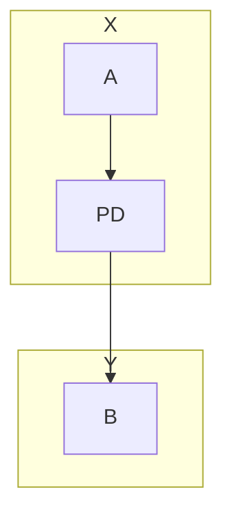
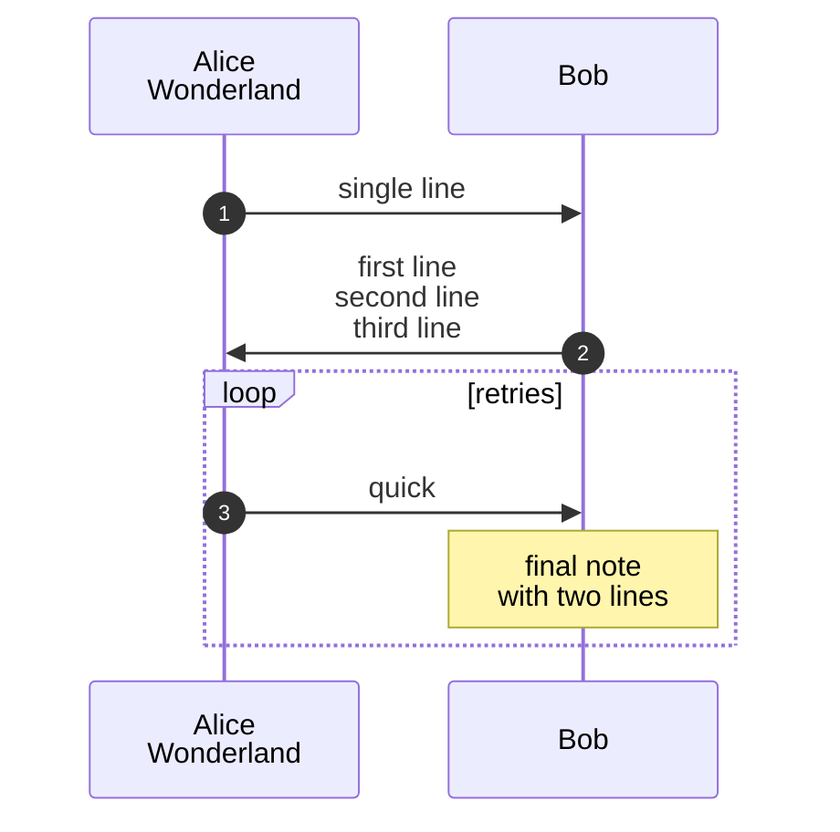
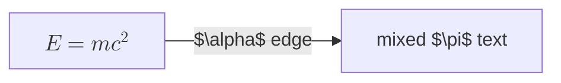
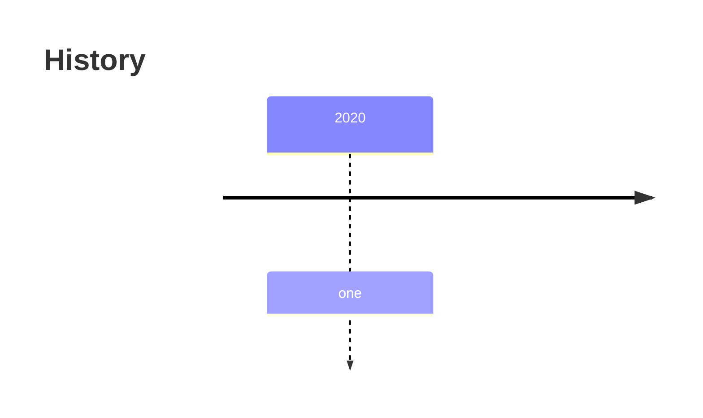

# Diagrams

A flowchart with two subgraphs claiming `PD` (E-01), a sequence with ` ` labels and autonumber, math in a node, and an unsupported type that falls back (E-02).

Prose after the diagrams.
